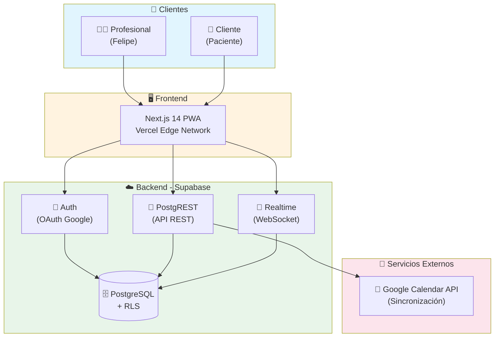
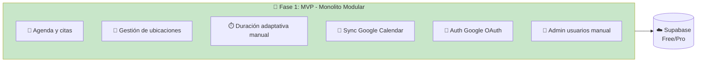
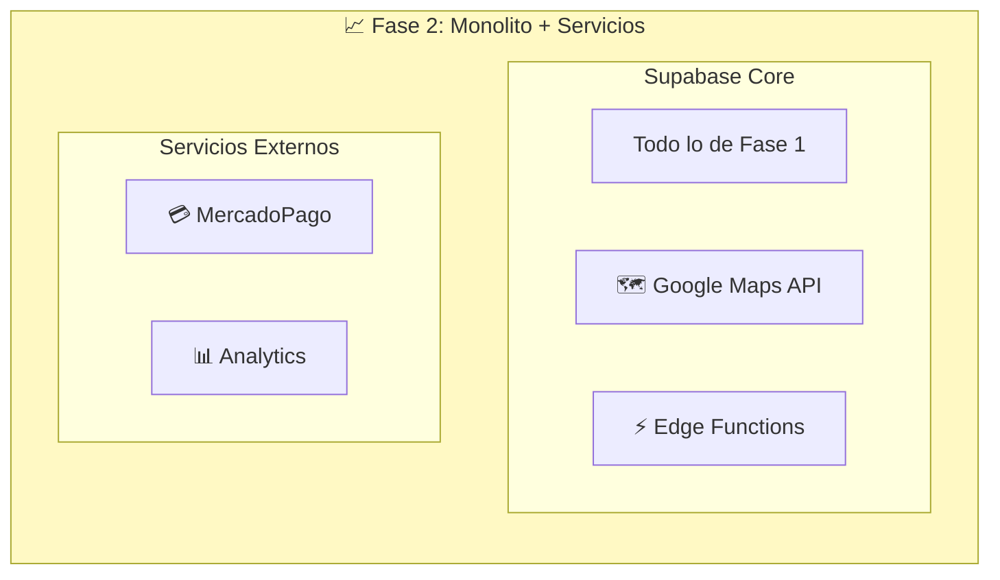
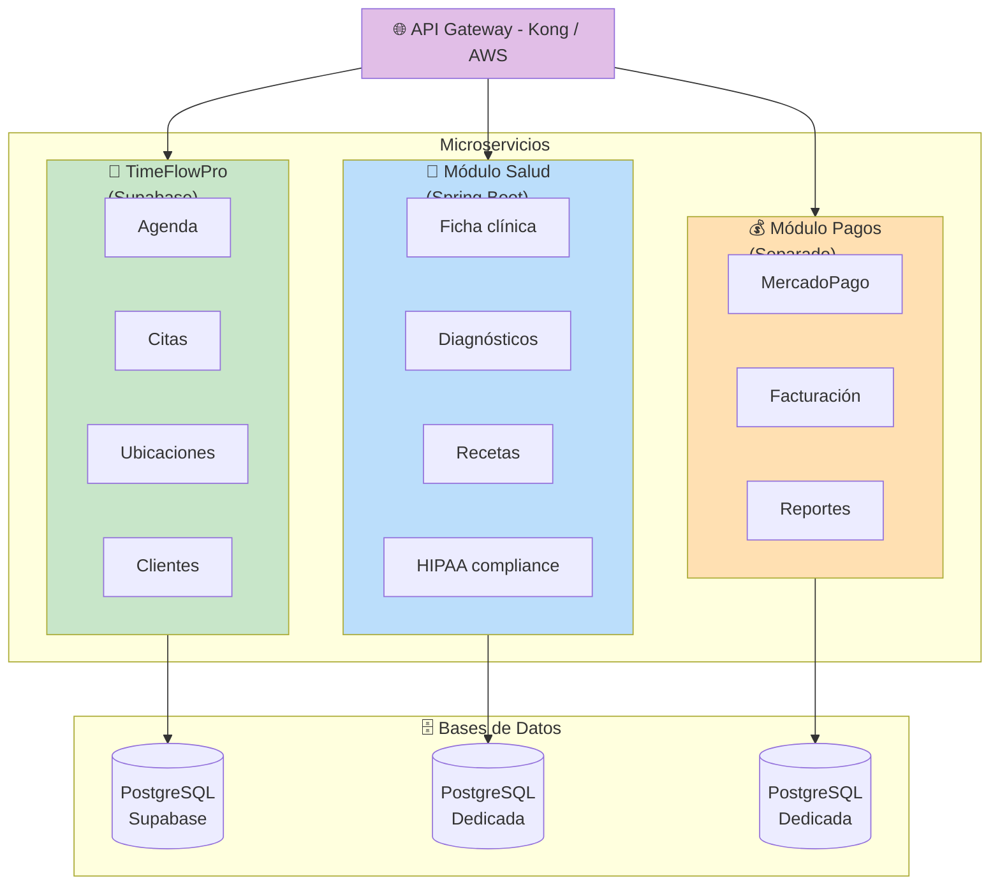

# Ficha del Proyecto - TimeFlowPro

---

## 0.1 Autor

**Nombre:** Ruben Contreras  
**Rol:** Product Owner & Lead Developer  
**Contacto:** 4tipruben@gmail.com

---

## 0.2 Nombre del Proyecto

**TimeFlowPro**

> Nombre que combina "Time" (tiempo), "Flow" (flujo optimizado) y "Pro" (profesionales). Único y descriptivo para el dominio de agendamiento inteligente.

---

## 0.3 Descripción Breve

> **Una aplicación web PWA diseñada para profesionales móviles que trabajan en múltiples ubicaciones, permitiéndoles gestionar agendas con duraciones adaptativas por cliente, bloqueo de tiempo de traslado y sincronización con Google Calendar, eliminando tiempos muertos y sobreagendamientos.**

### Elevator Pitch (10 segundos)
*"TimeFlowPro es la primera agenda digital que entiende que los profesionales se mueven. Calcula traslados, adapta duraciones por cliente y optimiza tu jornada automáticamente."*

---

## 0.4 URLs del Proyecto

| Entorno | URL | Estado |
|---------|-----|--------|
| **Producción** | `https://timeflowpro.app` | 🔜 Pendiente |
| **Staging** | `https://staging.timeflowpro.app` | 🔜 Pendiente |
| **Documentación API** | `https://docs.timeflowpro.app` | 🔜 Pendiente |

> **Credenciales de prueba:** Disponibles en el gestor de contraseñas del equipo (NO incluir aquí por seguridad).

---

## 0.5 URL del Repositorio

| Repositorio | URL | Visibilidad |
|-------------|-----|-------------|
| **Monorepo Principal** | `https://github.com/rcontreras1337/timeflowpro` | Privado |

### Estructura del Repositorio
```
timeflowpro/
├── apps/
│   └── web/                 # Next.js 14 PWA
├── packages/
│   └── shared/              # Tipos y utilidades compartidas
├── supabase/
│   ├── migrations/          # Migraciones SQL
│   └── seed.sql             # Datos de prueba
├── docs/                    # Documentación técnica (Mermaid, ADRs)
└── .github/
    └── workflows/           # CI/CD con GitHub Actions
```

> **Nota:** Toda la documentación técnica (diagramas Mermaid, ADRs) vive en `/docs` dentro del repositorio, versionada junto al código.

---

## 0.6 Stack Tecnológico

### Frontend
| Tecnología | Versión | Propósito |
|------------|---------|-----------|
| Next.js | 14.x (App Router) | Framework React con SSR/SSG |
| TailwindCSS | 3.x | Estilos utilitarios |
| TypeScript | 5.x | Tipado estático |
| next-pwa | latest | Soporte PWA |
| React Query | 5.x | Estado servidor y caché |

### Backend (BaaS)
| Tecnología | Propósito |
|------------|-----------|
| Supabase | PostgreSQL + Auth + API REST + Realtime |
| Supabase Auth | Autenticación OAuth (Google) |
| Supabase RLS | Seguridad a nivel de filas |
| Edge Functions | Lógica de negocio serverless (Deno) |

### Integraciones
| Servicio | Propósito | Fase |
|----------|-----------|------|
| Google Calendar API | Sincronización bidireccional de citas | MVP |
| Google Maps API | Cálculo automático de tiempo de traslado | Fase 2 |
| MercadoPago | Procesamiento de pagos | Fase 2 |

### Infraestructura
| Servicio | Propósito |
|----------|-----------|
| Vercel | Hosting frontend + Edge Functions |
| Supabase Cloud | Base de datos + Auth + API |
| GitHub Actions | CI/CD |

---

## 0.7 Arquitectura de Alto Nivel



---

## 0.8 Plan de Escalamiento

### Fase 1: MVP (Actual)



| Métrica | Valor |
|---------|-------|
| 👥 Usuarios objetivo | 1-50 profesionales |
| 🏗️ Infraestructura | Supabase Free/Pro |
| 💰 Costo estimado | $0-25/mes |

### Fase 2: Validación y Crecimiento



| Métrica | Valor |
|---------|-------|
| 👥 Usuarios objetivo | 50-500 profesionales |
| 🏗️ Infraestructura | Supabase Pro + Vercel Pro |
| 💰 Costo estimado | $50-200/mes |

### Fase 3: Escala / Módulo Salud (Si aplica)



| Métrica | Valor |
|---------|-------|
| 👥 Usuarios objetivo | 500+ profesionales |
| 🏗️ Infraestructura | Multi-cloud / Kubernetes |
| 💰 Costo estimado | $500+/mes |
| 👨‍💻 Equipo | 3-5 desarrolladores |

### Criterios para Escalar a Fase 3

| Indicador | Umbral | Acción |
|-----------|--------|--------|
| Usuarios activos | >500 | Evaluar separación de módulos |
| Requisitos HIPAA/salud | Cualquiera | Módulo salud en backend dedicado |
| Latencia API | >500ms p95 | Optimizar o separar servicios |
| Complejidad de negocio | Workflows complejos | Edge Functions → Spring Boot |
| Equipo de desarrollo | >3 devs | Considerar microservicios |

### Garantías de Migración

| Aspecto | Estrategia |
|---------|------------|
| **Datos** | PostgreSQL estándar, exportable a cualquier infraestructura |
| **API** | RESTful estándar, contratos documentados en OpenAPI |
| **Auth** | JWT estándar, migrable a cualquier proveedor |
| **Código** | TypeScript, reutilizable en cualquier framework |

---

## 0.9 Decisiones Arquitectónicas (ADR Resumen)

### ADR-001: Supabase como Backend
- **Decisión:** Usar Supabase (BaaS) en lugar de backend custom (Spring Boot/NestJS)
- **Contexto:** MVP con equipo pequeño, validación rápida con usuario piloto
- **Consecuencias:** 
  - ✅ Desarrollo 60% más rápido
  - ✅ Costo inicial $0
  - ⚠️ Migrar a backend propio si se requiere lógica muy compleja
- **Reversibilidad:** Alta (PostgreSQL estándar, datos exportables)

### ADR-002: Next.js sobre Angular
- **Decisión:** Next.js 14 en lugar de Angular 18
- **Contexto:** PWA liviana, performance crítica, ecosistema moderno
- **Consecuencias:**
  - ✅ Bundle más pequeño, carga más rápida
  - ✅ PWA con `next-pwa` en 3 líneas
  - ⚠️ Curva de aprendizaje si solo se conoce Angular
- **Reversibilidad:** Media (compartir lógica de negocio vía packages)

### ADR-003: Google Calendar como fuente de notificaciones
- **Decisión:** Sincronizar con Google Calendar en lugar de sistema de notificaciones propio
- **Contexto:** Usuarios ya tienen Google Calendar en móvil con notificaciones configuradas
- **Consecuencias:**
  - ✅ Cero desarrollo de sistema de notificaciones
  - ✅ Funciona offline (GCal cachea eventos)
  - ⚠️ Dependencia de Google

---

## 0.10 Checklist de Validación

- [x] **Accesibilidad:** URLs definidas (pendientes de deploy)
- [x] **Claridad:** Descripción entendible en <10 segundos
- [x] **Propiedad:** Autor y contacto definidos
- [x] **Stack:** Tecnologías con versiones especificadas
- [x] **Escalabilidad:** Plan de 3 fases documentado
- [x] **Decisiones:** ADRs principales documentados

---

## 0.11 Referencias

| Documento | Ubicación |
|-----------|-----------|
| Descripción General | `Documentacion/1-DescripcionGeneral.md` |
| Arquitectura del Sistema | `Documentacion/2-ArquitecturaSistema.md` |
| Modelo de Datos | `Documentacion/3-ModeloDatos.md` |
| Especificación API | `Documentacion/4-EspecificacionAPI.md` |
| Historias de Usuario | `Documentacion/5-HistoriasUsuario.md` |
| Tickets de Trabajo | `Documentacion/6-TicketsTrabajo.md` |
| Pull Requests | `Documentacion/7-PullRequests.md` |

---

**Última actualización:** Enero 2026  
**Versión del documento:** 1.0.0

