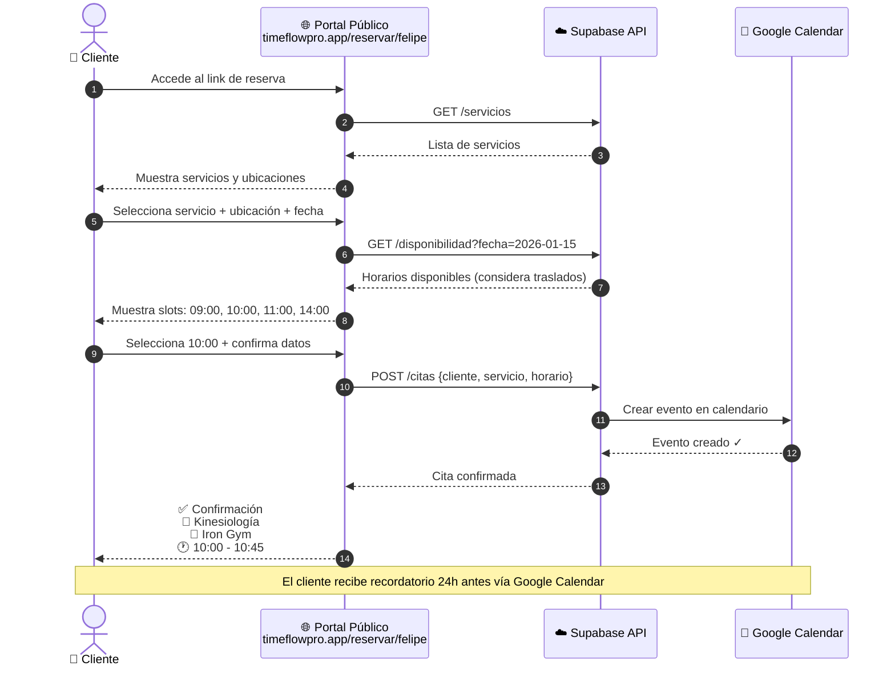
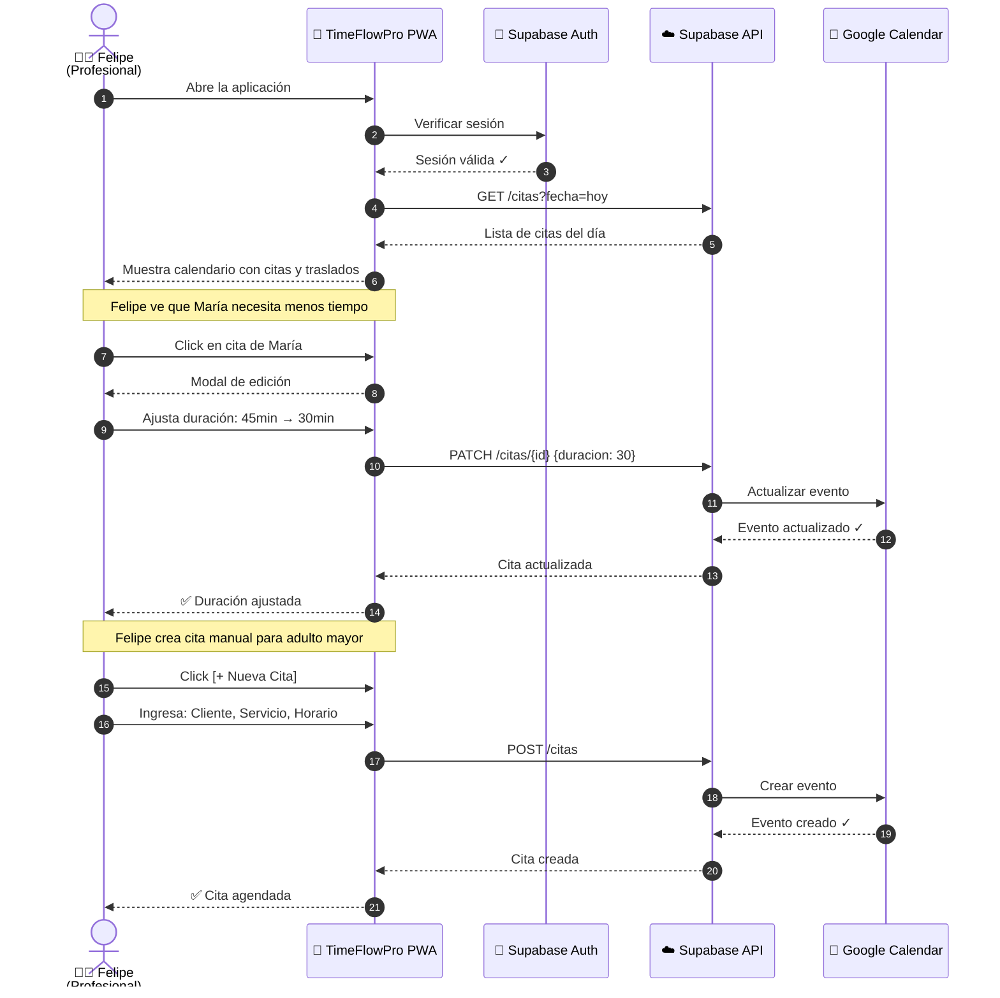

# 1. Descripción General del Producto - TimeFlowPro

---

## 1.1 Objetivo

### Problema Detectado

Los profesionales móviles que trabajan en múltiples ubicaciones (kinesiólogos, barberos a domicilio, entrenadores personales, técnicos, terapeutas) **no utilizan agendas digitales** porque estas asumen:

| Supuesto de agendas actuales                | Realidad del profesional móvil           |
| ------------------------------------------- | ---------------------------------------- |
| Ubicación fija                              | Trabaja en 3+ lugares diferentes         |
| Bloques de tiempo estándar (30, 45, 60 min) | Duración varía según cliente e historial |
| Cero tiempo de traslado                     | Debe moverse entre ubicaciones           |

**Resultado:** Tiempos muertos, sobreagendamientos, estrés y abandono de herramientas digitales.

### Investigación de Mercado

**Competidores analizados:**

| Herramienta         | Fortalezas               | Debilidades para profesionales móviles            |
| ------------------- | ------------------------ | ------------------------------------------------- |
| Calendly            | UI simple, integraciones | ❌ Sin multi-ubicación, ❌ Sin traslados          |
| SimplyBook          | Sector servicios         | ❌ Bloques rígidos, ❌ Sin adaptación por cliente |
| Google Calendar     | Ubicuo, gratis           | ❌ Sin lógica de negocio, ❌ Manual               |
| Agendas de clínicas | Sector salud             | ❌ Pensadas para lugar fijo                       |

**Conclusión:** Ninguna agenda existente está diseñada para profesionales que **se mueven**.

### Buyer Persona Principal

```
┌─────────────────────────────────────────────────────────────────┐
│  FELIPE - Kinesiólogo Móvil                                     │
├─────────────────────────────────────────────────────────────────┤
│  Edad: 32 años                                                  │
│  Ubicaciones de trabajo:                                        │
│    🏋️ Iron Gym (mañanas)                                        │
│    🏨 Hotel Viejas Escuelas (tardes)                            │
│    🏠 Domicilios (según demanda)                                │
│                                                                 │
│  Frustraciones:                                                 │
│    • Pierde 1-2 horas/día en huecos entre pacientes            │
│    • Agenda citas imposibles por no considerar traslado         │
│    • Pacientes recurrentes no necesitan 45 min, solo 30        │
│    • Gestiona todo en papel o WhatsApp                          │
│                                                                 │
│  Necesita:                                                      │
│    • Agenda que entienda que SE MUEVE                           │
│    • Bloqueo automático de tiempo de viaje                      │
│    • Duración flexible por paciente                             │
│    • Que funcione en su celular                                 │
└─────────────────────────────────────────────────────────────────┘
```

### Solución Propuesta

**TimeFlowPro** es una aplicación web PWA que permite a profesionales móviles:

1. **Gestionar múltiples ubicaciones** de trabajo con horarios diferenciados
2. **Adaptar duraciones** de citas según el cliente (editable por el profesional)
3. **Bloquear tiempo de traslado** entre ubicaciones (manual en MVP, automático en Fase 2)
4. **Sincronizar con Google Calendar** para notificaciones nativas
5. **Permitir reservas** tanto por el profesional como por clientes

### Valor Diferencial

| Métrica                           | Sin TimeFlowPro   | Con TimeFlowPro   |
| --------------------------------- | ----------------- | ----------------- |
| Conflictos de agenda por traslado | Frecuentes        | Eliminados        |
| Tiempo perdido en huecos          | 1-2 hrs/día       | Optimizado        |
| Gestión de ubicaciones            | Manual/caótica    | Centralizada      |
| Reservas de clientes              | WhatsApp/llamadas | Self-service 24/7 |

---

## 1.2 Funcionalidades Principales

### MVP (Fase 1)

| #   | Funcionalidad                        | Descripción                                                            | Estrategia                |
| --- | ------------------------------------ | ---------------------------------------------------------------------- | ------------------------- |
| 1   | **Multi-ubicación**                  | Profesional configura N ubicaciones con horarios específicos           | Build                     |
| 2   | **Calendario inteligente**           | Vista de agenda con citas y bloques de traslado                        | Build                     |
| 3   | **Duración adaptativa**              | Profesional puede ajustar duración por cliente/servicio                | Build                     |
| 4   | **Bloqueo de traslado (manual)**     | Profesional indica tiempo de viaje entre ubicaciones                   | Build                     |
| 5   | **Reserva dual**                     | Profesional y cliente pueden crear citas                               | Build                     |
| 6   | **Portal de reservas público**       | Enlace compartible para que clientes agenden (sin necesidad de cuenta) | Build                     |
| 7   | **Sincronización Google Calendar**   | Citas se reflejan en GCal del profesional                              | Buy (Google Calendar API) |
| 8   | **Autenticación Google**             | Login con cuenta Google + trial automático                             | Buy (Supabase Auth)       |
| 9   | **Gestión de clientes**              | CRUD de clientes con notas y historial                                 | Build                     |
| 10  | **Gestión de servicios**             | Profesional define servicios con duración base y precio                | Build                     |
| 11  | **Cancelación y reagendamiento**     | Cliente puede cancelar/reagendar con anticipación mínima configurable  | Build                     |
| 12  | **Bloqueos personales**              | Profesional bloquea almuerzo, vacaciones, tiempo personal              | Build                     |
| 13  | **Términos y condiciones**           | Checkbox obligatorio al reservar (configurable)                        | Build                     |
| 14  | **Gestión de profesionales (Admin)** | Superadmin activa, suspende y gestiona trials                          | Build                     |
| 15  | **Modo solo lectura**                | Cuenta con trial expirado puede ver pero no crear                      | Build                     |

### Funcionalidades Futuras (Post-MVP)

| Fase | Funcionalidad            | Descripción                                              |
| ---- | ------------------------ | -------------------------------------------------------- |
| 2    | **Traslado automático**  | Google Maps API calcula tiempo de viaje                  |
| 2    | **Pagos online**         | Integración MercadoPago                                  |
| 2    | **Optimización de ruta** | Sugerir reordenamiento de citas para minimizar traslados |
| 2    | **Recordatorios SMS**    | Notificaciones vía Twilio                                |
| 3    | **Multi-profesional**    | Un dueño gestiona varios profesionales                   |
| 3    | **Módulo salud**         | Ficha clínica, diagnósticos (si aplica)                  |

### Decisiones Buy vs Build

| Componente           | Decisión                      | Justificación                           |
| -------------------- | ----------------------------- | --------------------------------------- |
| Base de datos        | **Buy** (Supabase)            | PostgreSQL managed, API automática, RLS |
| Autenticación        | **Buy** (Supabase Auth)       | OAuth Google en minutos                 |
| Mapas/Rutas          | **Buy** (Google Maps API)     | Fase 2, API estándar                    |
| Calendario sync      | **Buy** (Google Calendar API) | Ubicuo, notificaciones nativas          |
| UI/Lógica de negocio | **Build**                     | Core del producto, diferenciador        |
| Pagos                | **Buy** (MercadoPago)         | Fase 2, regulado                        |

---

## 1.3 Diseño y Experiencia de Usuario

### Customer Journey 1: Cliente Reserva una Cita



**Resultado esperado en pantalla:**

| Campo           | Valor                           |
| --------------- | ------------------------------- |
| ✅ Estado       | Cita confirmada                 |
| 📅 Servicio     | Sesión de Kinesiología          |
| 📍 Ubicación    | Iron Gym                        |
| 🕐 Horario      | 15 Ene 2026, 10:00 - 10:45      |
| 🔔 Recordatorio | Vía Google Calendar (24h antes) |

### Customer Journey 2: Profesional Gestiona su Agenda



**Vista del Dashboard:**

```mermaid
gantt
    title 📅 Agenda de Felipe - Miércoles 15 de Enero
    dateFormat HH:mm
    axisFormat %H:%M

    section 🏋️ Iron Gym
    Juan Pérez - Kinesiología (45min)    :active, 09:00, 45m

    section 🚗 Traslado
    Traslado a Hotel (20min)             :crit, 10:45, 20m

    section 🏨 Hotel V.E.
    María López - Rehabilitación (30min) :active, 11:05, 30m
    Disponible                           :11:35, 85m
```



**Leyenda visual:**
| Color | Significado |
|-------|-------------|
| 🟦 Azul | Cita confirmada |
| 🟥 Rojo | Tiempo de traslado (bloqueado) |
| ⬜ Gris | Disponible |

### Estados de Error

| Escenario                    | Mensaje al Usuario                                     | Acción               |
| ---------------------------- | ------------------------------------------------------ | -------------------- |
| Horario no disponible        | "Este horario ya no está disponible. Selecciona otro." | Refrescar slots      |
| Error de conexión            | "Sin conexión. Reintentando..."                        | Retry automático     |
| Google Calendar desconectado | "Reconecta tu Google Calendar para sincronizar"        | Botón reconectar     |
| Conflicto de traslado        | "No es posible llegar a tiempo desde tu cita anterior" | Sugerir alternativas |

### Prototipos

| Recurso                   | URL             | Estado       |
| ------------------------- | --------------- | ------------ |
| Figma - Flujo completo    | `[Por definir]` | 🔜 Pendiente |
| Wireframes baja fidelidad | `[Por definir]` | 🔜 Pendiente |

---

## 1.4 Instrucciones de Instalación

### Objetivo DX

> Un desarrollador junior debe poder levantar el proyecto en **menos de 30 minutos** siguiendo estas instrucciones.

### Prerrequisitos

| Herramienta     | Versión Mínima | Instalación                                   |
| --------------- | -------------- | --------------------------------------------- |
| Node.js         | 20.x LTS       | [nodejs.org](https://nodejs.org)              |
| pnpm            | 8.x            | `npm install -g pnpm`                         |
| Docker Desktop  | 4.x            | [docker.com](https://docker.com)              |
| Git             | 2.x            | [git-scm.com](https://git-scm.com)            |
| Cuenta Google   | -              | Para OAuth y Calendar API                     |
| Cuenta Supabase | -              | [supabase.com](https://supabase.com) (gratis) |

### Pasos de Instalación

#### 1. Clonar el Repositorio

```bash
git clone https://github.com/rcontreras1337/timeflowpro.git
cd timeflowpro
```

#### 2. Instalar Dependencias

```bash
pnpm install
```

#### 3. Configurar Variables de Entorno

```bash
# Copiar template de variables
cp .env.example .env.local

# Editar con tus credenciales (ver sección siguiente)
code .env.local
```

#### 4. Configurar Supabase

```bash
# Instalar CLI de Supabase
pnpm add -g supabase

# Login a Supabase
supabase login

# Iniciar Supabase local (requiere Docker)
supabase start
```

#### 5. Ejecutar Migraciones

```bash
# Aplicar migraciones de base de datos
supabase db push

# Cargar datos de prueba (seeds)
pnpm db:seed
```

#### 6. Iniciar Servidor de Desarrollo

```bash
pnpm dev
```

Abrir [http://localhost:3000](http://localhost:3000) en el navegador.

### Variables de Entorno

Archivo `.env.local` (NO commitear):

```env
# Supabase
NEXT_PUBLIC_SUPABASE_URL=http://localhost:54321
NEXT_PUBLIC_SUPABASE_ANON_KEY=eyJ... # Obtener de supabase start
SUPABASE_SERVICE_ROLE_KEY=eyJ...     # Obtener de supabase start

# Google OAuth (configurar en Google Cloud Console)
GOOGLE_CLIENT_ID=xxx.apps.googleusercontent.com
GOOGLE_CLIENT_SECRET=GOCSPX-xxx

# Google Calendar API
GOOGLE_CALENDAR_API_KEY=AIza...

# App
NEXT_PUBLIC_APP_URL=http://localhost:3000
```

> ⚠️ **Importante:** Nunca commitear `.env.local`. Ya está en `.gitignore`.

### Verificación de Instalación

| Check              | Comando                                 | Resultado Esperado            |
| ------------------ | --------------------------------------- | ----------------------------- |
| App corriendo      | Abrir `localhost:3000`                  | Ver página de login           |
| Supabase corriendo | `supabase status`                       | Todos los servicios `running` |
| DB con datos       | Abrir Supabase Studio `localhost:54323` | Ver tablas con seeds          |
| Login funciona     | Click "Login con Google"                | Redirige a OAuth              |

### Troubleshooting

| Problema             | Solución                                  |
| -------------------- | ----------------------------------------- |
| Puerto 3000 ocupado  | `pnpm dev -- -p 3001`                     |
| Docker no inicia     | Verificar Docker Desktop está corriendo   |
| Error de migraciones | `supabase db reset` y reintentar          |
| OAuth falla          | Verificar redirect URIs en Google Console |

---

## 1.5 Checklist de Validación

### Claridad del Objetivo

- [x] ¿Menciona explícitamente el problema del usuario? ✅ Tiempos muertos, traslados ignorados
- [x] ¿Está claro el usuario objetivo? ✅ Buyer Persona Felipe documentado

### Alcance y Funcionalidad

- [x] ¿Funcionalidades corresponden al MVP? ✅ 10 funcionalidades core listadas
- [x] ¿Se diferencia MVP de futuro? ✅ Tabla separada de Fase 2/3
- [x] ¿Estrategia Buy vs Build documentada? ✅ Tabla con justificaciones

### Experiencia de Usuario

- [x] ¿Customer Journey documentado? ✅ 2 flujos con diagramas Mermaid (sequence + gantt)
- [x] ¿Estados de error cubiertos? ✅ Tabla de escenarios

### Instalación y DX

- [x] ¿Prerrequisitos claros? ✅ Tabla con versiones y links
- [x] ¿Pasos secuenciales? ✅ 6 pasos numerados con comandos
- [x] ¿Variables de entorno documentadas? ✅ Template sin secretos reales
- [x] ¿Troubleshooting incluido? ✅ Problemas comunes con soluciones

---

## 1.6 Referencias

| Documento                 | Ubicación                                                              |
| ------------------------- | ---------------------------------------------------------------------- |
| Ficha del Proyecto        | [`Documentacion/0-FichaProyecto.md`](./0-FichaProyecto.md)             |
| Arquitectura del Sistema  | [`Documentacion/2-ArquitecturaSistema.md`](./2-ArquitecturaSistema.md) |
| Scaffolding de referencia | `ScafoldingDocumentacion/1-Descripción general del producto.md`        |

---

**Última actualización:** Enero 2026  
**Versión del documento:** 1.1.0
