# 2. Arquitectura del Sistema - TimeFlowPro

---

## 2.1 Diagrama de Arquitectura

### 2.1.1 Vista General del Sistema (C4 - Nivel 1: Contexto)

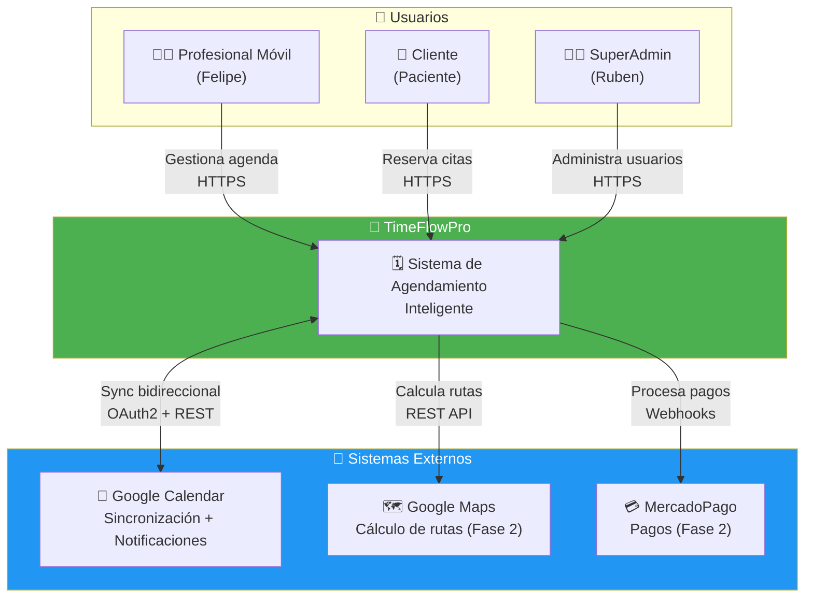

### 2.1.2 Diagrama de Contenedores (C4 - Nivel 2)

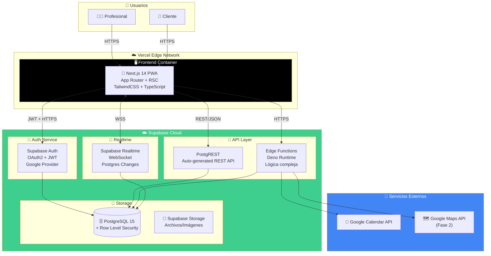

### 2.1.3 Diagrama de Componentes (C4 - Nivel 3: Frontend)

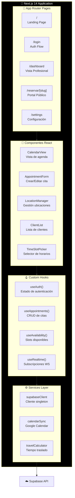

### 2.1.4 Flujo de Datos en Tiempo Real

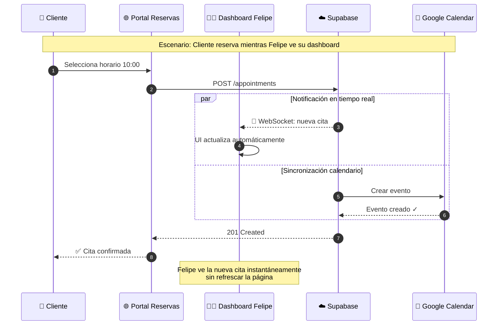

---

## 2.2 Decisiones Arquitectónicas (ADRs)

### ADR-001: Supabase como Backend-as-a-Service

| Campo         | Valor           |
| ------------- | --------------- |
| **Estado**    | ✅ Aceptado     |
| **Fecha**     | Enero 2026      |
| **Decisores** | Ruben Contreras |

**Contexto:**
Necesitamos un backend para TimeFlowPro MVP. Opciones evaluadas:

1. Backend custom con NestJS/Spring Boot
2. Firebase (Google)
3. Supabase (Open Source)

**Decisión:**
Usar **Supabase** como BaaS principal.

**Justificación:**

| Criterio             | NestJS Custom       | Firebase           | Supabase ✅            |
| -------------------- | ------------------- | ------------------ | ---------------------- |
| Tiempo de desarrollo | 10-14 semanas       | 6-8 semanas        | 4-6 semanas            |
| Base de datos        | PostgreSQL (manual) | Firestore (NoSQL)  | PostgreSQL (managed)   |
| Auth integrado       | ❌ Implementar      | ✅ Sí              | ✅ Sí                  |
| API automática       | ❌ Escribir todo    | ❌ Solo SDK        | ✅ PostgREST           |
| Row Level Security   | ❌ Manual           | ⚠️ Rules limitadas | ✅ RLS nativo          |
| Vendor lock-in       | ✅ Ninguno          | ❌ Alto            | ⚠️ Bajo (open source)  |
| Costo MVP            | $50-100/mes         | $0-25/mes          | $0-25/mes              |
| Migrabilidad         | ✅ Total            | ❌ Difícil         | ✅ PostgreSQL estándar |

**Consecuencias:**

- ✅ Desarrollo 60% más rápido
- ✅ Auth, API, Realtime incluidos
- ✅ PostgreSQL permite migración futura
- ⚠️ Lógica muy compleja requiere Edge Functions
- ⚠️ Dependencia de Supabase Cloud (mitigable con self-host)

**Reversibilidad:** Alta - PostgreSQL estándar, datos 100% exportables.

---

### ADR-002: Arquitectura Modular con Feature Slices

| Campo      | Valor       |
| ---------- | ----------- |
| **Estado** | ✅ Aceptado |
| **Fecha**  | Enero 2026  |

**Contexto:**
¿Cómo organizar el código del frontend para escalabilidad?

**Decisión:**
Usar **Feature Slices Architecture** en lugar de arquitectura por capas tradicional.

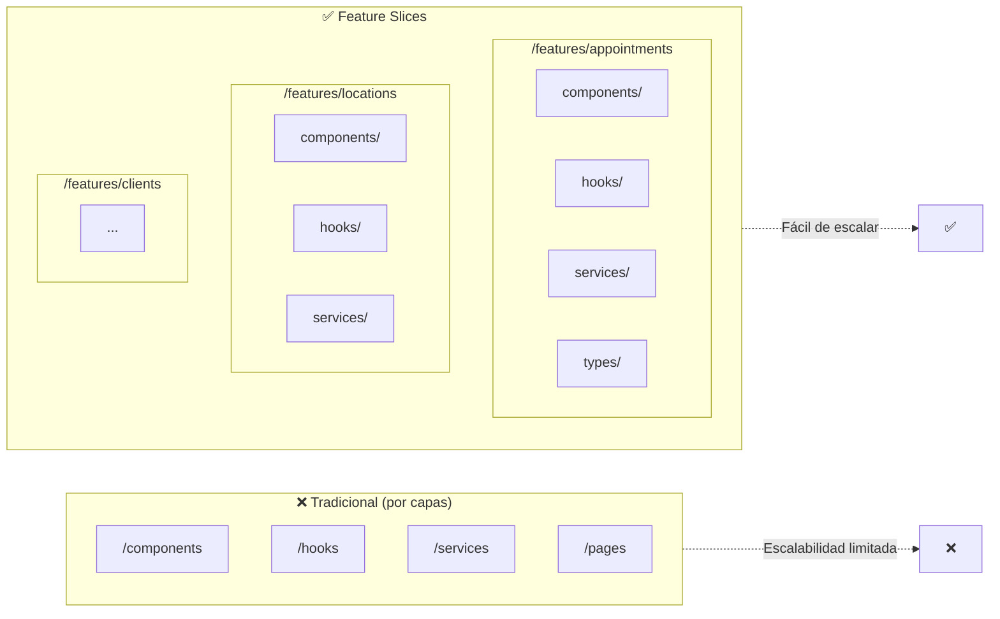

**Justificación:**

- Cada feature es autocontenida
- Fácil añadir nuevas features sin afectar otras
- Permite extraer features a packages si escala
- Testing aislado por feature

---

### ADR-003: Row Level Security para Multi-tenancy

| Campo      | Valor       |
| ---------- | ----------- |
| **Estado** | ✅ Aceptado |
| **Fecha**  | Enero 2026  |

**Contexto:**
Cada profesional debe ver solo SUS datos. ¿Cómo implementar aislamiento?

**Decisión:**
Usar **Row Level Security (RLS)** de PostgreSQL en lugar de filtros en código.

```sql
-- Ejemplo: Política RLS para tabla appointments
CREATE POLICY "Users can only see their own appointments"
ON appointments
FOR ALL
USING (
    user_id = auth.uid()
    OR
    client_id IN (SELECT id FROM clients WHERE user_id = auth.uid())
);
```

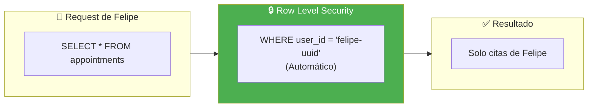

**Justificación:**

- Seguridad a nivel de base de datos (no bypasseable)
- No requiere código en cada query
- Funciona automáticamente con PostgREST
- Auditable y testeable

---

### ADR-004: Sincronización Bidireccional con Google Calendar

| Campo      | Valor       |
| ---------- | ----------- |
| **Estado** | ✅ Aceptado |
| **Fecha**  | Enero 2026  |

**Contexto:**
¿Cómo sincronizar citas con Google Calendar?

**Decisión:**
Implementar sincronización bidireccional via webhooks.

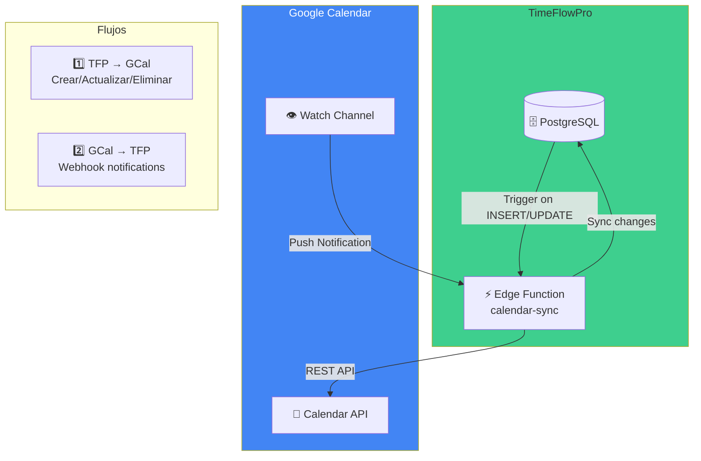

**Flujo detallado:**

1. **TFP → Google Calendar:**
   - Trigger PostgreSQL detecta cambio en `appointments`
   - Edge Function recibe evento
   - Crea/actualiza/elimina evento en GCal

2. **Google Calendar → TFP:**
   - Watch channel configurado para el calendario
   - Google envía webhook cuando hay cambios
   - Edge Function sincroniza cambios a PostgreSQL
   - Marca eventos externos como `source: 'google_calendar'`

---

## 2.3 Descripción de Componentes Principales

### 2.3.1 Tabla de Componentes

| Componente          | Responsabilidad                  | Stack                              | Comunicación | Ubicación      |
| ------------------- | -------------------------------- | ---------------------------------- | ------------ | -------------- |
| **Next.js PWA**     | UI, SSR, routing, estado cliente | Next.js 14, React 18, TypeScript 5 | HTTPS, WSS   | Vercel Edge    |
| **Supabase Auth**   | Autenticación, sesiones, OAuth   | GoTrue, JWT                        | HTTPS/OAuth2 | Supabase Cloud |
| **PostgREST**       | API REST auto-generada           | PostgREST 11                       | REST/JSON    | Supabase Cloud |
| **Edge Functions**  | Lógica de negocio compleja       | Deno, TypeScript                   | HTTPS        | Supabase Edge  |
| **PostgreSQL**      | Persistencia, RLS, triggers      | PostgreSQL 15                      | TCP/5432     | Supabase Cloud |
| **Realtime**        | Subscripciones WebSocket         | Elixir, Phoenix                    | WSS          | Supabase Cloud |
| **Google Calendar** | Sincronización, notificaciones   | REST API v3                        | HTTPS/OAuth2 | Google Cloud   |

### 2.3.2 Detalle por Componente

#### 🖥️ Next.js 14 PWA

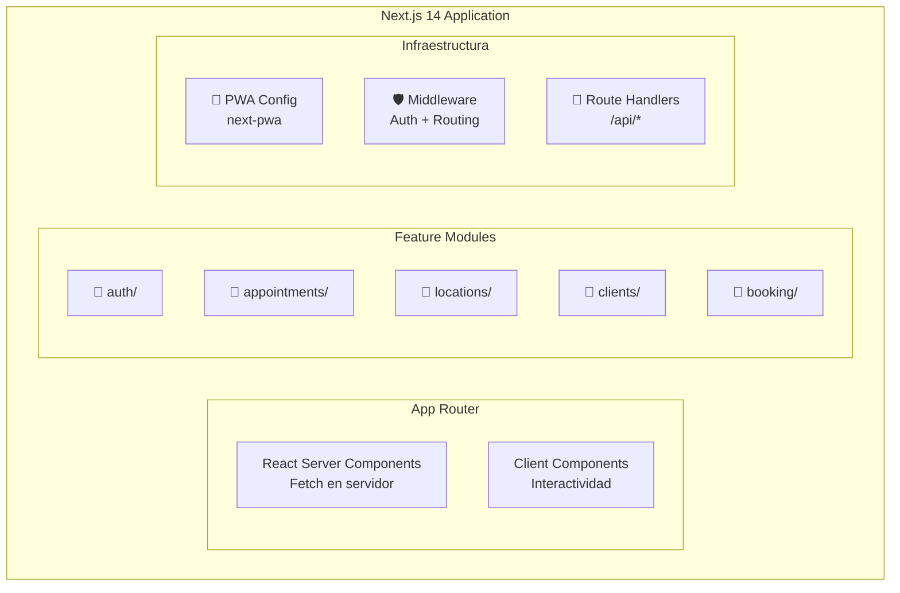

**Responsabilidades:**

- ✅ Renderizado de UI (SSR + CSR)
- ✅ Routing y navegación
- ✅ Estado del cliente (React Query)
- ✅ PWA: offline, instalable
- ✅ Middleware de autenticación

**NO hace:**

- ❌ Lógica de negocio compleja
- ❌ Acceso directo a base de datos
- ❌ Almacenamiento de secretos

---

#### ⚡ Supabase Edge Functions

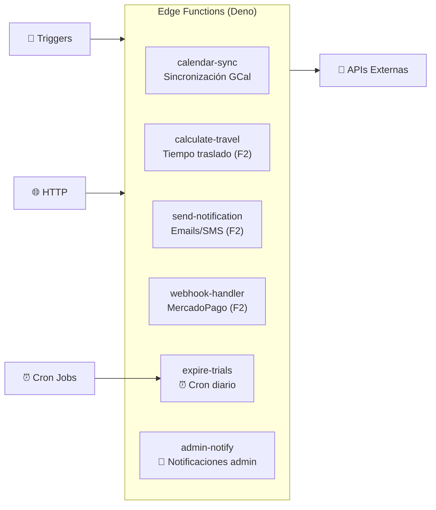

**Edge Functions MVP:**

| Función         | Trigger             | Descripción                              |
| --------------- | ------------------- | ---------------------------------------- |
| `calendar-sync` | Trigger PostgreSQL  | Sincroniza citas con Google Calendar     |
| `expire-trials` | Cron (diario 00:00) | Cambia trials expirados a `readonly`     |
| `admin-notify`  | Trigger PostgreSQL  | Notifica al admin en registros y eventos |

**Responsabilidades:**

- ✅ Lógica que no puede ser RLS/SQL
- ✅ Integración con APIs externas
- ✅ Procesamiento de webhooks
- ✅ Operaciones asíncronas

---

## 2.4 Estructura de Ficheros

### 2.4.1 Estructura del Monorepo

```
timeflowpro/
├── 📁 apps/
│   └── 📁 web/                          # Next.js 14 PWA
│       ├── 📁 app/                      # App Router
│       │   ├── 📁 (auth)/               # Grupo de rutas auth
│       │   │   ├── login/page.tsx
│       │   │   └── callback/page.tsx
│       │   ├── 📁 (dashboard)/          # Grupo rutas protegidas
│       │   │   ├── layout.tsx           # Layout con sidebar
│       │   │   ├── page.tsx             # Dashboard principal
│       │   │   ├── 📁 appointments/
│       │   │   ├── 📁 clients/
│       │   │   ├── 📁 locations/
│       │   │   └── 📁 settings/
│       │   ├── 📁 reservar/             # Portal público
│       │   │   └── [slug]/page.tsx
│       │   ├── layout.tsx               # Root layout
│       │   ├── page.tsx                 # Landing page
│       │   └── globals.css
│       │
│       ├── 📁 features/                 # 🎯 Feature Slices
│       │   ├── 📁 appointments/
│       │   │   ├── 📁 components/
│       │   │   │   ├── AppointmentCard.tsx
│       │   │   │   ├── AppointmentForm.tsx
│       │   │   │   ├── CalendarView.tsx
│       │   │   │   └── index.ts
│       │   │   ├── 📁 hooks/
│       │   │   │   ├── useAppointments.ts
│       │   │   │   ├── useAvailability.ts
│       │   │   │   └── index.ts
│       │   │   ├── 📁 services/
│       │   │   │   └── appointmentService.ts
│       │   │   ├── 📁 types/
│       │   │   │   └── appointment.types.ts
│       │   │   └── index.ts
│       │   │
│       │   ├── 📁 locations/
│       │   │   ├── components/
│       │   │   ├── hooks/
│       │   │   ├── services/
│       │   │   └── types/
│       │   │
│       │   ├── 📁 clients/
│       │   ├── 📁 auth/
│       │   └── 📁 booking/
│       │
│       ├── 📁 components/               # Componentes compartidos
│       │   ├── 📁 ui/                   # Primitivos UI (shadcn)
│       │   │   ├── Button.tsx
│       │   │   ├── Input.tsx
│       │   │   ├── Modal.tsx
│       │   │   └── ...
│       │   └── 📁 layout/
│       │       ├── Sidebar.tsx
│       │       ├── Header.tsx
│       │       └── MobileNav.tsx
│       │
│       ├── 📁 lib/                      # Utilidades
│       │   ├── supabase/
│       │   │   ├── client.ts            # Cliente browser
│       │   │   ├── server.ts            # Cliente server
│       │   │   └── middleware.ts
│       │   ├── utils.ts
│       │   └── constants.ts
│       │
│       ├── 📁 styles/
│       │   └── globals.css
│       │
│       ├── middleware.ts                # Auth middleware
│       ├── next.config.js
│       ├── tailwind.config.js
│       └── tsconfig.json
│
├── 📁 packages/
│   └── 📁 shared/                       # Código compartido
│       ├── 📁 types/                    # Tipos TypeScript
│       │   ├── database.types.ts        # Generado por Supabase
│       │   └── index.ts
│       ├── 📁 utils/
│       │   ├── date.ts
│       │   ├── validation.ts
│       │   └── index.ts
│       └── package.json
│
├── 📁 supabase/
│   ├── 📁 migrations/                   # Migraciones SQL
│   │   ├── 20260115000000_initial_schema.sql
│   │   ├── 20260115000001_rls_policies.sql
│   │   └── 20260115000002_functions.sql
│   ├── 📁 functions/                    # Edge Functions
│   │   ├── 📁 calendar-sync/
│   │   │   └── index.ts
│   │   ├── 📁 expire-trials/
│   │   │   └── index.ts                 # Cron diario - expira trials
│   │   ├── 📁 admin-notify/
│   │   │   └── index.ts                 # Notificaciones al admin
│   │   ├── 📁 calculate-travel/
│   │   │   └── index.ts                 # Fase 2
│   │   └── 📁 _shared/
│   │       ├── cors.ts
│   │       └── email.ts                 # Utilidades de email
│   ├── seed.sql                         # Datos de prueba
│   └── config.toml
│
├── 📁 docs/                             # Documentación técnica
│   ├── adr/                             # Architecture Decision Records
│   ├── api/                             # OpenAPI specs
│   └── diagrams/                        # Diagramas fuente
│
├── 📁 .github/
│   └── 📁 workflows/
│       ├── ci.yml                       # Tests + Lint
│       ├── deploy-preview.yml           # Preview deployments
│       └── deploy-production.yml        # Deploy a producción
│
├── .env.example
├── .gitignore
├── package.json
├── pnpm-workspace.yaml
├── turbo.json                           # Turborepo config
└── README.md
```

### 2.4.2 Justificación de la Estructura

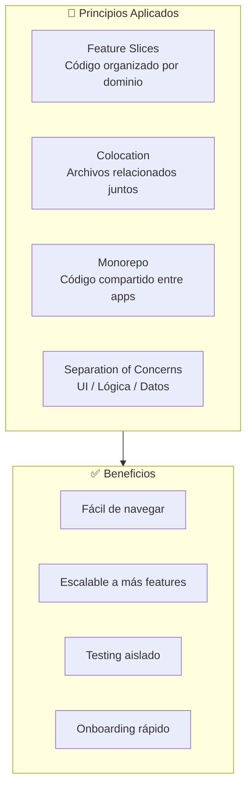

---

## 2.5 Infraestructura y Despliegue

### 2.5.1 Diagrama de Infraestructura

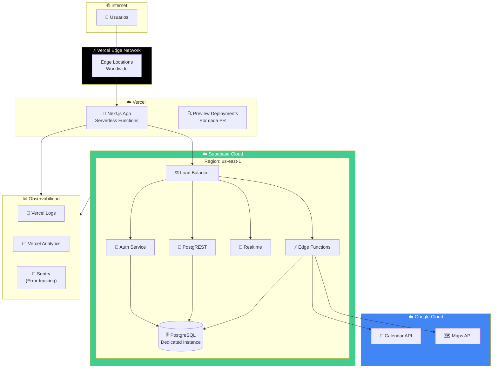

### 2.5.2 Ambientes

| Ambiente       | URL                           | Branch      | Base de Datos       | Propósito       |
| -------------- | ----------------------------- | ----------- | ------------------- | --------------- |
| **Local**      | localhost:3000                | -           | Supabase Local      | Desarrollo      |
| **Preview**    | pr-123.timeflowpro.vercel.app | PR branches | Supabase Staging    | Review PRs      |
| **Staging**    | staging.timeflowpro.app       | `develop`   | Supabase Staging    | QA y testing    |
| **Producción** | timeflowpro.app               | `main`      | Supabase Production | Usuarios reales |

### 2.5.3 Pipeline CI/CD

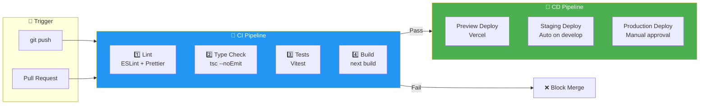

#### GitHub Actions Workflow

```yaml
# .github/workflows/ci.yml
name: CI

on:
  push:
    branches: [main, develop]
  pull_request:
    branches: [main, develop]

jobs:
  quality:
    runs-on: ubuntu-latest
    steps:
      - uses: actions/checkout@v4
      - uses: pnpm/action-setup@v2
      - uses: actions/setup-node@v4
        with:
          node-version: 20
          cache: 'pnpm'

      - run: pnpm install --frozen-lockfile

      - name: 🔍 Lint
        run: pnpm lint

      - name: 📝 Type Check
        run: pnpm type-check

      - name: 🧪 Unit Tests
        run: pnpm test -- --coverage

      - name: 🔗 Integration Tests
        run: pnpm test:integration
        env:
          SUPABASE_URL: ${{ secrets.SUPABASE_TEST_URL }}
          SUPABASE_KEY: ${{ secrets.SUPABASE_TEST_KEY }}

      # ⚠️ E2E Tests NO se ejecutan en CI
      # Se corren localmente: pnpm test:e2e
      # Razón: Alto consumo de recursos y tiempo

      - name: 🏗️ Build
        run: pnpm build

      - name: 📊 Upload Coverage
        uses: codecov/codecov-action@v3
        with:
          files: ./coverage/lcov.info

  deploy-preview:
    needs: quality
    if: github.event_name == 'pull_request'
    runs-on: ubuntu-latest
    steps:
      - uses: actions/checkout@v4
      - uses: amondnet/vercel-action@v25
        with:
          vercel-token: ${{ secrets.VERCEL_TOKEN }}
          vercel-org-id: ${{ secrets.VERCEL_ORG_ID }}
          vercel-project-id: ${{ secrets.VERCEL_PROJECT_ID }}
```

> 💡 **¿Por qué E2E solo en local?**
>
> - Los tests E2E con Playwright requieren ~5-10 minutos adicionales
> - Consumen browsers headless que aumentan costos de CI
> - Son más útiles para validación visual durante desarrollo
> - Unit + Integration cubren el 95% de regresiones

### 2.5.4 Git Hooks con Husky 🐶

Husky permite ejecutar scripts automáticamente en eventos de Git, asegurando que el código cumpla estándares **antes** de llegar al repositorio.

#### Hooks Configurados

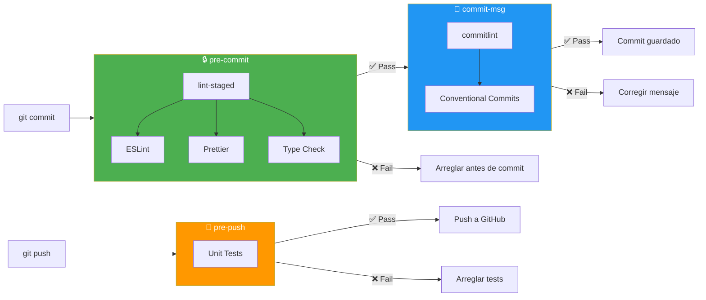

#### Instalación y Configuración

```bash
# Instalar dependencias
pnpm add -D husky lint-staged @commitlint/cli @commitlint/config-conventional
```

**Estructura de archivos:**

```
timeflowpro/
├── .husky/
│   ├── pre-commit           # Lint + Format
│   ├── commit-msg           # Validar mensaje
│   └── pre-push             # Tests antes de push
├── .lintstagedrc.js         # Configuración lint-staged
├── commitlint.config.js     # Reglas de commits
└── package.json
```

#### Configuración de Hooks

**.husky/pre-commit:**

```bash
#!/usr/bin/env sh
. "$(dirname -- "$0")/_/husky.sh"

echo "🔍 Running pre-commit checks..."
pnpm lint-staged
```

**.husky/commit-msg:**

```bash
#!/usr/bin/env sh
. "$(dirname -- "$0")/_/husky.sh"

echo "📝 Validating commit message..."
pnpm commitlint --edit $1
```

**.husky/pre-push:**

```bash
#!/usr/bin/env sh
. "$(dirname -- "$0")/_/husky.sh"

echo "🧪 Running tests before push..."
pnpm test --run
```

#### Configuración de lint-staged

**.lintstagedrc.js:**

```javascript
module.exports = {
  // TypeScript/JavaScript
  '*.{ts,tsx,js,jsx}': ['eslint --fix', 'prettier --write'],
  // Archivos de estilo
  '*.{css,scss}': ['prettier --write'],
  // JSON, Markdown
  '*.{json,md}': ['prettier --write'],
  // Type check en archivos TS modificados
  '*.{ts,tsx}': () => 'tsc --noEmit',
}
```

#### Configuración de Commitlint

**commitlint.config.js:**

```javascript
module.exports = {
  extends: ['@commitlint/config-conventional'],
  rules: {
    'type-enum': [
      2,
      'always',
      [
        'feat', // Nueva funcionalidad
        'fix', // Corrección de bug
        'docs', // Documentación
        'style', // Formato (no afecta lógica)
        'refactor', // Refactorización
        'perf', // Mejora de performance
        'test', // Tests
        'chore', // Mantenimiento
        'ci', // CI/CD
        'revert', // Revertir commit
      ],
    ],
    'subject-max-length': [2, 'always', 72],
    'body-max-line-length': [2, 'always', 100],
  },
}
```

#### Ejemplos de Commits Válidos

```bash
# ✅ Válidos
git commit -m "feat(appointments): add duration suggestion feature"
git commit -m "fix(calendar): resolve timezone offset bug"
git commit -m "docs: update README with installation steps"
git commit -m "refactor(auth): simplify OAuth flow"

# ❌ Inválidos (serán rechazados)
git commit -m "fixed stuff"           # No sigue formato
git commit -m "FEAT: add feature"     # Tipo en mayúsculas
git commit -m "feat: this is a very long commit message that exceeds the maximum allowed length"
```

#### Flujo Completo con Husky

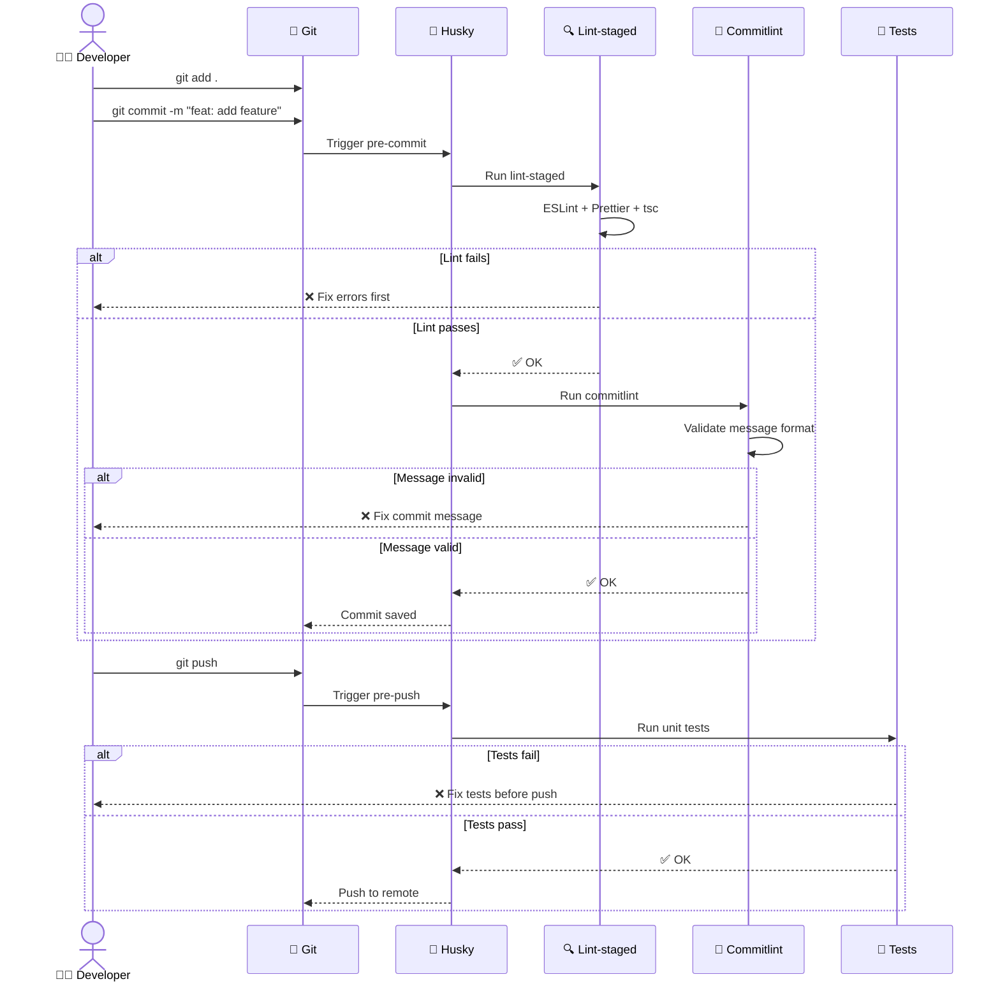

#### Beneficios

| Sin Husky                         | Con Husky                   |
| --------------------------------- | --------------------------- |
| Errores de lint llegan a PR       | ❌ Bloqueados en commit     |
| Mensajes de commit inconsistentes | ✅ Formato estandarizado    |
| Tests rotos llegan a CI           | ❌ Detectados antes de push |
| CI falla por formato              | ✅ Arreglado localmente     |
| Tiempo de CI desperdiciado        | ⏱️ CI más rápido            |

#### Scripts en package.json

```json
{
  "scripts": {
    "prepare": "husky install",
    "lint": "eslint . --ext .ts,.tsx",
    "lint:fix": "eslint . --ext .ts,.tsx --fix",
    "format": "prettier --write .",
    "type-check": "tsc --noEmit",
    "test": "vitest",
    "test:run": "vitest run",
    "commitlint": "commitlint --edit"
  }
}
```

> 💡 **Tip:** Al clonar el repo, ejecutar `pnpm install` automáticamente instala los hooks gracias al script `prepare`.

---

## 2.6 Seguridad

### 2.6.1 Modelo de Seguridad

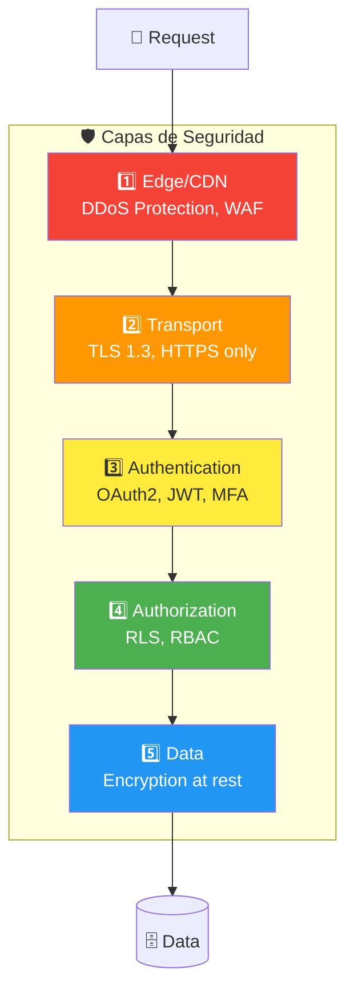

### 2.6.2 Autenticación

| Aspecto              | Implementación                     |
| -------------------- | ---------------------------------- |
| **Provider**         | Supabase Auth (GoTrue)             |
| **Método principal** | OAuth2 con Google                  |
| **Tokens**           | JWT firmados con HS256             |
| **Refresh**          | Automático con refresh tokens      |
| **Sesión**           | httpOnly cookies (no localStorage) |
| **MFA**              | Disponible para Fase 2             |

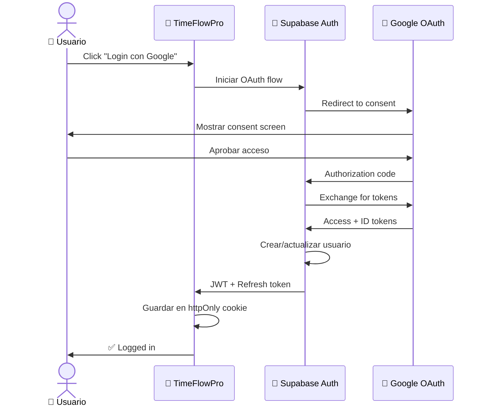

### 2.6.3 Autorización (RBAC)

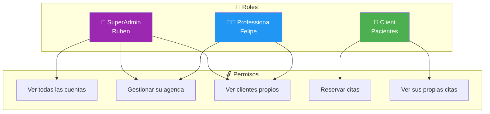

**Implementación con RLS:**

```sql
-- Políticas por rol
CREATE POLICY "SuperAdmin sees all" ON appointments
FOR ALL TO authenticated
USING (
    EXISTS (
        SELECT 1 FROM profiles
        WHERE profiles.id = auth.uid()
        AND profiles.role = 'superadmin'
    )
);

CREATE POLICY "Professional sees own" ON appointments
FOR ALL TO authenticated
USING (user_id = auth.uid());

CREATE POLICY "Client sees own bookings" ON appointments
FOR SELECT TO authenticated
USING (client_id = auth.uid());
```

### 2.6.4 Gestión de Secretos

| Secreto                     | Almacenamiento   | Acceso           |
| --------------------------- | ---------------- | ---------------- |
| `SUPABASE_SERVICE_ROLE_KEY` | GitHub Secrets   | Solo CI/CD       |
| `GOOGLE_CLIENT_SECRET`      | Vercel Env Vars  | Server-side only |
| `GOOGLE_CALENDAR_API_KEY`   | Supabase Vault   | Edge Functions   |
| Database password           | Supabase managed | Nunca expuesto   |

**Reglas:**

- ❌ **NUNCA** en código o commits
- ❌ **NUNCA** en `NEXT_PUBLIC_*` (expone al cliente)
- ✅ Variables de entorno server-side
- ✅ Supabase Vault para Edge Functions
- ✅ Rotación periódica de tokens

### 2.6.5 Protección de API

| Protección           | Implementación                              |
| -------------------- | ------------------------------------------- |
| **Rate Limiting**    | Supabase built-in (100 req/min por IP)      |
| **CORS**             | Configurado solo para dominios permitidos   |
| **Input Validation** | Zod schemas en frontend y Edge Functions    |
| **SQL Injection**    | Imposible (PostgREST + Prepared statements) |
| **XSS**              | React escapa por defecto + CSP headers      |
| **CSRF**             | SameSite cookies + tokens                   |

---

## 2.7 Estrategia de Tests

### 2.7.1 Pirámide de Tests

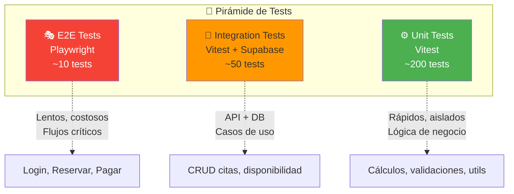

### 2.7.2 Estrategia por Tipo

| Tipo            | Herramienta       | Ubicación                   | Cobertura Target   | Ejecuta en                    |
| --------------- | ----------------- | --------------------------- | ------------------ | ----------------------------- |
| **Unit**        | Vitest            | `*.test.ts` junto al código | >80%               | ☁️ GitHub Actions (cada push) |
| **Integration** | Vitest + Supabase | `__tests__/integration/`    | Casos críticos     | ☁️ GitHub Actions (cada PR)   |
| **E2E**         | Playwright        | `e2e/`                      | Flujos principales | 💻 **Solo Local**             |
| **Visual**      | Playwright        | `e2e/`                      | Componentes UI     | 💻 **Solo Local**             |

> ⚠️ **Nota sobre E2E:** Los tests E2E con Playwright consumen muchos recursos (browser headless, timeouts, screenshots). Se ejecutan **solo en local** antes de crear PRs importantes. Esto reduce costos de CI y tiempos de build.

### 2.7.3 Ejemplos de Tests

**Unit Test (Vitest):**

```typescript
// features/appointments/utils/calculateEndTime.test.ts
import { describe, it, expect } from 'vitest'
import { calculateEndTime } from './calculateEndTime'

describe('calculateEndTime', () => {
  it('adds duration to start time', () => {
    const start = new Date('2026-01-15T10:00:00')
    const durationMinutes = 45

    const result = calculateEndTime(start, durationMinutes)

    expect(result).toEqual(new Date('2026-01-15T10:45:00'))
  })

  it('handles overnight appointments', () => {
    const start = new Date('2026-01-15T23:30:00')
    const durationMinutes = 60

    const result = calculateEndTime(start, durationMinutes)

    expect(result).toEqual(new Date('2026-01-16T00:30:00'))
  })
})
```

**Integration Test:**

```typescript
// __tests__/integration/appointments.test.ts
import { describe, it, expect, beforeAll } from 'vitest'
import { createClient } from '@supabase/supabase-js'

describe('Appointments API', () => {
  let supabase

  beforeAll(() => {
    supabase = createClient(process.env.SUPABASE_URL!, process.env.SUPABASE_SERVICE_KEY!)
  })

  it('creates appointment and blocks time slot', async () => {
    const { data, error } = await supabase
      .from('appointments')
      .insert({
        user_id: 'test-user',
        client_id: 'test-client',
        start_time: '2026-01-15T10:00:00',
        duration_minutes: 45,
      })
      .select()
      .single()

    expect(error).toBeNull()
    expect(data.status).toBe('confirmed')
  })
})
```

**E2E Test (Playwright):**

```typescript
// e2e/booking.spec.ts
import { test, expect } from '@playwright/test'

test('client can book appointment', async ({ page }) => {
  // Ir al portal de reservas
  await page.goto('/reservar/felipe')

  // Seleccionar servicio
  await page.getByRole('combobox', { name: 'Servicio' }).click()
  await page.getByRole('option', { name: 'Kinesiología' }).click()

  // Seleccionar ubicación
  await page.getByRole('combobox', { name: 'Ubicación' }).click()
  await page.getByRole('option', { name: 'Iron Gym' }).click()

  // Seleccionar horario
  await page.getByRole('button', { name: '10:00' }).click()

  // Confirmar
  await page.getByRole('button', { name: 'Confirmar Reserva' }).click()

  // Verificar confirmación
  await expect(page.getByText('Cita confirmada')).toBeVisible()
})
```

### 2.7.4 Métricas de Calidad

| Métrica                   | Umbral | Acción si falla        | Ejecuta en        |
| ------------------------- | ------ | ---------------------- | ----------------- |
| Cobertura Unit Tests      | >80%   | ❌ CI falla            | ☁️ GitHub Actions |
| Tests Integration pasando | 100%   | ❌ CI falla            | ☁️ GitHub Actions |
| Tests E2E pasando         | 100%   | ⚠️ Revisar antes de PR | 💻 Local only     |
| Lighthouse Performance    | >90    | ⚠️ Warning             | ☁️ GitHub Actions |
| Bundle Size               | <500KB | ⚠️ Warning             | ☁️ GitHub Actions |

### 2.7.5 Flujo de Testing Recomendado

```mermaid
flowchart LR
    subgraph Local["💻 Desarrollo Local"]
        Dev["Escribir código"]
        Unit1["pnpm test<br/>(Unit tests)"]
        E2E1["pnpm test:e2e<br/>(E2E con Playwright)"]
    end

    subgraph CI["☁️ GitHub Actions"]
        Lint["Lint + Type Check"]
        Unit2["Unit Tests"]
        Int["Integration Tests"]
        Build["Build"]
    end

    subgraph Deploy["🚀 Deploy"]
        Preview["Preview Deploy"]
        Prod["Production"]
    end

    Dev --> Unit1
    Unit1 -->|"Antes de PR importante"| E2E1
    E2E1 -->|"git push"| Lint
    Lint --> Unit2 --> Int --> Build
    Build --> Preview
    Preview -->|"Aprobación"| Prod

    style Local fill:#e3f2fd
    style CI fill:#fff3e0
    style Deploy fill:#e8f5e9
```

**Comandos de testing:**

```bash
# Desarrollo diario (rápido)
pnpm test              # Unit tests con Vitest
pnpm test:watch        # Watch mode

# Antes de PR importante (completo)
pnpm test:e2e          # E2E con Playwright
pnpm test:e2e:ui       # E2E con UI de Playwright

# CI ejecuta automáticamente
pnpm test:ci           # Unit + Integration (sin E2E)
```

---

## 2.8 Checklist de Validación

- [x] **Diagramas en Mermaid:** C4 Nivel 1, 2, 3 + flujos
- [x] **ADRs documentados:** 4 decisiones arquitectónicas clave
- [x] **Componentes descritos:** Tabla + detalle de cada uno
- [x] **Estructura de ficheros:** Feature Slices con justificación
- [x] **Infraestructura separada:** Diagrama independiente de arquitectura lógica
- [x] **Pipeline CI/CD:** GitHub Actions con stages
- [x] **Git Hooks con Husky:** pre-commit, commit-msg, pre-push configurados
- [x] **Conventional Commits:** Commitlint con reglas definidas
- [x] **Seguridad multinivel:** Auth, RLS, secretos, protección API
- [x] **Tests estratificados:** Pirámide con ejemplos reales (E2E solo local)
- [x] **Sin credenciales visibles:** Solo placeholders

---

## 2.9 Referencias

| Documento           | Ubicación                                              |
| ------------------- | ------------------------------------------------------ |
| Ficha del Proyecto  | [`0-FichaProyecto.md`](./0-FichaProyecto.md)           |
| Descripción General | [`1-DescripcionGeneral.md`](./1-DescripcionGeneral.md) |
| Modelo de Datos     | [`3-ModeloDatos.md`](./3-ModeloDatos.md)               |
| Supabase Docs       | [supabase.com/docs](https://supabase.com/docs)         |
| Next.js 14 Docs     | [nextjs.org/docs](https://nextjs.org/docs)             |
| C4 Model            | [c4model.com](https://c4model.com)                     |

---

**Última actualización:** Enero 2026  
**Versión del documento:** 1.1.0
