# 2. Arquitectura del Sistema - TimeFlowPro

---

## 2.1 Diagrama de Arquitectura

### 2.1.1 Vista General del Sistema (C4 - Nivel 1: Contexto)

```mermaid
flowchart TB
    subgraph Usuarios["👥 Usuarios"]
        Pro["🧑‍⚕️ Profesional Móvil<br/>(Felipe)"]
        Cli["👤 Cliente<br/>(Paciente)"]
        Admin["👨‍💼 SuperAdmin<br/>(Ruben)"]
    end

    subgraph Sistema["📱 TimeFlowPro"]
        TFP["🗓️ Sistema de Agendamiento<br/>Inteligente"]
    end

    subgraph Externos["🔗 Sistemas Externos"]
        GCal["📅 Google Calendar<br/>Sincronización + Notificaciones"]
        GMaps["🗺️ Google Maps<br/>Cálculo de rutas (Fase 2)"]
        MPago["💳 MercadoPago<br/>Pagos (Fase 2)"]
    end

    Pro -->|"Gestiona agenda<br/>HTTPS"| TFP
    Cli -->|"Reserva citas<br/>HTTPS"| TFP
    Admin -->|"Administra usuarios<br/>HTTPS"| TFP
    
    TFP <-->|"Sync bidireccional<br/>OAuth2 + REST"| GCal
    TFP -->|"Calcula rutas<br/>REST API"| GMaps
    TFP -->|"Procesa pagos<br/>Webhooks"| MPago

    style Sistema fill:#4CAF50,color:#fff
    style Externos fill:#2196F3,color:#fff
```

### 2.1.2 Diagrama de Contenedores (C4 - Nivel 2)

```mermaid
flowchart TB
    subgraph Usuarios["👥 Usuarios"]
        Pro["🧑‍⚕️ Profesional"]
        Cli["👤 Cliente"]
    end

    subgraph Vercel["☁️ Vercel Edge Network"]
        subgraph Frontend["🖥️ Frontend Container"]
            NextJS["📱 Next.js 14 PWA<br/>App Router + RSC<br/>TailwindCSS + TypeScript"]
        end
    end

    subgraph SupabaseCloud["☁️ Supabase Cloud"]
        subgraph Auth["🔐 Auth Service"]
            SAuth["Supabase Auth<br/>OAuth2 + JWT<br/>Google Provider"]
        end
        
        subgraph API["🔌 API Layer"]
            PostgREST["PostgREST<br/>Auto-generated REST API"]
            EdgeFn["Edge Functions<br/>Deno Runtime<br/>Lógica compleja"]
        end
        
        subgraph Realtime["📡 Realtime"]
            RT["Supabase Realtime<br/>WebSocket<br/>Postgres Changes"]
        end
        
        subgraph Storage["💾 Storage"]
            DB[("🗄️ PostgreSQL 15<br/>+ Row Level Security")]
            Files["📁 Supabase Storage<br/>Archivos/Imágenes"]
        end
    end

    subgraph External["🔗 Servicios Externos"]
        GCal["📅 Google Calendar API"]
        GMaps["🗺️ Google Maps API<br/>(Fase 2)"]
    end

    Pro -->|"HTTPS"| NextJS
    Cli -->|"HTTPS"| NextJS
    
    NextJS -->|"JWT + HTTPS"| SAuth
    NextJS -->|"REST/JSON"| PostgREST
    NextJS -->|"HTTPS"| EdgeFn
    NextJS <-->|"WSS"| RT
    
    SAuth --> DB
    PostgREST --> DB
    EdgeFn --> DB
    EdgeFn --> GCal
    EdgeFn --> GMaps
    RT --> DB

    style Frontend fill:#000,color:#fff
    style SupabaseCloud fill:#3ECF8E,color:#fff
    style External fill:#4285F4,color:#fff
```

### 2.1.3 Diagrama de Componentes (C4 - Nivel 3: Frontend)

```mermaid
flowchart TB
    subgraph NextApp["📱 Next.js 14 Application"]
        subgraph Pages["📄 App Router Pages"]
            Landing["/ <br/>Landing Page"]
            Login["/login<br/>Auth Flow"]
            Dashboard["/dashboard<br/>Vista Profesional"]
            Booking["/reservar/[slug]<br/>Portal Público"]
            Settings["/settings<br/>Configuración"]
        end

        subgraph Components["🧩 Componentes React"]
            Calendar["CalendarView<br/>Vista de agenda"]
            AppointmentForm["AppointmentForm<br/>Crear/Editar cita"]
            LocationManager["LocationManager<br/>Gestión ubicaciones"]
            ClientList["ClientList<br/>Lista de clientes"]
            TimeSlotPicker["TimeSlotPicker<br/>Selector de horarios"]
        end

        subgraph Hooks["🪝 Custom Hooks"]
            useAuth["useAuth()<br/>Estado de autenticación"]
            useAppointments["useAppointments()<br/>CRUD de citas"]
            useAvailability["useAvailability()<br/>Slots disponibles"]
            useRealtime["useRealtime()<br/>Subscripciones WS"]
        end

        subgraph Services["⚙️ Services Layer"]
            SupaClient["supabaseClient<br/>Cliente singleton"]
            CalendarSync["calendarSync<br/>Google Calendar"]
            TravelCalc["travelCalculator<br/>Tiempo traslado"]
        end
    end

    Pages --> Components
    Components --> Hooks
    Hooks --> Services
    Services --> API["☁️ Supabase API"]

    style NextApp fill:#000,color:#fff
```

### 2.1.4 Flujo de Datos en Tiempo Real

```mermaid
sequenceDiagram
    autonumber
    participant Cliente as 👤 Cliente
    participant Portal as 🌐 Portal Reservas
    participant Prof as 🧑‍⚕️ Dashboard Felipe
    participant Supabase as ☁️ Supabase
    participant GCal as 📅 Google Calendar

    Note over Cliente,GCal: Escenario: Cliente reserva mientras Felipe ve su dashboard

    Cliente->>Portal: Selecciona horario 10:00
    Portal->>Supabase: POST /appointments
    
    par Notificación en tiempo real
        Supabase-->>Prof: 📡 WebSocket: nueva cita
        Prof->>Prof: UI actualiza automáticamente
    and Sincronización calendario
        Supabase->>GCal: Crear evento
        GCal-->>Supabase: Evento creado ✓
    end
    
    Supabase-->>Portal: 201 Created
    Portal-->>Cliente: ✅ Cita confirmada

    Note over Prof: Felipe ve la nueva cita instantáneamente<br/>sin refrescar la página
```

---

## 2.2 Decisiones Arquitectónicas (ADRs)

### ADR-001: Supabase como Backend-as-a-Service

| Campo | Valor |
|-------|-------|
| **Estado** | ✅ Aceptado |
| **Fecha** | Enero 2026 |
| **Decisores** | Ruben Contreras |

**Contexto:**
Necesitamos un backend para TimeFlowPro MVP. Opciones evaluadas:
1. Backend custom con NestJS/Spring Boot
2. Firebase (Google)
3. Supabase (Open Source)

**Decisión:**
Usar **Supabase** como BaaS principal.

**Justificación:**

| Criterio | NestJS Custom | Firebase | Supabase ✅ |
|----------|---------------|----------|-------------|
| Tiempo de desarrollo | 10-14 semanas | 6-8 semanas | 4-6 semanas |
| Base de datos | PostgreSQL (manual) | Firestore (NoSQL) | PostgreSQL (managed) |
| Auth integrado | ❌ Implementar | ✅ Sí | ✅ Sí |
| API automática | ❌ Escribir todo | ❌ Solo SDK | ✅ PostgREST |
| Row Level Security | ❌ Manual | ⚠️ Rules limitadas | ✅ RLS nativo |
| Vendor lock-in | ✅ Ninguno | ❌ Alto | ⚠️ Bajo (open source) |
| Costo MVP | $50-100/mes | $0-25/mes | $0-25/mes |
| Migrabilidad | ✅ Total | ❌ Difícil | ✅ PostgreSQL estándar |

**Consecuencias:**
- ✅ Desarrollo 60% más rápido
- ✅ Auth, API, Realtime incluidos
- ✅ PostgreSQL permite migración futura
- ⚠️ Lógica muy compleja requiere Edge Functions
- ⚠️ Dependencia de Supabase Cloud (mitigable con self-host)

**Reversibilidad:** Alta - PostgreSQL estándar, datos 100% exportables.

---

### ADR-002: Arquitectura Modular con Feature Slices

| Campo | Valor |
|-------|-------|
| **Estado** | ✅ Aceptado |
| **Fecha** | Enero 2026 |

**Contexto:**
¿Cómo organizar el código del frontend para escalabilidad?

**Decisión:**
Usar **Feature Slices Architecture** en lugar de arquitectura por capas tradicional.

```mermaid
flowchart LR
    subgraph Traditional["❌ Tradicional (por capas)"]
        direction TB
        C1["/components"]
        H1["/hooks"]
        S1["/services"]
        P1["/pages"]
    end

    subgraph FeatureSlices["✅ Feature Slices"]
        direction TB
        subgraph F1["/features/appointments"]
            C2["components/"]
            H2["hooks/"]
            S2["services/"]
            T2["types/"]
        end
        subgraph F2["/features/locations"]
            C3["components/"]
            H3["hooks/"]
            S3["services/"]
        end
        subgraph F3["/features/clients"]
            C4["..."]
        end
    end

    Traditional -.->|"Escalabilidad limitada"| X["❌"]
    FeatureSlices -.->|"Fácil de escalar"| Y["✅"]
```

**Justificación:**
- Cada feature es autocontenida
- Fácil añadir nuevas features sin afectar otras
- Permite extraer features a packages si escala
- Testing aislado por feature

---

### ADR-003: Row Level Security para Multi-tenancy

| Campo | Valor |
|-------|-------|
| **Estado** | ✅ Aceptado |
| **Fecha** | Enero 2026 |

**Contexto:**
Cada profesional debe ver solo SUS datos. ¿Cómo implementar aislamiento?

**Decisión:**
Usar **Row Level Security (RLS)** de PostgreSQL en lugar de filtros en código.

```sql
-- Ejemplo: Política RLS para tabla appointments
CREATE POLICY "Users can only see their own appointments"
ON appointments
FOR ALL
USING (
    user_id = auth.uid()
    OR 
    client_id IN (SELECT id FROM clients WHERE user_id = auth.uid())
);
```


**Justificación:**
- Seguridad a nivel de base de datos (no bypasseable)
- No requiere código en cada query
- Funciona automáticamente con PostgREST
- Auditable y testeable

---

### ADR-004: Sincronización Bidireccional con Google Calendar

| Campo | Valor |
|-------|-------|
| **Estado** | ✅ Aceptado |
| **Fecha** | Enero 2026 |

**Contexto:**
¿Cómo sincronizar citas con Google Calendar?

**Decisión:**
Implementar sincronización bidireccional via webhooks.

```mermaid
flowchart TB
    subgraph TFP["TimeFlowPro"]
        DB[("🗄️ PostgreSQL")]
        Edge["⚡ Edge Function<br/>calendar-sync"]
    end

    subgraph Google["Google Calendar"]
        GCal["📅 Calendar API"]
        Watch["👁️ Watch Channel"]
    end

    subgraph Flows["Flujos"]
        direction LR
        F1["1️⃣ TFP → GCal<br/>Crear/Actualizar/Eliminar"]
        F2["2️⃣ GCal → TFP<br/>Webhook notifications"]
    end

    DB -->|"Trigger on INSERT/UPDATE"| Edge
    Edge -->|"REST API"| GCal
    
    Watch -->|"Push Notification"| Edge
    Edge -->|"Sync changes"| DB

    style TFP fill:#3ECF8E
    style Google fill:#4285F4,color:#fff
```

**Flujo detallado:**

1. **TFP → Google Calendar:**
   - Trigger PostgreSQL detecta cambio en `appointments`
   - Edge Function recibe evento
   - Crea/actualiza/elimina evento en GCal

2. **Google Calendar → TFP:**
   - Watch channel configurado para el calendario
   - Google envía webhook cuando hay cambios
   - Edge Function sincroniza cambios a PostgreSQL
   - Marca eventos externos como `source: 'google_calendar'`

---

## 2.3 Descripción de Componentes Principales

### 2.3.1 Tabla de Componentes

| Componente | Responsabilidad | Stack | Comunicación | Ubicación |
|------------|-----------------|-------|--------------|-----------|
| **Next.js PWA** | UI, SSR, routing, estado cliente | Next.js 14, React 18, TypeScript 5 | HTTPS, WSS | Vercel Edge |
| **Supabase Auth** | Autenticación, sesiones, OAuth | GoTrue, JWT | HTTPS/OAuth2 | Supabase Cloud |
| **PostgREST** | API REST auto-generada | PostgREST 11 | REST/JSON | Supabase Cloud |
| **Edge Functions** | Lógica de negocio compleja | Deno, TypeScript | HTTPS | Supabase Edge |
| **PostgreSQL** | Persistencia, RLS, triggers | PostgreSQL 15 | TCP/5432 | Supabase Cloud |
| **Realtime** | Subscripciones WebSocket | Elixir, Phoenix | WSS | Supabase Cloud |
| **Google Calendar** | Sincronización, notificaciones | REST API v3 | HTTPS/OAuth2 | Google Cloud |

### 2.3.2 Detalle por Componente

#### 🖥️ Next.js 14 PWA

```mermaid
flowchart TB
    subgraph NextJS["Next.js 14 Application"]
        subgraph AppRouter["App Router"]
            RSC["React Server Components<br/>Fetch en servidor"]
            Client["Client Components<br/>Interactividad"]
        end
        
        subgraph Features["Feature Modules"]
            Auth["🔐 auth/"]
            Appointments["📅 appointments/"]
            Locations["📍 locations/"]
            Clients["👥 clients/"]
            Booking["🎫 booking/"]
        end
        
        subgraph Infra["Infraestructura"]
            PWA["📱 PWA Config<br/>next-pwa"]
            Middleware["🛡️ Middleware<br/>Auth + Routing"]
            API["🔌 Route Handlers<br/>/api/*"]
        end
    end
```

**Responsabilidades:**
- ✅ Renderizado de UI (SSR + CSR)
- ✅ Routing y navegación
- ✅ Estado del cliente (React Query)
- ✅ PWA: offline, instalable
- ✅ Middleware de autenticación

**NO hace:**
- ❌ Lógica de negocio compleja
- ❌ Acceso directo a base de datos
- ❌ Almacenamiento de secretos

---

#### ⚡ Supabase Edge Functions

```mermaid
flowchart LR
    subgraph EdgeFunctions["Edge Functions (Deno)"]
        Sync["calendar-sync<br/>Sincronización GCal"]
        Travel["calculate-travel<br/>Tiempo traslado (F2)"]
        Notify["send-notification<br/>Emails/SMS (F2)"]
        Webhook["webhook-handler<br/>MercadoPago (F2)"]
    end

    Trigger["🔔 Triggers"] --> EdgeFunctions
    API["🌐 HTTP"] --> EdgeFunctions
    EdgeFunctions --> External["🔗 APIs Externas"]
```

**Responsabilidades:**
- ✅ Lógica que no puede ser RLS/SQL
- ✅ Integración con APIs externas
- ✅ Procesamiento de webhooks
- ✅ Operaciones asíncronas

---

## 2.4 Estructura de Ficheros

### 2.4.1 Estructura del Monorepo

```
timeflowpro/
├── 📁 apps/
│   └── 📁 web/                          # Next.js 14 PWA
│       ├── 📁 app/                      # App Router
│       │   ├── 📁 (auth)/               # Grupo de rutas auth
│       │   │   ├── login/page.tsx
│       │   │   └── callback/page.tsx
│       │   ├── 📁 (dashboard)/          # Grupo rutas protegidas
│       │   │   ├── layout.tsx           # Layout con sidebar
│       │   │   ├── page.tsx             # Dashboard principal
│       │   │   ├── 📁 appointments/
│       │   │   ├── 📁 clients/
│       │   │   ├── 📁 locations/
│       │   │   └── 📁 settings/
│       │   ├── 📁 reservar/             # Portal público
│       │   │   └── [slug]/page.tsx
│       │   ├── layout.tsx               # Root layout
│       │   ├── page.tsx                 # Landing page
│       │   └── globals.css
│       │
│       ├── 📁 features/                 # 🎯 Feature Slices
│       │   ├── 📁 appointments/
│       │   │   ├── 📁 components/
│       │   │   │   ├── AppointmentCard.tsx
│       │   │   │   ├── AppointmentForm.tsx
│       │   │   │   ├── CalendarView.tsx
│       │   │   │   └── index.ts
│       │   │   ├── 📁 hooks/
│       │   │   │   ├── useAppointments.ts
│       │   │   │   ├── useAvailability.ts
│       │   │   │   └── index.ts
│       │   │   ├── 📁 services/
│       │   │   │   └── appointmentService.ts
│       │   │   ├── 📁 types/
│       │   │   │   └── appointment.types.ts
│       │   │   └── index.ts
│       │   │
│       │   ├── 📁 locations/
│       │   │   ├── components/
│       │   │   ├── hooks/
│       │   │   ├── services/
│       │   │   └── types/
│       │   │
│       │   ├── 📁 clients/
│       │   ├── 📁 auth/
│       │   └── 📁 booking/
│       │
│       ├── 📁 components/               # Componentes compartidos
│       │   ├── 📁 ui/                   # Primitivos UI (shadcn)
│       │   │   ├── Button.tsx
│       │   │   ├── Input.tsx
│       │   │   ├── Modal.tsx
│       │   │   └── ...
│       │   └── 📁 layout/
│       │       ├── Sidebar.tsx
│       │       ├── Header.tsx
│       │       └── MobileNav.tsx
│       │
│       ├── 📁 lib/                      # Utilidades
│       │   ├── supabase/
│       │   │   ├── client.ts            # Cliente browser
│       │   │   ├── server.ts            # Cliente server
│       │   │   └── middleware.ts
│       │   ├── utils.ts
│       │   └── constants.ts
│       │
│       ├── 📁 styles/
│       │   └── globals.css
│       │
│       ├── middleware.ts                # Auth middleware
│       ├── next.config.js
│       ├── tailwind.config.js
│       └── tsconfig.json
│
├── 📁 packages/
│   └── 📁 shared/                       # Código compartido
│       ├── 📁 types/                    # Tipos TypeScript
│       │   ├── database.types.ts        # Generado por Supabase
│       │   └── index.ts
│       ├── 📁 utils/
│       │   ├── date.ts
│       │   ├── validation.ts
│       │   └── index.ts
│       └── package.json
│
├── 📁 supabase/
│   ├── 📁 migrations/                   # Migraciones SQL
│   │   ├── 20260115000000_initial_schema.sql
│   │   ├── 20260115000001_rls_policies.sql
│   │   └── 20260115000002_functions.sql
│   ├── 📁 functions/                    # Edge Functions
│   │   ├── 📁 calendar-sync/
│   │   │   └── index.ts
│   │   ├── 📁 calculate-travel/
│   │   │   └── index.ts
│   │   └── 📁 _shared/
│   │       └── cors.ts
│   ├── seed.sql                         # Datos de prueba
│   └── config.toml
│
├── 📁 docs/                             # Documentación técnica
│   ├── adr/                             # Architecture Decision Records
│   ├── api/                             # OpenAPI specs
│   └── diagrams/                        # Diagramas fuente
│
├── 📁 .github/
│   └── 📁 workflows/
│       ├── ci.yml                       # Tests + Lint
│       ├── deploy-preview.yml           # Preview deployments
│       └── deploy-production.yml        # Deploy a producción
│
├── .env.example
├── .gitignore
├── package.json
├── pnpm-workspace.yaml
├── turbo.json                           # Turborepo config
└── README.md
```

### 2.4.2 Justificación de la Estructura

```mermaid
flowchart TB
    subgraph Principios["🎯 Principios Aplicados"]
        P1["Feature Slices<br/>Código organizado por dominio"]
        P2["Colocation<br/>Archivos relacionados juntos"]
        P3["Monorepo<br/>Código compartido entre apps"]
        P4["Separation of Concerns<br/>UI / Lógica / Datos"]
    end

    subgraph Beneficios["✅ Beneficios"]
        B1["Fácil de navegar"]
        B2["Escalable a más features"]
        B3["Testing aislado"]
        B4["Onboarding rápido"]
    end

    Principios --> Beneficios
```

---

## 2.5 Infraestructura y Despliegue

### 2.5.1 Diagrama de Infraestructura


### 2.5.2 Ambientes

| Ambiente | URL | Branch | Base de Datos | Propósito |
|----------|-----|--------|---------------|-----------|
| **Local** | localhost:3000 | - | Supabase Local | Desarrollo |
| **Preview** | pr-123.timeflowpro.vercel.app | PR branches | Supabase Staging | Review PRs |
| **Staging** | staging.timeflowpro.app | `develop` | Supabase Staging | QA y testing |
| **Producción** | timeflowpro.app | `main` | Supabase Production | Usuarios reales |

### 2.5.3 Pipeline CI/CD

```mermaid
flowchart LR
    subgraph Trigger["🎯 Trigger"]
        Push["git push"]
        PR["Pull Request"]
    end

    subgraph CI["🔄 CI Pipeline"]
        Lint["1️⃣ Lint<br/>ESLint + Prettier"]
        Types["2️⃣ Type Check<br/>tsc --noEmit"]
        Test["3️⃣ Tests<br/>Vitest"]
        Build["4️⃣ Build<br/>next build"]
    end

    subgraph CD["🚀 CD Pipeline"]
        Preview2["Preview Deploy<br/>Vercel"]
        Staging["Staging Deploy<br/>Auto on develop"]
        Prod["Production Deploy<br/>Manual approval"]
    end

    Push --> CI
    PR --> CI
    CI -->|"Pass"| CD
    CI -->|"Fail"| Block["❌ Block Merge"]

    style CI fill:#2196F3,color:#fff
    style CD fill:#4CAF50,color:#fff
```

#### GitHub Actions Workflow

```yaml
# .github/workflows/ci.yml
name: CI

on:
  push:
    branches: [main, develop]
  pull_request:
    branches: [main, develop]

jobs:
  quality:
    runs-on: ubuntu-latest
    steps:
      - uses: actions/checkout@v4
      - uses: pnpm/action-setup@v2
      - uses: actions/setup-node@v4
        with:
          node-version: 20
          cache: 'pnpm'
      
      - run: pnpm install --frozen-lockfile
      
      - name: Lint
        run: pnpm lint
      
      - name: Type Check
        run: pnpm type-check
      
      - name: Test
        run: pnpm test -- --coverage
      
      - name: Build
        run: pnpm build

  deploy-preview:
    needs: quality
    if: github.event_name == 'pull_request'
    runs-on: ubuntu-latest
    steps:
      - uses: actions/checkout@v4
      - uses: amondnet/vercel-action@v25
        with:
          vercel-token: ${{ secrets.VERCEL_TOKEN }}
          vercel-org-id: ${{ secrets.VERCEL_ORG_ID }}
          vercel-project-id: ${{ secrets.VERCEL_PROJECT_ID }}
```

---

## 2.6 Seguridad

### 2.6.1 Modelo de Seguridad

```mermaid
flowchart TB
    subgraph Capas["🛡️ Capas de Seguridad"]
        L1["1️⃣ Edge/CDN<br/>DDoS Protection, WAF"]
        L2["2️⃣ Transport<br/>TLS 1.3, HTTPS only"]
        L3["3️⃣ Authentication<br/>OAuth2, JWT, MFA"]
        L4["4️⃣ Authorization<br/>RLS, RBAC"]
        L5["5️⃣ Data<br/>Encryption at rest"]
    end

    Request["📨 Request"] --> L1 --> L2 --> L3 --> L4 --> L5 --> Data[("🗄️ Data")]

    style L1 fill:#f44336,color:#fff
    style L2 fill:#ff9800,color:#fff
    style L3 fill:#ffeb3b
    style L4 fill:#4caf50,color:#fff
    style L5 fill:#2196f3,color:#fff
```

### 2.6.2 Autenticación

| Aspecto | Implementación |
|---------|---------------|
| **Provider** | Supabase Auth (GoTrue) |
| **Método principal** | OAuth2 con Google |
| **Tokens** | JWT firmados con HS256 |
| **Refresh** | Automático con refresh tokens |
| **Sesión** | httpOnly cookies (no localStorage) |
| **MFA** | Disponible para Fase 2 |

```mermaid
sequenceDiagram
    actor User as 👤 Usuario
    participant App as 📱 TimeFlowPro
    participant Auth as 🔐 Supabase Auth
    participant Google as 🔵 Google OAuth

    User->>App: Click "Login con Google"
    App->>Auth: Iniciar OAuth flow
    Auth->>Google: Redirect to consent
    Google->>User: Mostrar consent screen
    User->>Google: Aprobar acceso
    Google->>Auth: Authorization code
    Auth->>Google: Exchange for tokens
    Google->>Auth: Access + ID tokens
    Auth->>Auth: Crear/actualizar usuario
    Auth->>App: JWT + Refresh token
    App->>App: Guardar en httpOnly cookie
    App->>User: ✅ Logged in
```

### 2.6.3 Autorización (RBAC)

```mermaid
flowchart TB
    subgraph Roles["👥 Roles"]
        Super["👑 SuperAdmin<br/>Ruben"]
        Prof["🧑‍⚕️ Professional<br/>Felipe"]
        Client["👤 Client<br/>Pacientes"]
    end

    subgraph Permisos["🔓 Permisos"]
        P1["Ver todas las cuentas"]
        P2["Gestionar su agenda"]
        P3["Ver clientes propios"]
        P4["Reservar citas"]
        P5["Ver sus propias citas"]
    end

    Super --> P1
    Super --> P2
    Super --> P3
    Prof --> P2
    Prof --> P3
    Client --> P4
    Client --> P5

    style Super fill:#9c27b0,color:#fff
    style Prof fill:#2196f3,color:#fff
    style Client fill:#4caf50,color:#fff
```

**Implementación con RLS:**

```sql
-- Políticas por rol
CREATE POLICY "SuperAdmin sees all" ON appointments
FOR ALL TO authenticated
USING (
    EXISTS (
        SELECT 1 FROM profiles 
        WHERE profiles.id = auth.uid() 
        AND profiles.role = 'superadmin'
    )
);

CREATE POLICY "Professional sees own" ON appointments
FOR ALL TO authenticated
USING (user_id = auth.uid());

CREATE POLICY "Client sees own bookings" ON appointments
FOR SELECT TO authenticated
USING (client_id = auth.uid());
```

### 2.6.4 Gestión de Secretos

| Secreto | Almacenamiento | Acceso |
|---------|----------------|--------|
| `SUPABASE_SERVICE_ROLE_KEY` | GitHub Secrets | Solo CI/CD |
| `GOOGLE_CLIENT_SECRET` | Vercel Env Vars | Server-side only |
| `GOOGLE_CALENDAR_API_KEY` | Supabase Vault | Edge Functions |
| Database password | Supabase managed | Nunca expuesto |

**Reglas:**
- ❌ **NUNCA** en código o commits
- ❌ **NUNCA** en `NEXT_PUBLIC_*` (expone al cliente)
- ✅ Variables de entorno server-side
- ✅ Supabase Vault para Edge Functions
- ✅ Rotación periódica de tokens

### 2.6.5 Protección de API

| Protección | Implementación |
|------------|---------------|
| **Rate Limiting** | Supabase built-in (100 req/min por IP) |
| **CORS** | Configurado solo para dominios permitidos |
| **Input Validation** | Zod schemas en frontend y Edge Functions |
| **SQL Injection** | Imposible (PostgREST + Prepared statements) |
| **XSS** | React escapa por defecto + CSP headers |
| **CSRF** | SameSite cookies + tokens |

---

## 2.7 Estrategia de Tests

### 2.7.1 Pirámide de Tests

```mermaid
flowchart TB
    subgraph Pyramid["🔺 Pirámide de Tests"]
        E2E["🎭 E2E Tests<br/>Playwright<br/>~10 tests"]
        Integration["🔗 Integration Tests<br/>Vitest + Supabase<br/>~50 tests"]
        Unit["⚙️ Unit Tests<br/>Vitest<br/>~200 tests"]
    end

    E2E -.->|"Lentos, costosos<br/>Flujos críticos"| Critical["Login, Reservar, Pagar"]
    Integration -.->|"API + DB<br/>Casos de uso"| UseCases["CRUD citas, disponibilidad"]
    Unit -.->|"Rápidos, aislados<br/>Lógica de negocio"| Logic["Cálculos, validaciones, utils"]

    style E2E fill:#f44336,color:#fff
    style Integration fill:#ff9800
    style Unit fill:#4caf50,color:#fff
```

### 2.7.2 Estrategia por Tipo

| Tipo | Herramienta | Ubicación | Cobertura Target | Ejecuta en |
|------|-------------|-----------|------------------|------------|
| **Unit** | Vitest | `*.test.ts` junto al código | >80% | Cada push |
| **Integration** | Vitest + Supabase | `__tests__/integration/` | Casos críticos | Cada PR |
| **E2E** | Playwright | `e2e/` | Flujos principales | Pre-deploy |
| **Visual** | Playwright | `e2e/` | Componentes UI | Opcional |

### 2.7.3 Ejemplos de Tests

**Unit Test (Vitest):**

```typescript
// features/appointments/utils/calculateEndTime.test.ts
import { describe, it, expect } from 'vitest';
import { calculateEndTime } from './calculateEndTime';

describe('calculateEndTime', () => {
  it('adds duration to start time', () => {
    const start = new Date('2026-01-15T10:00:00');
    const durationMinutes = 45;
    
    const result = calculateEndTime(start, durationMinutes);
    
    expect(result).toEqual(new Date('2026-01-15T10:45:00'));
  });

  it('handles overnight appointments', () => {
    const start = new Date('2026-01-15T23:30:00');
    const durationMinutes = 60;
    
    const result = calculateEndTime(start, durationMinutes);
    
    expect(result).toEqual(new Date('2026-01-16T00:30:00'));
  });
});
```

**Integration Test:**

```typescript
// __tests__/integration/appointments.test.ts
import { describe, it, expect, beforeAll } from 'vitest';
import { createClient } from '@supabase/supabase-js';

describe('Appointments API', () => {
  let supabase;

  beforeAll(() => {
    supabase = createClient(
      process.env.SUPABASE_URL!,
      process.env.SUPABASE_SERVICE_KEY!
    );
  });

  it('creates appointment and blocks time slot', async () => {
    const { data, error } = await supabase
      .from('appointments')
      .insert({
        user_id: 'test-user',
        client_id: 'test-client',
        start_time: '2026-01-15T10:00:00',
        duration_minutes: 45
      })
      .select()
      .single();

    expect(error).toBeNull();
    expect(data.status).toBe('confirmed');
  });
});
```

**E2E Test (Playwright):**

```typescript
// e2e/booking.spec.ts
import { test, expect } from '@playwright/test';

test('client can book appointment', async ({ page }) => {
  // Ir al portal de reservas
  await page.goto('/reservar/felipe');
  
  // Seleccionar servicio
  await page.getByRole('combobox', { name: 'Servicio' }).click();
  await page.getByRole('option', { name: 'Kinesiología' }).click();
  
  // Seleccionar ubicación
  await page.getByRole('combobox', { name: 'Ubicación' }).click();
  await page.getByRole('option', { name: 'Iron Gym' }).click();
  
  // Seleccionar horario
  await page.getByRole('button', { name: '10:00' }).click();
  
  // Confirmar
  await page.getByRole('button', { name: 'Confirmar Reserva' }).click();
  
  // Verificar confirmación
  await expect(page.getByText('Cita confirmada')).toBeVisible();
});
```

### 2.7.4 Métricas de Calidad

| Métrica | Umbral | Acción si falla |
|---------|--------|-----------------|
| Cobertura Unit Tests | >80% | ❌ CI falla |
| Tests Integration pasando | 100% | ❌ CI falla |
| Tests E2E pasando | 100% | ❌ Deploy bloqueado |
| Lighthouse Performance | >90 | ⚠️ Warning |
| Bundle Size | <500KB | ⚠️ Warning |

---

## 2.8 Checklist de Validación

- [x] **Diagramas en Mermaid:** C4 Nivel 1, 2, 3 + flujos
- [x] **ADRs documentados:** 4 decisiones arquitectónicas clave
- [x] **Componentes descritos:** Tabla + detalle de cada uno
- [x] **Estructura de ficheros:** Feature Slices con justificación
- [x] **Infraestructura separada:** Diagrama independiente de arquitectura lógica
- [x] **Pipeline CI/CD:** GitHub Actions con stages
- [x] **Seguridad multinivel:** Auth, RLS, secretos, protección API
- [x] **Tests estratificados:** Pirámide con ejemplos reales
- [x] **Sin credenciales visibles:** Solo placeholders

---

## 2.9 Referencias

| Documento | Ubicación |
|-----------|-----------|
| Ficha del Proyecto | [`0-FichaProyecto.md`](./0-FichaProyecto.md) |
| Descripción General | [`1-DescripcionGeneral.md`](./1-DescripcionGeneral.md) |
| Modelo de Datos | [`3-ModeloDatos.md`](./3-ModeloDatos.md) |
| Supabase Docs | [supabase.com/docs](https://supabase.com/docs) |
| Next.js 14 Docs | [nextjs.org/docs](https://nextjs.org/docs) |
| C4 Model | [c4model.com](https://c4model.com) |

---

**Última actualización:** Enero 2026  
**Versión del documento:** 1.0.0

