# 3. Modelo de Datos - TimeFlowPro

---

## 3.1 Diagrama Entidad-Relación

### 3.1.1 Diagrama ERD Completo

```mermaid
erDiagram
    %% ========================================
    %% CORE ENTITIES
    %% ========================================
    
    PROFILES ||--o{ LOCATIONS : "works_at"
    PROFILES ||--o{ SERVICES : "offers"
    PROFILES ||--o{ CLIENTS : "has"
    PROFILES ||--o{ WORKING_HOURS : "defines"
    PROFILES ||--|| GOOGLE_CALENDAR_TOKENS : "connects"
    
    CLIENTS ||--o{ APPOINTMENTS : "books"
    CLIENTS ||--o{ CLIENT_SERVICE_DURATIONS : "has_history"
    
    LOCATIONS ||--o{ APPOINTMENTS : "hosts"
    LOCATIONS ||--o{ WORKING_HOURS : "has_schedule"
    LOCATIONS ||--o{ LOCATION_TRAVEL_TIMES : "from"
    LOCATIONS ||--o{ LOCATION_TRAVEL_TIMES : "to"
    
    SERVICES ||--o{ APPOINTMENTS : "provides"
    SERVICES ||--o{ CLIENT_SERVICE_DURATIONS : "tracked_in"
    SERVICES ||--o{ LOCATION_SERVICES : "available_at"
    LOCATIONS ||--o{ LOCATION_SERVICES : "offers"
    
    APPOINTMENTS ||--o| TRAVEL_BLOCKS : "preceded_by"
    APPOINTMENTS ||--o| GOOGLE_CALENDAR_EVENTS : "synced_to"

    %% ========================================
    %% ENTITY DEFINITIONS
    %% ========================================

    PROFILES {
        uuid id PK "Referencias auth.users(id)"
        string email UK "Email único"
        string full_name "Nombre completo"
        string phone "Teléfono contacto"
        string slug UK "URL pública: /reservar/slug"
        string timezone "America/Santiago"
        string avatar_url "URL foto perfil"
        enum role "professional | superadmin"
        boolean is_active "Estado de cuenta"
        jsonb settings "Configuraciones"
        timestamptz created_at
        timestamptz updated_at
    }

    LOCATIONS {
        uuid id PK
        uuid user_id FK "Profesional dueño"
        string name "Nombre ubicación"
        string address "Dirección completa"
        decimal latitude "Coordenada lat"
        decimal longitude "Coordenada lng"
        string color "Color en calendario"
        boolean is_active "Activa/Inactiva"
        int order_index "Orden de display"
        timestamptz created_at
        timestamptz updated_at
    }

    SERVICES {
        uuid id PK
        uuid user_id FK "Profesional dueño"
        string name "Nombre servicio"
        text description "Descripción"
        int default_duration_minutes "Duración por defecto"
        decimal price "Precio (CLP)"
        string color "Color en calendario"
        boolean is_active "Activo/Inactivo"
        boolean allow_online_booking "Reserva online"
        int buffer_time_minutes "Tiempo buffer post-cita"
        int order_index "Orden de display"
        timestamptz created_at
        timestamptz updated_at
    }

    CLIENTS {
        uuid id PK
        uuid user_id FK "Profesional dueño"
        string name "Nombre cliente"
        string email "Email cliente"
        string phone "Teléfono"
        text notes "Notas internas"
        date birthdate "Fecha nacimiento"
        enum source "manual | online_booking | import"
        jsonb custom_fields "Campos personalizados"
        timestamptz created_at
        timestamptz updated_at
        timestamptz deleted_at "Soft delete"
    }

    APPOINTMENTS {
        uuid id PK
        uuid user_id FK "Profesional"
        uuid client_id FK "Cliente"
        uuid service_id FK "Servicio"
        uuid location_id FK "Ubicación"
        timestamptz start_time "Inicio cita"
        timestamptz end_time "Fin cita"
        int duration_minutes "Duración real"
        enum status "pending | confirmed | completed | cancelled | no_show"
        text notes "Notas de la cita"
        text cancellation_reason "Razón cancelación"
        enum source "manual | online_booking | google_calendar"
        string google_event_id "ID evento GCal"
        timestamptz created_at
        timestamptz updated_at
        timestamptz deleted_at "Soft delete"
    }

    CLIENT_SERVICE_DURATIONS {
        uuid id PK
        uuid client_id FK "Cliente"
        uuid service_id FK "Servicio"
        int average_duration_minutes "Promedio calculado"
        int min_duration_minutes "Mínimo registrado"
        int max_duration_minutes "Máximo registrado"
        int total_appointments "Cantidad de citas"
        timestamptz last_appointment_at "Última cita"
        timestamptz updated_at
    }

    TRAVEL_BLOCKS {
        uuid id PK
        uuid user_id FK "Profesional"
        uuid appointment_id FK "Cita destino"
        uuid from_location_id FK "Ubicación origen"
        uuid to_location_id FK "Ubicación destino"
        timestamptz start_time "Inicio traslado"
        timestamptz end_time "Fin traslado"
        int travel_time_minutes "Tiempo estimado"
        enum source "manual | google_maps"
        timestamptz created_at
    }

    LOCATION_TRAVEL_TIMES {
        uuid id PK
        uuid user_id FK "Profesional"
        uuid from_location_id FK "Origen"
        uuid to_location_id FK "Destino"
        int travel_time_minutes "Tiempo manual"
        timestamptz updated_at
    }

    WORKING_HOURS {
        uuid id PK
        uuid user_id FK "Profesional"
        uuid location_id FK "Ubicación"
        int day_of_week "0=Dom, 1=Lun..."
        time start_time "Hora inicio"
        time end_time "Hora fin"
        boolean is_active "Activo"
        timestamptz created_at
        timestamptz updated_at
    }

    LOCATION_SERVICES {
        uuid id PK
        uuid location_id FK "Ubicación"
        uuid service_id FK "Servicio"
        boolean is_active "Disponible"
        timestamptz created_at
    }

    GOOGLE_CALENDAR_TOKENS {
        uuid id PK
        uuid user_id FK "FK UNIQUE - Profesional"
        string access_token "Token acceso"
        string refresh_token "Token refresh"
        timestamptz token_expires_at "Expiración"
        string calendar_id "ID calendario"
        string sync_token "Token sync"
        boolean is_active "Sync activa"
        timestamptz last_sync_at "Ultimo sync"
        timestamptz created_at
        timestamptz updated_at
    }

    GOOGLE_CALENDAR_EVENTS {
        uuid id PK
        uuid user_id FK "Profesional"
        uuid appointment_id FK "FK UNIQUE - Cita vinculada"
        string google_event_id "UNIQUE - ID en GCal"
        string calendar_id "ID calendario"
        enum sync_status "pending synced error"
        text last_error "Ultimo error"
        timestamptz synced_at "Ultima sync"
        timestamptz created_at
        timestamptz updated_at
    }
```



### 3.1.2 Diagrama de Relaciones Simplificado

```mermaid
flowchart TB
    subgraph Core["🎯 Entidades Core"]
        P["👤 profiles"]
        C["👥 clients"]
        L["📍 locations"]
        S["🛠️ services"]
        A["📅 appointments"]
    end

    subgraph Support["📊 Entidades de Soporte"]
        CSD["⏱️ client_service_durations"]
        TB["🚗 travel_blocks"]
        LTT["🗺️ location_travel_times"]
        WH["🕐 working_hours"]
        LS["🔗 location_services"]
    end

    subgraph Integration["🔗 Integración"]
        GCT["🔑 google_calendar_tokens"]
        GCE["📆 google_calendar_events"]
    end

    P --> C
    P --> L
    P --> S
    C --> A
    L --> A
    S --> A
    
    C --> CSD
    S --> CSD
    A --> TB
    L --> LTT
    L --> WH
    L --> LS
    S --> LS
    
    P --> GCT
    A --> GCE

    style Core fill:#4CAF50,color:#fff
    style Support fill:#2196F3,color:#fff
    style Integration fill:#FF9800,color:#fff
```



---

## 3.2 Diccionario de Datos

### 3.2.1 Tabla: `profiles`

> Extiende la tabla `auth.users` de Supabase Auth. Almacena información adicional del profesional.

| Campo | Tipo | Constraints | Default | Descripción |
|-------|------|-------------|---------|-------------|
| `id` | `UUID` | PK, NOT NULL | - | Referencia a `auth.users(id)` |
| `email` | `VARCHAR(255)` | UNIQUE, NOT NULL | - | Email del profesional |
| `full_name` | `VARCHAR(255)` | NOT NULL | - | Nombre completo |
| `phone` | `VARCHAR(20)` | - | NULL | Teléfono de contacto |
| `slug` | `VARCHAR(50)` | UNIQUE, NOT NULL | - | URL pública `/reservar/{slug}` |
| `timezone` | `VARCHAR(50)` | NOT NULL | `'America/Santiago'` | Zona horaria IANA |
| `avatar_url` | `TEXT` | - | NULL | URL de foto de perfil |
| `role` | `user_role` | NOT NULL | `'professional'` | Enum: professional, superadmin |
| `is_active` | `BOOLEAN` | NOT NULL | `TRUE` | Cuenta activa |
| `settings` | `JSONB` | NOT NULL | `'{}'` | Configuraciones personalizadas |
| `created_at` | `TIMESTAMPTZ` | NOT NULL | `NOW()` | Fecha de creación |
| `updated_at` | `TIMESTAMPTZ` | NOT NULL | `NOW()` | Última actualización |

**Índices:**
```sql
CREATE INDEX idx_profiles_slug ON profiles(slug);
CREATE INDEX idx_profiles_email ON profiles(email);
```

---

### 3.2.2 Tabla: `locations`

> Ubicaciones donde el profesional ofrece sus servicios.

| Campo | Tipo | Constraints | Default | Descripción |
|-------|------|-------------|---------|-------------|
| `id` | `UUID` | PK, NOT NULL | `gen_random_uuid()` | Identificador único |
| `user_id` | `UUID` | FK, NOT NULL | - | Referencia a `profiles(id)` |
| `name` | `VARCHAR(100)` | NOT NULL | - | Nombre: "Iron Gym", "Hotel VE" |
| `address` | `TEXT` | - | NULL | Dirección completa |
| `latitude` | `DECIMAL(10,8)` | - | NULL | Coordenada latitud |
| `longitude` | `DECIMAL(11,8)` | - | NULL | Coordenada longitud |
| `color` | `VARCHAR(7)` | NOT NULL | `'#3B82F6'` | Color hex para calendario |
| `is_active` | `BOOLEAN` | NOT NULL | `TRUE` | Ubicación activa |
| `order_index` | `INTEGER` | NOT NULL | `0` | Orden de visualización |
| `created_at` | `TIMESTAMPTZ` | NOT NULL | `NOW()` | Fecha de creación |
| `updated_at` | `TIMESTAMPTZ` | NOT NULL | `NOW()` | Última actualización |

**Índices:**
```sql
CREATE INDEX idx_locations_user_id ON locations(user_id);
CREATE INDEX idx_locations_active ON locations(user_id, is_active);
```

---

### 3.2.3 Tabla: `services`

> Servicios que ofrece el profesional.

| Campo | Tipo | Constraints | Default | Descripción |
|-------|------|-------------|---------|-------------|
| `id` | `UUID` | PK, NOT NULL | `gen_random_uuid()` | Identificador único |
| `user_id` | `UUID` | FK, NOT NULL | - | Referencia a `profiles(id)` |
| `name` | `VARCHAR(100)` | NOT NULL | - | Nombre del servicio |
| `description` | `TEXT` | - | NULL | Descripción detallada |
| `default_duration_minutes` | `INTEGER` | NOT NULL | `45` | Duración por defecto |
| `price` | `DECIMAL(10,2)` | NOT NULL | `0.00` | Precio en CLP |
| `color` | `VARCHAR(7)` | NOT NULL | `'#10B981'` | Color hex |
| `is_active` | `BOOLEAN` | NOT NULL | `TRUE` | Servicio activo |
| `allow_online_booking` | `BOOLEAN` | NOT NULL | `TRUE` | Permite reserva online |
| `buffer_time_minutes` | `INTEGER` | NOT NULL | `0` | Tiempo buffer post-cita |
| `order_index` | `INTEGER` | NOT NULL | `0` | Orden de visualización |
| `created_at` | `TIMESTAMPTZ` | NOT NULL | `NOW()` | Fecha de creación |
| `updated_at` | `TIMESTAMPTZ` | NOT NULL | `NOW()` | Última actualización |

**Índices:**
```sql
CREATE INDEX idx_services_user_id ON services(user_id);
CREATE INDEX idx_services_active ON services(user_id, is_active);
CREATE INDEX idx_services_bookable ON services(user_id, is_active, allow_online_booking);
```

---

### 3.2.4 Tabla: `clients`

> Clientes del profesional.

| Campo | Tipo | Constraints | Default | Descripción |
|-------|------|-------------|---------|-------------|
| `id` | `UUID` | PK, NOT NULL | `gen_random_uuid()` | Identificador único |
| `user_id` | `UUID` | FK, NOT NULL | - | Profesional dueño |
| `name` | `VARCHAR(255)` | NOT NULL | - | Nombre del cliente |
| `email` | `VARCHAR(255)` | - | NULL | Email (opcional) |
| `phone` | `VARCHAR(20)` | - | NULL | Teléfono |
| `notes` | `TEXT` | - | NULL | Notas internas |
| `birthdate` | `DATE` | - | NULL | Fecha de nacimiento |
| `source` | `client_source` | NOT NULL | `'manual'` | Origen del cliente |
| `custom_fields` | `JSONB` | NOT NULL | `'{}'` | Campos personalizados |
| `created_at` | `TIMESTAMPTZ` | NOT NULL | `NOW()` | Fecha de creación |
| `updated_at` | `TIMESTAMPTZ` | NOT NULL | `NOW()` | Última actualización |
| `deleted_at` | `TIMESTAMPTZ` | - | NULL | Soft delete |

**Índices:**
```sql
CREATE INDEX idx_clients_user_id ON clients(user_id) WHERE deleted_at IS NULL;
CREATE INDEX idx_clients_email ON clients(user_id, email) WHERE deleted_at IS NULL;
CREATE INDEX idx_clients_name ON clients(user_id, name) WHERE deleted_at IS NULL;
```

---

### 3.2.5 Tabla: `appointments`

> Citas agendadas.

| Campo | Tipo | Constraints | Default | Descripción |
|-------|------|-------------|---------|-------------|
| `id` | `UUID` | PK, NOT NULL | `gen_random_uuid()` | Identificador único |
| `user_id` | `UUID` | FK, NOT NULL | - | Profesional |
| `client_id` | `UUID` | FK, NOT NULL | - | Cliente |
| `service_id` | `UUID` | FK, NOT NULL | - | Servicio |
| `location_id` | `UUID` | FK, NOT NULL | - | Ubicación |
| `start_time` | `TIMESTAMPTZ` | NOT NULL | - | Inicio de la cita |
| `end_time` | `TIMESTAMPTZ` | NOT NULL | - | Fin de la cita |
| `duration_minutes` | `INTEGER` | NOT NULL | - | Duración real en minutos |
| `status` | `appointment_status` | NOT NULL | `'pending'` | Estado de la cita |
| `notes` | `TEXT` | - | NULL | Notas de la cita |
| `cancellation_reason` | `TEXT` | - | NULL | Razón de cancelación |
| `source` | `appointment_source` | NOT NULL | `'manual'` | Origen |
| `google_event_id` | `VARCHAR(255)` | - | NULL | ID del evento en GCal |
| `created_at` | `TIMESTAMPTZ` | NOT NULL | `NOW()` | Fecha de creación |
| `updated_at` | `TIMESTAMPTZ` | NOT NULL | `NOW()` | Última actualización |
| `deleted_at` | `TIMESTAMPTZ` | - | NULL | Soft delete |

**Constraints:**
```sql
ALTER TABLE appointments ADD CONSTRAINT check_end_after_start 
    CHECK (end_time > start_time);

ALTER TABLE appointments ADD CONSTRAINT check_duration_positive 
    CHECK (duration_minutes > 0);
```

**Índices:**
```sql
-- Índice principal para consultas de calendario
CREATE INDEX idx_appointments_calendar ON appointments(user_id, start_time, end_time) 
    WHERE deleted_at IS NULL;

-- Índice para buscar por cliente
CREATE INDEX idx_appointments_client ON appointments(client_id, start_time) 
    WHERE deleted_at IS NULL;

-- Índice para buscar por ubicación y fecha
CREATE INDEX idx_appointments_location ON appointments(location_id, start_time) 
    WHERE deleted_at IS NULL;

-- Índice para sincronización con Google Calendar
CREATE INDEX idx_appointments_google ON appointments(google_event_id) 
    WHERE google_event_id IS NOT NULL;
```

---

### 3.2.6 Tabla: `client_service_durations`

> Historial de duraciones por cliente y servicio para sugerencia adaptativa.

| Campo | Tipo | Constraints | Default | Descripción |
|-------|------|-------------|---------|-------------|
| `id` | `UUID` | PK, NOT NULL | `gen_random_uuid()` | Identificador único |
| `client_id` | `UUID` | FK, NOT NULL | - | Cliente |
| `service_id` | `UUID` | FK, NOT NULL | - | Servicio |
| `average_duration_minutes` | `INTEGER` | NOT NULL | - | Promedio calculado |
| `min_duration_minutes` | `INTEGER` | NOT NULL | - | Mínimo registrado |
| `max_duration_minutes` | `INTEGER` | NOT NULL | - | Máximo registrado |
| `total_appointments` | `INTEGER` | NOT NULL | `0` | Cantidad de citas |
| `last_appointment_at` | `TIMESTAMPTZ` | - | NULL | Fecha última cita |
| `updated_at` | `TIMESTAMPTZ` | NOT NULL | `NOW()` | Última actualización |

**Constraints:**
```sql
-- Unicidad: un registro por combinación cliente-servicio
ALTER TABLE client_service_durations 
    ADD CONSTRAINT unique_client_service UNIQUE (client_id, service_id);
```

**Índices:**
```sql
CREATE INDEX idx_csd_client ON client_service_durations(client_id);
CREATE INDEX idx_csd_service ON client_service_durations(service_id);
```

---

### 3.2.7 Tabla: `travel_blocks`

> Bloques de tiempo de traslado entre ubicaciones.

| Campo | Tipo | Constraints | Default | Descripción |
|-------|------|-------------|---------|-------------|
| `id` | `UUID` | PK, NOT NULL | `gen_random_uuid()` | Identificador único |
| `user_id` | `UUID` | FK, NOT NULL | - | Profesional |
| `appointment_id` | `UUID` | FK, NOT NULL | - | Cita destino |
| `from_location_id` | `UUID` | FK, NOT NULL | - | Ubicación origen |
| `to_location_id` | `UUID` | FK, NOT NULL | - | Ubicación destino |
| `start_time` | `TIMESTAMPTZ` | NOT NULL | - | Inicio del traslado |
| `end_time` | `TIMESTAMPTZ` | NOT NULL | - | Fin del traslado |
| `travel_time_minutes` | `INTEGER` | NOT NULL | - | Tiempo en minutos |
| `source` | `travel_source` | NOT NULL | `'manual'` | Origen del cálculo |
| `created_at` | `TIMESTAMPTZ` | NOT NULL | `NOW()` | Fecha de creación |

**Índices:**
```sql
CREATE INDEX idx_travel_blocks_calendar ON travel_blocks(user_id, start_time, end_time);
CREATE INDEX idx_travel_blocks_appointment ON travel_blocks(appointment_id);
```

---

### 3.2.8 Tabla: `location_travel_times`

> Tiempos de traslado predefinidos entre ubicaciones (configuración manual).

| Campo | Tipo | Constraints | Default | Descripción |
|-------|------|-------------|---------|-------------|
| `id` | `UUID` | PK, NOT NULL | `gen_random_uuid()` | Identificador único |
| `user_id` | `UUID` | FK, NOT NULL | - | Profesional |
| `from_location_id` | `UUID` | FK, NOT NULL | - | Ubicación origen |
| `to_location_id` | `UUID` | FK, NOT NULL | - | Ubicación destino |
| `travel_time_minutes` | `INTEGER` | NOT NULL | - | Tiempo en minutos |
| `updated_at` | `TIMESTAMPTZ` | NOT NULL | `NOW()` | Última actualización |

**Constraints:**
```sql
-- Unicidad y evitar origen = destino
ALTER TABLE location_travel_times 
    ADD CONSTRAINT unique_travel_pair UNIQUE (from_location_id, to_location_id);

ALTER TABLE location_travel_times 
    ADD CONSTRAINT check_different_locations CHECK (from_location_id != to_location_id);
```

---

### 3.2.9 Tabla: `working_hours`

> Horarios de trabajo por ubicación.

| Campo | Tipo | Constraints | Default | Descripción |
|-------|------|-------------|---------|-------------|
| `id` | `UUID` | PK, NOT NULL | `gen_random_uuid()` | Identificador único |
| `user_id` | `UUID` | FK, NOT NULL | - | Profesional |
| `location_id` | `UUID` | FK, NOT NULL | - | Ubicación |
| `day_of_week` | `SMALLINT` | NOT NULL | - | 0=Domingo, 1=Lunes... |
| `start_time` | `TIME` | NOT NULL | - | Hora de inicio |
| `end_time` | `TIME` | NOT NULL | - | Hora de fin |
| `is_active` | `BOOLEAN` | NOT NULL | `TRUE` | Activo |
| `created_at` | `TIMESTAMPTZ` | NOT NULL | `NOW()` | Fecha de creación |
| `updated_at` | `TIMESTAMPTZ` | NOT NULL | `NOW()` | Última actualización |

**Constraints:**
```sql
ALTER TABLE working_hours ADD CONSTRAINT check_day_of_week 
    CHECK (day_of_week >= 0 AND day_of_week <= 6);

ALTER TABLE working_hours ADD CONSTRAINT check_end_after_start_time 
    CHECK (end_time > start_time);
```

**Índices:**
```sql
CREATE INDEX idx_working_hours_lookup ON working_hours(user_id, location_id, day_of_week, is_active);
```

---

### 3.2.10 Tabla: `location_services`

> Relación N:M entre ubicaciones y servicios (qué servicios están disponibles en cada ubicación).

| Campo | Tipo | Constraints | Default | Descripción |
|-------|------|-------------|---------|-------------|
| `id` | `UUID` | PK, NOT NULL | `gen_random_uuid()` | Identificador único |
| `location_id` | `UUID` | FK, NOT NULL | - | Ubicación |
| `service_id` | `UUID` | FK, NOT NULL | - | Servicio |
| `is_active` | `BOOLEAN` | NOT NULL | `TRUE` | Disponible |
| `created_at` | `TIMESTAMPTZ` | NOT NULL | `NOW()` | Fecha de creación |

**Constraints:**
```sql
ALTER TABLE location_services 
    ADD CONSTRAINT unique_location_service UNIQUE (location_id, service_id);
```

---

### 3.2.11 Tabla: `google_calendar_tokens`

> Tokens de OAuth para sincronización con Google Calendar.

| Campo | Tipo | Constraints | Default | Descripción |
|-------|------|-------------|---------|-------------|
| `id` | `UUID` | PK, NOT NULL | `gen_random_uuid()` | Identificador único |
| `user_id` | `UUID` | FK, UNIQUE, NOT NULL | - | Profesional |
| `access_token` | `TEXT` | NOT NULL | - | Token de acceso (encriptado) |
| `refresh_token` | `TEXT` | NOT NULL | - | Token de refresh (encriptado) |
| `token_expires_at` | `TIMESTAMPTZ` | NOT NULL | - | Fecha de expiración |
| `calendar_id` | `VARCHAR(255)` | NOT NULL | `'primary'` | ID del calendario |
| `sync_token` | `TEXT` | - | NULL | Token de sincronización incremental |
| `is_active` | `BOOLEAN` | NOT NULL | `TRUE` | Sincronización activa |
| `last_sync_at` | `TIMESTAMPTZ` | - | NULL | Última sincronización |
| `created_at` | `TIMESTAMPTZ` | NOT NULL | `NOW()` | Fecha de creación |
| `updated_at` | `TIMESTAMPTZ` | NOT NULL | `NOW()` | Última actualización |

> ⚠️ **Seguridad:** Los tokens `access_token` y `refresh_token` se almacenan encriptados usando `pgcrypto`.

---

### 3.2.12 Tabla: `google_calendar_events`

> Tracking de eventos sincronizados con Google Calendar.

| Campo | Tipo | Constraints | Default | Descripción |
|-------|------|-------------|---------|-------------|
| `id` | `UUID` | PK, NOT NULL | `gen_random_uuid()` | Identificador único |
| `user_id` | `UUID` | FK, NOT NULL | - | Profesional |
| `appointment_id` | `UUID` | FK, UNIQUE, NOT NULL | - | Cita vinculada |
| `google_event_id` | `VARCHAR(255)` | UNIQUE, NOT NULL | - | ID del evento en GCal |
| `calendar_id` | `VARCHAR(255)` | NOT NULL | - | ID del calendario |
| `sync_status` | `sync_status` | NOT NULL | `'pending'` | Estado de sync |
| `last_error` | `TEXT` | - | NULL | Último error |
| `synced_at` | `TIMESTAMPTZ` | - | NULL | Última sincronización exitosa |
| `created_at` | `TIMESTAMPTZ` | NOT NULL | `NOW()` | Fecha de creación |
| `updated_at` | `TIMESTAMPTZ` | NOT NULL | `NOW()` | Última actualización |

---

## 3.3 Tipos Enumerados (ENUMs)

```sql
-- Rol del usuario
CREATE TYPE user_role AS ENUM ('professional', 'superadmin');

-- Origen del cliente
CREATE TYPE client_source AS ENUM ('manual', 'online_booking', 'import');

-- Estado de la cita
CREATE TYPE appointment_status AS ENUM (
    'pending',      -- Pendiente de confirmar
    'confirmed',    -- Confirmada
    'completed',    -- Completada
    'cancelled',    -- Cancelada
    'no_show'       -- No asistió
);

-- Origen de la cita
CREATE TYPE appointment_source AS ENUM (
    'manual',           -- Creada por el profesional
    'online_booking',   -- Reservada por el cliente
    'google_calendar'   -- Importada desde GCal
);

-- Origen del cálculo de traslado
CREATE TYPE travel_source AS ENUM ('manual', 'google_maps');

-- Estado de sincronización
CREATE TYPE sync_status AS ENUM ('pending', 'synced', 'error');
```

---

## 3.4 Políticas RLS (Row Level Security)

### 3.4.1 Política General

```mermaid
flowchart LR
    subgraph Request["📨 Request"]
        User["Usuario autenticado<br/>auth.uid()"]
    end

    subgraph RLS["🔒 Row Level Security"]
        Policy["WHERE user_id = auth.uid()"]
    end

    subgraph Result["✅ Resultado"]
        Data["Solo datos del usuario"]
    end

    Request --> RLS --> Result

    style RLS fill:#4CAF50,color:#fff
```



### 3.4.2 Políticas por Tabla

```sql
-- =============================================
-- PROFILES
-- =============================================
ALTER TABLE profiles ENABLE ROW LEVEL SECURITY;

-- Ver solo el propio perfil
CREATE POLICY "Users can view own profile" ON profiles
    FOR SELECT USING (id = auth.uid());

-- Actualizar solo el propio perfil
CREATE POLICY "Users can update own profile" ON profiles
    FOR UPDATE USING (id = auth.uid());

-- =============================================
-- LOCATIONS
-- =============================================
ALTER TABLE locations ENABLE ROW LEVEL SECURITY;

CREATE POLICY "Users can CRUD own locations" ON locations
    FOR ALL USING (user_id = auth.uid());

-- Política para portal público: ver ubicaciones activas del profesional
CREATE POLICY "Public can view active locations" ON locations
    FOR SELECT USING (
        is_active = TRUE 
        AND EXISTS (
            SELECT 1 FROM profiles 
            WHERE profiles.id = locations.user_id 
            AND profiles.is_active = TRUE
        )
    );

-- =============================================
-- SERVICES
-- =============================================
ALTER TABLE services ENABLE ROW LEVEL SECURITY;

CREATE POLICY "Users can CRUD own services" ON services
    FOR ALL USING (user_id = auth.uid());

CREATE POLICY "Public can view bookable services" ON services
    FOR SELECT USING (
        is_active = TRUE 
        AND allow_online_booking = TRUE
    );

-- =============================================
-- CLIENTS
-- =============================================
ALTER TABLE clients ENABLE ROW LEVEL SECURITY;

CREATE POLICY "Users can CRUD own clients" ON clients
    FOR ALL USING (user_id = auth.uid());

-- =============================================
-- APPOINTMENTS
-- =============================================
ALTER TABLE appointments ENABLE ROW LEVEL SECURITY;

-- Profesional ve todas sus citas
CREATE POLICY "Users can CRUD own appointments" ON appointments
    FOR ALL USING (user_id = auth.uid());

-- Cliente puede ver sus propias citas (si tiene auth)
CREATE POLICY "Clients can view own appointments" ON appointments
    FOR SELECT USING (
        client_id IN (
            SELECT id FROM clients 
            WHERE email = auth.jwt()->>'email'
        )
    );

-- =============================================
-- SUPERADMIN
-- =============================================
-- El superadmin puede ver todo
CREATE POLICY "Superadmin full access" ON profiles
    FOR ALL USING (
        EXISTS (
            SELECT 1 FROM profiles 
            WHERE id = auth.uid() 
            AND role = 'superadmin'
        )
    );

-- Repetir para cada tabla que el superadmin necesite acceder
```

---

## 3.5 Triggers y Funciones

### 3.5.1 Trigger: Actualizar `updated_at`

```sql
-- Función genérica para actualizar updated_at
CREATE OR REPLACE FUNCTION update_updated_at_column()
RETURNS TRIGGER AS $$
BEGIN
    NEW.updated_at = NOW();
    RETURN NEW;
END;
$$ LANGUAGE plpgsql;

-- Aplicar a todas las tablas con updated_at
CREATE TRIGGER update_profiles_updated_at
    BEFORE UPDATE ON profiles
    FOR EACH ROW EXECUTE FUNCTION update_updated_at_column();

CREATE TRIGGER update_locations_updated_at
    BEFORE UPDATE ON locations
    FOR EACH ROW EXECUTE FUNCTION update_updated_at_column();

-- ... repetir para cada tabla
```

### 3.5.2 Trigger: Actualizar Historial de Duraciones

```sql
-- Actualiza client_service_durations cuando una cita se completa
CREATE OR REPLACE FUNCTION update_client_service_duration()
RETURNS TRIGGER AS $$
BEGIN
    -- Solo cuando status cambia a 'completed'
    IF NEW.status = 'completed' AND OLD.status != 'completed' THEN
        INSERT INTO client_service_durations (
            client_id, 
            service_id, 
            average_duration_minutes,
            min_duration_minutes,
            max_duration_minutes,
            total_appointments,
            last_appointment_at
        )
        VALUES (
            NEW.client_id,
            NEW.service_id,
            NEW.duration_minutes,
            NEW.duration_minutes,
            NEW.duration_minutes,
            1,
            NEW.end_time
        )
        ON CONFLICT (client_id, service_id) DO UPDATE SET
            average_duration_minutes = (
                (client_service_durations.average_duration_minutes * client_service_durations.total_appointments + NEW.duration_minutes)
                / (client_service_durations.total_appointments + 1)
            ),
            min_duration_minutes = LEAST(client_service_durations.min_duration_minutes, NEW.duration_minutes),
            max_duration_minutes = GREATEST(client_service_durations.max_duration_minutes, NEW.duration_minutes),
            total_appointments = client_service_durations.total_appointments + 1,
            last_appointment_at = NEW.end_time,
            updated_at = NOW();
    END IF;
    
    RETURN NEW;
END;
$$ LANGUAGE plpgsql;

CREATE TRIGGER trigger_update_client_service_duration
    AFTER UPDATE ON appointments
    FOR EACH ROW EXECUTE FUNCTION update_client_service_duration();
```

### 3.5.3 Trigger: Crear Travel Block Automático

```sql
-- Crea travel_block cuando se agenda una cita en ubicación diferente a la anterior
CREATE OR REPLACE FUNCTION create_travel_block_if_needed()
RETURNS TRIGGER AS $$
DECLARE
    prev_appointment RECORD;
    travel_time INTEGER;
BEGIN
    -- Buscar cita anterior del mismo día
    SELECT * INTO prev_appointment
    FROM appointments
    WHERE user_id = NEW.user_id
      AND DATE(start_time) = DATE(NEW.start_time)
      AND end_time <= NEW.start_time
      AND id != NEW.id
      AND deleted_at IS NULL
    ORDER BY end_time DESC
    LIMIT 1;

    -- Si hay cita anterior y es en ubicación diferente
    IF FOUND AND prev_appointment.location_id != NEW.location_id THEN
        -- Buscar tiempo de traslado configurado
        SELECT ltt.travel_time_minutes INTO travel_time
        FROM location_travel_times ltt
        WHERE ltt.from_location_id = prev_appointment.location_id
          AND ltt.to_location_id = NEW.location_id;

        -- Si hay tiempo configurado, crear travel_block
        IF travel_time IS NOT NULL AND travel_time > 0 THEN
            INSERT INTO travel_blocks (
                user_id,
                appointment_id,
                from_location_id,
                to_location_id,
                start_time,
                end_time,
                travel_time_minutes,
                source
            ) VALUES (
                NEW.user_id,
                NEW.id,
                prev_appointment.location_id,
                NEW.location_id,
                prev_appointment.end_time,
                prev_appointment.end_time + (travel_time || ' minutes')::INTERVAL,
                travel_time,
                'manual'
            );
        END IF;
    END IF;

    RETURN NEW;
END;
$$ LANGUAGE plpgsql;

CREATE TRIGGER trigger_create_travel_block
    AFTER INSERT ON appointments
    FOR EACH ROW EXECUTE FUNCTION create_travel_block_if_needed();
```

---

## 3.6 Índices Recomendados

### 3.6.1 Tabla de Índices

| Tabla | Índice | Campos | Tipo | Justificación |
|-------|--------|--------|------|---------------|
| `profiles` | `idx_profiles_slug` | `slug` | BTREE | Lookup por URL pública |
| `appointments` | `idx_appointments_calendar` | `user_id, start_time, end_time` | BTREE | Consultas de calendario |
| `appointments` | `idx_appointments_client` | `client_id, start_time` | BTREE | Historial de cliente |
| `appointments` | `idx_appointments_status` | `user_id, status` | BTREE | Filtrado por estado |
| `clients` | `idx_clients_search` | `user_id, name, email` | GIN (trigram) | Búsqueda fuzzy |
| `working_hours` | `idx_working_hours_lookup` | `user_id, location_id, day_of_week` | BTREE | Disponibilidad |
| `travel_blocks` | `idx_travel_blocks_calendar` | `user_id, start_time, end_time` | BTREE | Vista de calendario |

### 3.6.2 Índices para Búsqueda de Texto

```sql
-- Habilitar extensión para búsqueda fuzzy
CREATE EXTENSION IF NOT EXISTS pg_trgm;

-- Índice para búsqueda de clientes por nombre
CREATE INDEX idx_clients_name_trgm ON clients 
    USING GIN (name gin_trgm_ops) 
    WHERE deleted_at IS NULL;
```

---

## 3.7 Reglas de Negocio en Base de Datos

### 3.7.1 Duración Adaptativa

```mermaid
flowchart LR
    subgraph Input["📥 Entrada"]
        A["Nueva cita<br/>solicitada"]
    end

    subgraph Decision["🔍 Verificación"]
        B{"¿Historial<br/>existe?"}
    end

    subgraph Duration["⏱️ Duración a Usar"]
        C["default_duration<br/>(primera vez)"]
        D["average_duration<br/>(recurrente)"]
    end

    subgraph Action["✏️ Acción"]
        E["Profesional<br/>ajusta"]
    end

    subgraph Result["✅ Resultado"]
        F["Cita creada"]
        G["Trigger<br/>actualiza"]
    end

    A --> B
    B -->|No| C
    B -->|Sí| D
    C --> E
    D --> E
    E --> F
    F --> G
    G -.->|Próxima vez| B

    style D fill:#4CAF50,color:#fff
    style G fill:#2196F3,color:#fff
```



### 3.7.2 Bloqueo de Traslado

```mermaid
sequenceDiagram
    participant Pro as 👤 Profesional
    participant App as 📱 App
    participant DB as 🗄️ PostgreSQL
    participant Trigger as ⚡ Trigger

    Pro->>App: Crear cita en Hotel (12:00)
    App->>DB: INSERT appointments
    DB->>Trigger: AFTER INSERT
    
    Trigger->>DB: Buscar cita anterior del día
    DB-->>Trigger: Cita en Gym termina 11:30
    
    Trigger->>DB: Buscar travel_time (Gym → Hotel)
    DB-->>Trigger: 20 minutos
    
    Trigger->>DB: INSERT travel_blocks<br/>(11:30 - 11:50)
    DB-->>App: Cita + Travel Block creados
    App-->>Pro: ✅ Cita agendada<br/>⚠️ 20min de traslado bloqueados
```



---

## 3.8 Migración Inicial

### 3.8.1 Script de Migración Completo

```sql
-- =============================================
-- MIGRACIÓN INICIAL: TimeFlowPro
-- Archivo: 20260115000000_initial_schema.sql
-- =============================================

-- Extensiones necesarias
CREATE EXTENSION IF NOT EXISTS "uuid-ossp";
CREATE EXTENSION IF NOT EXISTS "pgcrypto";
CREATE EXTENSION IF NOT EXISTS "pg_trgm";

-- =============================================
-- TIPOS ENUMERADOS
-- =============================================
CREATE TYPE user_role AS ENUM ('professional', 'superadmin');
CREATE TYPE client_source AS ENUM ('manual', 'online_booking', 'import');
CREATE TYPE appointment_status AS ENUM ('pending', 'confirmed', 'completed', 'cancelled', 'no_show');
CREATE TYPE appointment_source AS ENUM ('manual', 'online_booking', 'google_calendar');
CREATE TYPE travel_source AS ENUM ('manual', 'google_maps');
CREATE TYPE sync_status AS ENUM ('pending', 'synced', 'error');

-- =============================================
-- TABLAS
-- =============================================

-- Profiles (extiende auth.users)
CREATE TABLE profiles (
    id UUID PRIMARY KEY REFERENCES auth.users(id) ON DELETE CASCADE,
    email VARCHAR(255) UNIQUE NOT NULL,
    full_name VARCHAR(255) NOT NULL,
    phone VARCHAR(20),
    slug VARCHAR(50) UNIQUE NOT NULL,
    timezone VARCHAR(50) NOT NULL DEFAULT 'America/Santiago',
    avatar_url TEXT,
    role user_role NOT NULL DEFAULT 'professional',
    is_active BOOLEAN NOT NULL DEFAULT TRUE,
    settings JSONB NOT NULL DEFAULT '{}',
    created_at TIMESTAMPTZ NOT NULL DEFAULT NOW(),
    updated_at TIMESTAMPTZ NOT NULL DEFAULT NOW()
);

-- Locations
CREATE TABLE locations (
    id UUID PRIMARY KEY DEFAULT gen_random_uuid(),
    user_id UUID NOT NULL REFERENCES profiles(id) ON DELETE CASCADE,
    name VARCHAR(100) NOT NULL,
    address TEXT,
    latitude DECIMAL(10,8),
    longitude DECIMAL(11,8),
    color VARCHAR(7) NOT NULL DEFAULT '#3B82F6',
    is_active BOOLEAN NOT NULL DEFAULT TRUE,
    order_index INTEGER NOT NULL DEFAULT 0,
    created_at TIMESTAMPTZ NOT NULL DEFAULT NOW(),
    updated_at TIMESTAMPTZ NOT NULL DEFAULT NOW()
);

-- Services
CREATE TABLE services (
    id UUID PRIMARY KEY DEFAULT gen_random_uuid(),
    user_id UUID NOT NULL REFERENCES profiles(id) ON DELETE CASCADE,
    name VARCHAR(100) NOT NULL,
    description TEXT,
    default_duration_minutes INTEGER NOT NULL DEFAULT 45,
    price DECIMAL(10,2) NOT NULL DEFAULT 0.00,
    color VARCHAR(7) NOT NULL DEFAULT '#10B981',
    is_active BOOLEAN NOT NULL DEFAULT TRUE,
    allow_online_booking BOOLEAN NOT NULL DEFAULT TRUE,
    buffer_time_minutes INTEGER NOT NULL DEFAULT 0,
    order_index INTEGER NOT NULL DEFAULT 0,
    created_at TIMESTAMPTZ NOT NULL DEFAULT NOW(),
    updated_at TIMESTAMPTZ NOT NULL DEFAULT NOW()
);

-- Clients
CREATE TABLE clients (
    id UUID PRIMARY KEY DEFAULT gen_random_uuid(),
    user_id UUID NOT NULL REFERENCES profiles(id) ON DELETE CASCADE,
    name VARCHAR(255) NOT NULL,
    email VARCHAR(255),
    phone VARCHAR(20),
    notes TEXT,
    birthdate DATE,
    source client_source NOT NULL DEFAULT 'manual',
    custom_fields JSONB NOT NULL DEFAULT '{}',
    created_at TIMESTAMPTZ NOT NULL DEFAULT NOW(),
    updated_at TIMESTAMPTZ NOT NULL DEFAULT NOW(),
    deleted_at TIMESTAMPTZ
);

-- Appointments
CREATE TABLE appointments (
    id UUID PRIMARY KEY DEFAULT gen_random_uuid(),
    user_id UUID NOT NULL REFERENCES profiles(id) ON DELETE CASCADE,
    client_id UUID NOT NULL REFERENCES clients(id) ON DELETE CASCADE,
    service_id UUID NOT NULL REFERENCES services(id) ON DELETE RESTRICT,
    location_id UUID NOT NULL REFERENCES locations(id) ON DELETE RESTRICT,
    start_time TIMESTAMPTZ NOT NULL,
    end_time TIMESTAMPTZ NOT NULL,
    duration_minutes INTEGER NOT NULL,
    status appointment_status NOT NULL DEFAULT 'pending',
    notes TEXT,
    cancellation_reason TEXT,
    source appointment_source NOT NULL DEFAULT 'manual',
    google_event_id VARCHAR(255),
    created_at TIMESTAMPTZ NOT NULL DEFAULT NOW(),
    updated_at TIMESTAMPTZ NOT NULL DEFAULT NOW(),
    deleted_at TIMESTAMPTZ,
    CONSTRAINT check_end_after_start CHECK (end_time > start_time),
    CONSTRAINT check_duration_positive CHECK (duration_minutes > 0)
);

-- Client Service Durations
CREATE TABLE client_service_durations (
    id UUID PRIMARY KEY DEFAULT gen_random_uuid(),
    client_id UUID NOT NULL REFERENCES clients(id) ON DELETE CASCADE,
    service_id UUID NOT NULL REFERENCES services(id) ON DELETE CASCADE,
    average_duration_minutes INTEGER NOT NULL,
    min_duration_minutes INTEGER NOT NULL,
    max_duration_minutes INTEGER NOT NULL,
    total_appointments INTEGER NOT NULL DEFAULT 0,
    last_appointment_at TIMESTAMPTZ,
    updated_at TIMESTAMPTZ NOT NULL DEFAULT NOW(),
    CONSTRAINT unique_client_service UNIQUE (client_id, service_id)
);

-- Travel Blocks
CREATE TABLE travel_blocks (
    id UUID PRIMARY KEY DEFAULT gen_random_uuid(),
    user_id UUID NOT NULL REFERENCES profiles(id) ON DELETE CASCADE,
    appointment_id UUID NOT NULL REFERENCES appointments(id) ON DELETE CASCADE,
    from_location_id UUID NOT NULL REFERENCES locations(id) ON DELETE RESTRICT,
    to_location_id UUID NOT NULL REFERENCES locations(id) ON DELETE RESTRICT,
    start_time TIMESTAMPTZ NOT NULL,
    end_time TIMESTAMPTZ NOT NULL,
    travel_time_minutes INTEGER NOT NULL,
    source travel_source NOT NULL DEFAULT 'manual',
    created_at TIMESTAMPTZ NOT NULL DEFAULT NOW()
);

-- Location Travel Times (configuración manual)
CREATE TABLE location_travel_times (
    id UUID PRIMARY KEY DEFAULT gen_random_uuid(),
    user_id UUID NOT NULL REFERENCES profiles(id) ON DELETE CASCADE,
    from_location_id UUID NOT NULL REFERENCES locations(id) ON DELETE CASCADE,
    to_location_id UUID NOT NULL REFERENCES locations(id) ON DELETE CASCADE,
    travel_time_minutes INTEGER NOT NULL,
    updated_at TIMESTAMPTZ NOT NULL DEFAULT NOW(),
    CONSTRAINT unique_travel_pair UNIQUE (from_location_id, to_location_id),
    CONSTRAINT check_different_locations CHECK (from_location_id != to_location_id)
);

-- Working Hours
CREATE TABLE working_hours (
    id UUID PRIMARY KEY DEFAULT gen_random_uuid(),
    user_id UUID NOT NULL REFERENCES profiles(id) ON DELETE CASCADE,
    location_id UUID NOT NULL REFERENCES locations(id) ON DELETE CASCADE,
    day_of_week SMALLINT NOT NULL CHECK (day_of_week >= 0 AND day_of_week <= 6),
    start_time TIME NOT NULL,
    end_time TIME NOT NULL CHECK (end_time > start_time),
    is_active BOOLEAN NOT NULL DEFAULT TRUE,
    created_at TIMESTAMPTZ NOT NULL DEFAULT NOW(),
    updated_at TIMESTAMPTZ NOT NULL DEFAULT NOW()
);

-- Location Services (N:M)
CREATE TABLE location_services (
    id UUID PRIMARY KEY DEFAULT gen_random_uuid(),
    location_id UUID NOT NULL REFERENCES locations(id) ON DELETE CASCADE,
    service_id UUID NOT NULL REFERENCES services(id) ON DELETE CASCADE,
    is_active BOOLEAN NOT NULL DEFAULT TRUE,
    created_at TIMESTAMPTZ NOT NULL DEFAULT NOW(),
    CONSTRAINT unique_location_service UNIQUE (location_id, service_id)
);

-- Google Calendar Tokens
CREATE TABLE google_calendar_tokens (
    id UUID PRIMARY KEY DEFAULT gen_random_uuid(),
    user_id UUID UNIQUE NOT NULL REFERENCES profiles(id) ON DELETE CASCADE,
    access_token TEXT NOT NULL,
    refresh_token TEXT NOT NULL,
    token_expires_at TIMESTAMPTZ NOT NULL,
    calendar_id VARCHAR(255) NOT NULL DEFAULT 'primary',
    sync_token TEXT,
    is_active BOOLEAN NOT NULL DEFAULT TRUE,
    last_sync_at TIMESTAMPTZ,
    created_at TIMESTAMPTZ NOT NULL DEFAULT NOW(),
    updated_at TIMESTAMPTZ NOT NULL DEFAULT NOW()
);

-- Google Calendar Events
CREATE TABLE google_calendar_events (
    id UUID PRIMARY KEY DEFAULT gen_random_uuid(),
    user_id UUID NOT NULL REFERENCES profiles(id) ON DELETE CASCADE,
    appointment_id UUID UNIQUE NOT NULL REFERENCES appointments(id) ON DELETE CASCADE,
    google_event_id VARCHAR(255) UNIQUE NOT NULL,
    calendar_id VARCHAR(255) NOT NULL,
    sync_status sync_status NOT NULL DEFAULT 'pending',
    last_error TEXT,
    synced_at TIMESTAMPTZ,
    created_at TIMESTAMPTZ NOT NULL DEFAULT NOW(),
    updated_at TIMESTAMPTZ NOT NULL DEFAULT NOW()
);

-- =============================================
-- ÍNDICES
-- =============================================
CREATE INDEX idx_profiles_slug ON profiles(slug);
CREATE INDEX idx_locations_user_id ON locations(user_id);
CREATE INDEX idx_services_user_id ON services(user_id);
CREATE INDEX idx_clients_user_id ON clients(user_id) WHERE deleted_at IS NULL;
CREATE INDEX idx_clients_name_trgm ON clients USING GIN (name gin_trgm_ops) WHERE deleted_at IS NULL;
CREATE INDEX idx_appointments_calendar ON appointments(user_id, start_time, end_time) WHERE deleted_at IS NULL;
CREATE INDEX idx_appointments_client ON appointments(client_id, start_time) WHERE deleted_at IS NULL;
CREATE INDEX idx_appointments_google ON appointments(google_event_id) WHERE google_event_id IS NOT NULL;
CREATE INDEX idx_travel_blocks_calendar ON travel_blocks(user_id, start_time, end_time);
CREATE INDEX idx_working_hours_lookup ON working_hours(user_id, location_id, day_of_week, is_active);

-- =============================================
-- Ver archivo separado: 20260115000001_rls_policies.sql
-- Ver archivo separado: 20260115000002_functions.sql
-- =============================================
```

---

## 3.9 Checklist de Validación

- [x] **Diagrama en Mermaid:** ERD completo con todas las entidades
- [x] **PKs y FKs identificadas:** Todas marcadas en diagrama y diccionario
- [x] **Normalización:** 3FN, sin redundancia obvia
- [x] **Relaciones N:M:** Resueltas con tablas intermedias (`location_services`, `client_service_durations`)
- [x] **Tipos de datos precisos:** DECIMAL para dinero, UUID para IDs, TIMESTAMPTZ para fechas
- [x] **Constraints definidos:** NOT NULL, UNIQUE, CHECK donde corresponde
- [x] **Índices documentados:** Tabla con justificación de cada índice
- [x] **RLS policies:** Documentadas para multi-tenancy
- [x] **Triggers:** Para updated_at, historial de duraciones, travel blocks
- [x] **Coherencia con User Stories:** Modelo soporta todas las funcionalidades MVP
- [x] **Migración inicial:** Script SQL completo

---

## 3.10 Referencias

| Documento | Ubicación |
|-----------|-----------|
| Ficha del Proyecto | [`0-FichaProyecto.md`](./0-FichaProyecto.md) |
| Descripción General | [`1-DescripcionGeneral.md`](./1-DescripcionGeneral.md) |
| Arquitectura del Sistema | [`2-ArquitecturaSistema.md`](./2-ArquitecturaSistema.md) |
| Supabase Docs - RLS | [supabase.com/docs/guides/auth/row-level-security](https://supabase.com/docs/guides/auth/row-level-security) |
| PostgreSQL Types | [postgresql.org/docs/15/datatype.html](https://www.postgresql.org/docs/15/datatype.html) |

---

**Última actualización:** Enero 2026  
**Versión del documento:** 1.0.0

