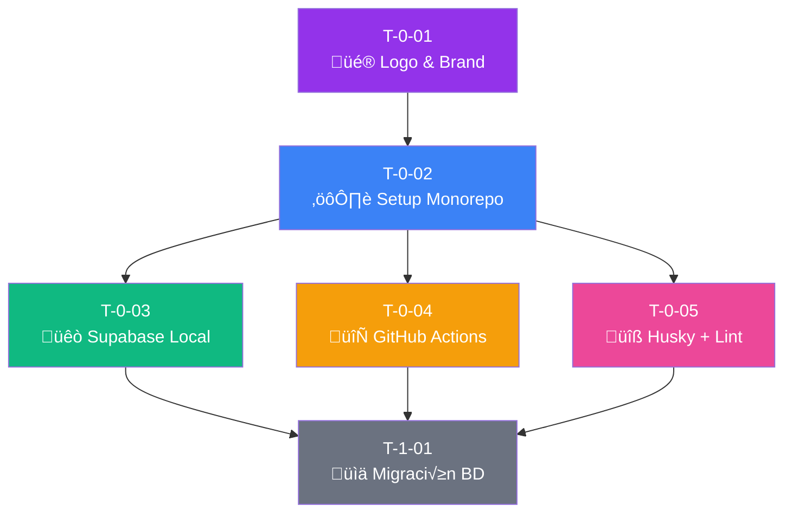
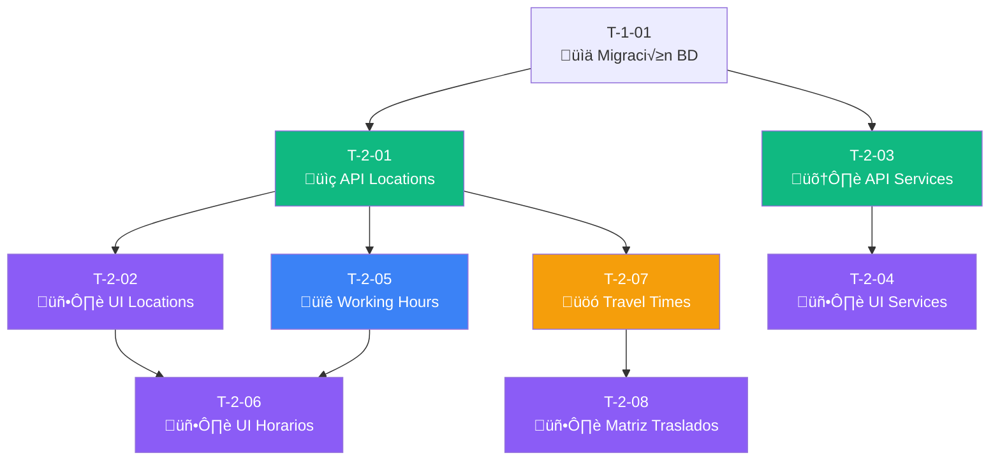

# 6. Tickets de Trabajo - TimeFlowPro

---

## 6.0 Metodología y Convenciones

### Estructura de Tickets

Cada ticket sigue el formato estándar con trazabilidad completa:

```
T-[Sprint]-[Número]: [Tipo] Título descriptivo con verbo de acción

- Tipo: Design | Infra | Database | Backend | Frontend | Testing
- Sprint: 0 = Setup, 1-6 = Sprints de desarrollo
- Número: Secuencial dentro del sprint
```

### Etiquetas de Prioridad

| Prioridad | Símbolo | Criterio |
|-----------|---------|----------|
| 🔴 Crítica | P0 | Bloquea todo el sprint |
| 🟠 Alta | P1 | Necesario para completar HDU críticas |
| 🟡 Media | P2 | Mejora la experiencia pero no bloquea |
| 🟢 Baja | P3 | Nice-to-have, puede posponerse |

### Estimación (Story Points - Fibonacci)

| Puntos | Tiempo estimado | Complejidad |
|--------|-----------------|-------------|
| 1 | 2-4 horas | Trivial, sin incertidumbre |
| 2 | 4-8 horas | Simple, patrón conocido |
| 3 | 1-2 días | Moderado, alguna investigación |
| 5 | 2-3 días | Complejo, múltiples componentes |
| 8 | 3-5 días | Muy complejo, alto riesgo |
| 13 | 1 semana+ | Épico, debe dividirse |

---

## 6.1 Resumen de Tickets por Sprint

### Sprint 0: Setup e Infraestructura Base

| ID | Título | Tipo | Prioridad | Pts | HDUs | Dependencias |
|----|--------|------|-----------|-----|------|--------------|
| T-0-01 | Diseño de Logo y Brand Identity | Design | 🔴 P0 | 3 | - | - |
| T-0-02 | Setup Monorepo + Next.js 14 + Design Tokens | Infra | 🔴 P0 | 5 | - | T-0-01 |
| T-0-03 | Configuración Supabase Local (Docker) | Infra | 🔴 P0 | 3 | - | T-0-02 |
| T-0-04 | GitHub Actions CI/CD Pipeline | Infra | 🔴 P0 | 5 | - | T-0-02 |
| T-0-05 | Husky + Commitlint + ESLint + Prettier | Infra | 🟠 P1 | 2 | - | T-0-02 |

### Sprint 1: Autenticación y Perfil Base

| ID | Título | Tipo | Prioridad | Pts | HDUs | Dependencias |
|----|--------|------|-----------|-----|------|--------------|
| T-1-01 | Migración inicial de base de datos | Database | 🔴 P0 | 5 | US-01 | T-0-03 |
| T-1-02 | Configurar Supabase Auth con Google OAuth | Backend | 🔴 P0 | 5 | US-01 | T-1-01 |
| T-1-03 | Implementar página de Login | Frontend | 🔴 P0 | 3 | US-01 | T-1-02 |
| T-1-04 | Middleware de autenticación y rutas protegidas | Backend | 🔴 P0 | 3 | US-01 | T-1-02 |
| T-1-05 | Formulario de perfil profesional | Frontend | 🔴 P0 | 5 | US-02 | T-1-03 |
| T-1-06 | Sistema de trial automático | Backend | 🔴 P0 | 5 | US-01, US-16 | T-1-02 |
| T-1-07 | Dashboard Admin - Configuración Trial | Frontend | 🔴 P0 | 5 | US-16, US-17 | T-1-06 |

### Sprint 2: Ubicaciones y Servicios

| ID | Título | Tipo | Prioridad | Pts | HDUs | Dependencias |
|----|--------|------|-----------|-----|------|--------------|
| T-2-01 | CRUD Ubicaciones (API + RLS) | Backend | 🔴 P0 | 5 | US-03 | T-1-01 |
| T-2-02 | UI Gestión de Ubicaciones | Frontend | 🔴 P0 | 5 | US-03 | T-2-01 |
| T-2-03 | CRUD Servicios (API + RLS) | Backend | 🔴 P0 | 5 | US-04 | T-1-01 |
| T-2-04 | UI Gestión de Servicios | Frontend | 🔴 P0 | 5 | US-04 | T-2-03 |
| T-2-05 | Horarios de trabajo por ubicación | Backend | 🔴 P0 | 5 | US-06 | T-2-01 |
| T-2-06 | UI Configuración de Horarios | Frontend | 🔴 P0 | 5 | US-06 | T-2-05 |
| T-2-07 | Tiempos de traslado entre ubicaciones | Backend | 🟠 P1 | 3 | US-07 | T-2-01 |
| T-2-08 | Matriz de tiempos de traslado UI | Frontend | 🟠 P1 | 3 | US-07 | T-2-07 |

### Sprint 3: Gestión de Clientes y Citas

| ID | Título | Tipo | Prioridad | Pts | HDUs | Dependencias |
|----|--------|------|-----------|-----|------|--------------|
| T-3-01 | CRUD Clientes (API + RLS) | Backend | 🔴 P0 | 5 | US-05 | T-1-01 |
| T-3-02 | UI Gestión de Clientes | Frontend | 🔴 P0 | 5 | US-05 | T-3-01 |
| T-3-03 | API Crear Cita con validaciones | Backend | 🔴 P0 | 8 | US-08 | T-3-01, T-2-01 |
| T-3-04 | Motor de disponibilidad | Backend | 🔴 P0 | 8 | US-08, US-09 | T-2-05, T-2-07 |
| T-3-05 | Calendario visual de citas | Frontend | 🔴 P0 | 8 | US-09 | T-3-03 |
| T-3-06 | Bloqueos personales (almuerzo, vacaciones) | Backend | 🟠 P1 | 5 | US-22 | T-3-04 |
| T-3-07 | UI Bloqueos personales | Frontend | 🟠 P1 | 3 | US-22 | T-3-06 |

### Sprint 4: Portal Público y Reservas Online

| ID | Título | Tipo | Prioridad | Pts | HDUs | Dependencias |
|----|--------|------|-----------|-----|------|--------------|
| T-4-01 | Portal público por slug | Frontend | 🔴 P0 | 5 | US-12 | T-2-04 |
| T-4-02 | API Disponibilidad pública | Backend | 🔴 P0 | 5 | US-12, US-13 | T-3-04 |
| T-4-03 | Wizard de reserva online | Frontend | 🔴 P0 | 8 | US-13 | T-4-02 |
| T-4-04 | Términos y condiciones configurables | Backend | 🟠 P1 | 3 | US-23 | T-4-02 |
| T-4-05 | Completar/Cancelar cita | Backend | 🔴 P0 | 5 | US-11 | T-3-03 |
| T-4-06 | UI Completar cita + duración real | Frontend | 🔴 P0 | 3 | US-11 | T-4-05 |
| T-4-07 | Duración adaptativa por cliente | Backend | 🟠 P1 | 5 | US-10 | T-4-05 |
| T-4-08 | Cancelación por cliente | Backend | 🔴 P0 | 5 | US-20 | T-4-02 |
| T-4-09 | Reagendamiento de citas | Backend | 🔴 P0 | 5 | US-21 | T-4-02 |

### Sprint 5: Google Calendar Integration

| ID | Título | Tipo | Prioridad | Pts | HDUs | Dependencias |
|----|--------|------|-----------|-----|------|--------------|
| T-5-01 | OAuth Google Calendar | Backend | 🟠 P1 | 5 | US-14 | T-1-02 |
| T-5-02 | Sincronización bidireccional GCal | Backend | 🟠 P1 | 8 | US-14 | T-5-01 |
| T-5-03 | UI Conexión Google Calendar | Frontend | 🟠 P1 | 3 | US-14 | T-5-01 |
| T-5-04 | Webhook handler para GCal | Backend | 🟠 P1 | 5 | US-15 | T-5-02 |
| T-5-05 | Edge Function: expire-trials | Backend | 🟠 P1 | 3 | US-19 | T-1-06 |
| T-5-06 | Notificaciones admin por email | Backend | 🟠 P1 | 3 | US-18 | T-1-06 |
| T-5-07 | Modo solo lectura UI | Frontend | 🔴 P0 | 5 | US-19 | T-5-05 |

---

## 6.2 Tickets Detallados - Sprint 0: Setup

---

### T-0-01: [Design] Diseño de Logo y Brand Identity

#### Información General

| Campo | Valor |
|-------|-------|
| **Tipo** | Design |
| **Prioridad** | 🔴 P0 (Crítica) |
| **Estimación** | 3 Story Points |
| **Sprint** | 0 - Setup |
| **HDUs Relacionadas** | Ninguna (Infraestructura) |
| **Bloqueado por** | - |
| **Bloquea a** | T-0-02 |

#### Descripción

Crear la identidad visual completa de TimeFlowPro que refleje los valores de la marca:
- **Time**: Gestión del tiempo, puntualidad
- **Flow**: Fluidez, optimización, movimiento
- **Pro**: Profesionalismo, confianza

#### Entregables

##### 1. Logo Principal

```
Concepto: Reloj abstracto con flujo dinámico
- Símbolo: Círculo con flechas en espiral que sugieren movimiento/tiempo
- Texto: "TimeFlowPro" en tipografía moderna
- Variantes: Horizontal, vertical, solo ícono
- Formatos: SVG, PNG (16px, 32px, 64px, 128px, 512px)
```

**Propuesta de diseño:**

```
     ╭─────────╮
    ╱    ⟳     ╲      TimeFlowPro
   │   ◉──────▶ │     ────────────
    ╲     ⟲    ╱      Gestión inteligente
     ╰─────────╯
```

##### 2. Paleta de Colores

```css
/* === DESIGN TOKENS - TimeFlowPro === */

:root {
  /* === PRIMARY - Azul Profesional === */
  --color-primary-50: #EBF5FF;
  --color-primary-100: #E1EFFE;
  --color-primary-200: #C3DDFD;
  --color-primary-300: #A4CAFE;
  --color-primary-400: #76A9FA;
  --color-primary-500: #3F83F8;  /* Principal */
  --color-primary-600: #1C64F2;  /* Hover */
  --color-primary-700: #1A56DB;  /* Active */
  --color-primary-800: #1E429F;
  --color-primary-900: #233876;

  /* === SECONDARY - Teal Flow === */
  --color-secondary-50: #EDFAFA;
  --color-secondary-100: #D5F5F6;
  --color-secondary-200: #AFECEF;
  --color-secondary-300: #7EDCE2;
  --color-secondary-400: #16BDCA;
  --color-secondary-500: #0694A2;  /* Principal */
  --color-secondary-600: #047481;  /* Hover */
  --color-secondary-700: #036672;
  --color-secondary-800: #05505C;
  --color-secondary-900: #014451;

  /* === ACCENT - Naranja Energía === */
  --color-accent-50: #FFF8F1;
  --color-accent-100: #FEECDC;
  --color-accent-200: #FCD9BD;
  --color-accent-300: #FDBA8C;
  --color-accent-400: #FF8A4C;
  --color-accent-500: #FF5A1F;  /* Principal - CTAs importantes */
  --color-accent-600: #D03801;
  --color-accent-700: #B43403;
  --color-accent-800: #8A2C0D;
  --color-accent-900: #73230D;

  /* === NEUTRALS - Grises === */
  --color-gray-50: #F9FAFB;
  --color-gray-100: #F3F4F6;
  --color-gray-200: #E5E7EB;
  --color-gray-300: #D1D5DB;
  --color-gray-400: #9CA3AF;
  --color-gray-500: #6B7280;
  --color-gray-600: #4B5563;
  --color-gray-700: #374151;
  --color-gray-800: #1F2937;
  --color-gray-900: #111827;

  /* === SEMANTIC - Estados === */
  --color-success-500: #0E9F6E;
  --color-success-100: #DEF7EC;
  --color-warning-500: #C27803;
  --color-warning-100: #FDF6B2;
  --color-error-500: #F05252;
  --color-error-100: #FDE8E8;
  --color-info-500: #3F83F8;
  --color-info-100: #E1EFFE;

  /* === CALENDAR SPECIFIC === */
  --color-appointment: #3F83F8;      /* Citas normales */
  --color-travel-block: #F59E0B;     /* Bloques de traslado */
  --color-personal-block: #8B5CF6;   /* Bloqueos personales */
  --color-available: #10B981;        /* Slots disponibles */
  --color-unavailable: #EF4444;      /* No disponible */
}
```

##### 3. Tipografía

```css
/* === TIPOGRAFÍA === */

:root {
  /* Font Family - Plus Jakarta Sans (Google Fonts) */
  --font-family-sans: 'Plus Jakarta Sans', -apple-system, BlinkMacSystemFont, 
                      'Segoe UI', Roboto, sans-serif;
  --font-family-mono: 'JetBrains Mono', 'Fira Code', monospace;

  /* Font Sizes - Scale 1.25 (Major Third) */
  --font-size-xs: 0.75rem;     /* 12px */
  --font-size-sm: 0.875rem;    /* 14px */
  --font-size-base: 1rem;      /* 16px */
  --font-size-lg: 1.125rem;    /* 18px */
  --font-size-xl: 1.25rem;     /* 20px */
  --font-size-2xl: 1.5rem;     /* 24px */
  --font-size-3xl: 1.875rem;   /* 30px */
  --font-size-4xl: 2.25rem;    /* 36px */
  --font-size-5xl: 3rem;       /* 48px */

  /* Font Weights */
  --font-weight-normal: 400;
  --font-weight-medium: 500;
  --font-weight-semibold: 600;
  --font-weight-bold: 700;

  /* Line Heights */
  --line-height-tight: 1.25;
  --line-height-normal: 1.5;
  --line-height-relaxed: 1.75;

  /* Letter Spacing */
  --letter-spacing-tight: -0.025em;
  --letter-spacing-normal: 0;
  --letter-spacing-wide: 0.025em;
}
```

##### 4. Espaciado y Layout

```css
/* === SPACING (8px base) === */

:root {
  --space-0: 0;
  --space-1: 0.25rem;   /* 4px */
  --space-2: 0.5rem;    /* 8px */
  --space-3: 0.75rem;   /* 12px */
  --space-4: 1rem;      /* 16px */
  --space-5: 1.25rem;   /* 20px */
  --space-6: 1.5rem;    /* 24px */
  --space-8: 2rem;      /* 32px */
  --space-10: 2.5rem;   /* 40px */
  --space-12: 3rem;     /* 48px */
  --space-16: 4rem;     /* 64px */
  --space-20: 5rem;     /* 80px */

  /* Border Radius */
  --radius-sm: 0.25rem;   /* 4px */
  --radius-md: 0.375rem;  /* 6px */
  --radius-lg: 0.5rem;    /* 8px */
  --radius-xl: 0.75rem;   /* 12px */
  --radius-2xl: 1rem;     /* 16px */
  --radius-full: 9999px;

  /* Shadows */
  --shadow-sm: 0 1px 2px 0 rgb(0 0 0 / 0.05);
  --shadow-md: 0 4px 6px -1px rgb(0 0 0 / 0.1);
  --shadow-lg: 0 10px 15px -3px rgb(0 0 0 / 0.1);
  --shadow-xl: 0 20px 25px -5px rgb(0 0 0 / 0.1);
}
```

#### Criterios de Aceptación Técnicos

- [ ] Logo en formato SVG optimizado (<10KB)
- [ ] Logo responsive (se ve bien en 16px hasta 512px)
- [ ] Favicon generado en todos los tamaños (16, 32, 180, 192, 512)
- [ ] Contraste WCAG AA mínimo en todas las combinaciones de color
- [ ] Tokens de diseño documentados en archivo CSS/Tailwind
- [ ] Tipografía cargada desde Google Fonts (preconnect configurado)

#### Archivos a Crear

```
public/
├── logo.svg
├── logo-dark.svg
├── logo-icon.svg
├── favicon.ico
├── apple-touch-icon.png (180x180)
└── og-image.png (1200x630)

src/styles/
├── tokens/
│   ├── colors.css
│   ├── typography.css
│   └── spacing.css
└── globals.css
```

#### Tests

| Tipo | Descripción | Ubicación |
|------|-------------|-----------|
| Visual | Verificar logo en light/dark mode | Manual |
| A11y | Contraste de colores WCAG AA | `tests/a11y/colors.test.ts` |
| Unit | Tokens CSS válidos | `tests/unit/design-tokens.test.ts` |

#### Etiquetas

`design` `branding` `sprint-0` `priority-critical` `no-code`

---

### T-0-02: [Infra] Setup Monorepo + Next.js 14 + Design Tokens

#### Información General

| Campo | Valor |
|-------|-------|
| **Tipo** | Infra |
| **Prioridad** | 🔴 P0 (Crítica) |
| **Estimación** | 5 Story Points |
| **Sprint** | 0 - Setup |
| **HDUs Relacionadas** | Ninguna (Infraestructura) |
| **Bloqueado por** | T-0-01 |
| **Bloquea a** | T-0-03, T-0-04, T-0-05 |

#### Descripción

Configurar la estructura base del proyecto siguiendo las mejores prácticas:
- Monorepo con pnpm workspaces
- Next.js 14 con App Router
- TailwindCSS con design tokens del T-0-01
- TypeScript estricto
- Estructura de carpetas siguiendo Arquitectura Hexagonal

#### Pasos de Implementación

##### Paso 1: Inicializar Monorepo

```bash
# Crear estructura base
mkdir timeflowpro && cd timeflowpro
pnpm init

# Crear pnpm-workspace.yaml
cat > pnpm-workspace.yaml << 'EOF'
packages:
  - 'apps/*'
  - 'packages/*'
EOF

# Crear .npmrc
cat > .npmrc << 'EOF'
auto-install-peers=true
strict-peer-dependencies=false
EOF
```

##### Paso 2: Crear App Next.js 14

```bash
# Crear app web
cd apps
pnpm create next-app@latest web --typescript --tailwind --eslint --app --src-dir --import-alias "@/*"

# Instalar dependencias adicionales
cd web
pnpm add @supabase/supabase-js @supabase/ssr
pnpm add @tanstack/react-query
pnpm add lucide-react
pnpm add clsx tailwind-merge
pnpm add -D @types/node
```

##### Paso 3: Configurar TypeScript Estricto

```typescript
// apps/web/tsconfig.json
{
  "compilerOptions": {
    "target": "ES2022",
    "lib": ["dom", "dom.iterable", "ES2022"],
    "allowJs": true,
    "skipLibCheck": true,
    "strict": true,
    "noEmit": true,
    "esModuleInterop": true,
    "module": "esnext",
    "moduleResolution": "bundler",
    "resolveJsonModule": true,
    "isolatedModules": true,
    "jsx": "preserve",
    "incremental": true,
    "plugins": [{ "name": "next" }],
    "paths": {
      "@/*": ["./src/*"],
      "@/components/*": ["./src/components/*"],
      "@/lib/*": ["./src/lib/*"],
      "@/hooks/*": ["./src/hooks/*"],
      "@/services/*": ["./src/services/*"],
      "@/types/*": ["./src/types/*"]
    },
    // === STRICT MODE ===
    "noImplicitAny": true,
    "strictNullChecks": true,
    "strictFunctionTypes": true,
    "strictBindCallApply": true,
    "strictPropertyInitialization": true,
    "noImplicitThis": true,
    "alwaysStrict": true,
    "noUnusedLocals": true,
    "noUnusedParameters": true,
    "noImplicitReturns": true,
    "noFallthroughCasesInSwitch": true,
    "noUncheckedIndexedAccess": true
  },
  "include": ["next-env.d.ts", "**/*.ts", "**/*.tsx", ".next/types/**/*.ts"],
  "exclude": ["node_modules"]
}
```

##### Paso 4: Estructura de Carpetas (Arquitectura Hexagonal)

```bash
# Crear estructura
mkdir -p src/{app,components,lib,hooks,services,types,styles}
mkdir -p src/components/{ui,layout,features}
mkdir -p src/lib/{supabase,utils}
mkdir -p src/services/{api,domain}
mkdir -p src/types/{database,api}

# Estructura final:
apps/web/src/
├── app/                          # Next.js App Router
│   ├── (auth)/                   # Rutas de autenticación
│   │   ├── login/
│   │   └── callback/
│   ├── (dashboard)/              # Rutas protegidas
│   │   ├── layout.tsx
│   │   ├── page.tsx              # Dashboard principal
│   │   ├── appointments/
│   │   ├── clients/
│   │   ├── locations/
│   │   ├── services/
│   │   └── settings/
│   ├── (public)/                 # Portal público
│   │   └── [slug]/
│   ├── admin/                    # Panel admin
│   ├── layout.tsx
│   ├── page.tsx                  # Landing
│   └── globals.css
├── components/
│   ├── ui/                       # Componentes base (Button, Input, etc.)
│   ├── layout/                   # Header, Sidebar, Footer
│   └── features/                 # Componentes de negocio
│       ├── appointments/
│       ├── calendar/
│       ├── clients/
│       └── auth/
├── lib/
│   ├── supabase/
│   │   ├── client.ts             # Cliente browser
│   │   ├── server.ts             # Cliente server
│   │   └── middleware.ts         # Auth middleware
│   └── utils/
│       ├── cn.ts                 # Classnames helper
│       └── format.ts             # Formatters
├── hooks/
│   ├── use-auth.ts
│   ├── use-appointments.ts
│   └── use-availability.ts
├── services/
│   ├── api/                      # Llamadas a API
│   └── domain/                   # Lógica de negocio
├── types/
│   ├── database.types.ts         # Generado por Supabase
│   └── api.types.ts
└── styles/
    ├── tokens/
    │   ├── colors.css
    │   └── typography.css
    └── globals.css
```

##### Paso 5: Configurar TailwindCSS con Design Tokens

```typescript
// apps/web/tailwind.config.ts
import type { Config } from 'tailwindcss'

const config: Config = {
  darkMode: 'class',
  content: [
    './src/pages/**/*.{js,ts,jsx,tsx,mdx}',
    './src/components/**/*.{js,ts,jsx,tsx,mdx}',
    './src/app/**/*.{js,ts,jsx,tsx,mdx}',
  ],
  theme: {
    extend: {
      colors: {
        // Primary - Azul Profesional
        primary: {
          50: '#EBF5FF',
          100: '#E1EFFE',
          200: '#C3DDFD',
          300: '#A4CAFE',
          400: '#76A9FA',
          500: '#3F83F8',
          600: '#1C64F2',
          700: '#1A56DB',
          800: '#1E429F',
          900: '#233876',
        },
        // Secondary - Teal Flow
        secondary: {
          50: '#EDFAFA',
          100: '#D5F5F6',
          200: '#AFECEF',
          300: '#7EDCE2',
          400: '#16BDCA',
          500: '#0694A2',
          600: '#047481',
          700: '#036672',
          800: '#05505C',
          900: '#014451',
        },
        // Accent - Naranja Energía
        accent: {
          50: '#FFF8F1',
          100: '#FEECDC',
          200: '#FCD9BD',
          300: '#FDBA8C',
          400: '#FF8A4C',
          500: '#FF5A1F',
          600: '#D03801',
          700: '#B43403',
          800: '#8A2C0D',
          900: '#73230D',
        },
        // Calendar specific
        calendar: {
          appointment: '#3F83F8',
          travel: '#F59E0B',
          personal: '#8B5CF6',
          available: '#10B981',
          unavailable: '#EF4444',
        },
      },
      fontFamily: {
        sans: ['var(--font-jakarta)', 'system-ui', 'sans-serif'],
        mono: ['var(--font-jetbrains)', 'monospace'],
      },
      fontSize: {
        xs: ['0.75rem', { lineHeight: '1rem' }],
        sm: ['0.875rem', { lineHeight: '1.25rem' }],
        base: ['1rem', { lineHeight: '1.5rem' }],
        lg: ['1.125rem', { lineHeight: '1.75rem' }],
        xl: ['1.25rem', { lineHeight: '1.75rem' }],
        '2xl': ['1.5rem', { lineHeight: '2rem' }],
        '3xl': ['1.875rem', { lineHeight: '2.25rem' }],
        '4xl': ['2.25rem', { lineHeight: '2.5rem' }],
        '5xl': ['3rem', { lineHeight: '1' }],
      },
      borderRadius: {
        'sm': '0.25rem',
        'md': '0.375rem',
        'lg': '0.5rem',
        'xl': '0.75rem',
        '2xl': '1rem',
      },
      boxShadow: {
        'sm': '0 1px 2px 0 rgb(0 0 0 / 0.05)',
        'md': '0 4px 6px -1px rgb(0 0 0 / 0.1)',
        'lg': '0 10px 15px -3px rgb(0 0 0 / 0.1)',
        'xl': '0 20px 25px -5px rgb(0 0 0 / 0.1)',
      },
    },
  },
  plugins: [
    require('@tailwindcss/forms'),
    require('@tailwindcss/typography'),
  ],
}

export default config
```

##### Paso 6: Crear Utilidad cn (Classnames)

```typescript
// apps/web/src/lib/utils/cn.ts
import { clsx, type ClassValue } from 'clsx'
import { twMerge } from 'tailwind-merge'

/**
 * Combina clases de Tailwind de forma inteligente
 * Evita conflictos y permite condicionales
 * 
 * @example
 * cn('px-4 py-2', isActive && 'bg-primary-500', className)
 */
export function cn(...inputs: ClassValue[]) {
  return twMerge(clsx(inputs))
}
```

##### Paso 7: Componente Button Base

```typescript
// apps/web/src/components/ui/button.tsx
import { forwardRef, type ButtonHTMLAttributes } from 'react'
import { cva, type VariantProps } from 'class-variance-authority'
import { cn } from '@/lib/utils/cn'

/**
 * Variants del botón siguiendo Design System de TimeFlowPro
 * 
 * @principle Single Responsibility - Solo maneja estilos y variantes
 * @principle Open/Closed - Extensible via className, cerrado para modificación
 */
const buttonVariants = cva(
  // Base styles
  [
    'inline-flex items-center justify-center',
    'rounded-lg font-medium',
    'transition-colors duration-200',
    'focus-visible:outline-none focus-visible:ring-2 focus-visible:ring-offset-2',
    'disabled:pointer-events-none disabled:opacity-50',
  ],
  {
    variants: {
      variant: {
        primary: [
          'bg-primary-500 text-white',
          'hover:bg-primary-600',
          'focus-visible:ring-primary-500',
        ],
        secondary: [
          'bg-secondary-500 text-white',
          'hover:bg-secondary-600',
          'focus-visible:ring-secondary-500',
        ],
        accent: [
          'bg-accent-500 text-white',
          'hover:bg-accent-600',
          'focus-visible:ring-accent-500',
        ],
        outline: [
          'border-2 border-primary-500 text-primary-500',
          'hover:bg-primary-50',
          'focus-visible:ring-primary-500',
        ],
        ghost: [
          'text-gray-700',
          'hover:bg-gray-100',
          'focus-visible:ring-gray-500',
        ],
        destructive: [
          'bg-red-500 text-white',
          'hover:bg-red-600',
          'focus-visible:ring-red-500',
        ],
      },
      size: {
        sm: 'h-8 px-3 text-sm',
        md: 'h-10 px-4 text-base',
        lg: 'h-12 px-6 text-lg',
        icon: 'h-10 w-10',
      },
    },
    defaultVariants: {
      variant: 'primary',
      size: 'md',
    },
  }
)

export interface ButtonProps
  extends ButtonHTMLAttributes<HTMLButtonElement>,
    VariantProps<typeof buttonVariants> {
  isLoading?: boolean
}

/**
 * Componente Button base de TimeFlowPro
 * 
 * @example
 * <Button variant="primary" size="lg">Guardar</Button>
 * <Button variant="outline" isLoading>Procesando...</Button>
 */
export const Button = forwardRef<HTMLButtonElement, ButtonProps>(
  ({ className, variant, size, isLoading, children, disabled, ...props }, ref) => {
    return (
      <button
        className={cn(buttonVariants({ variant, size, className }))}
        ref={ref}
        disabled={disabled || isLoading}
        {...props}
      >
        {isLoading ? (
          <>
            <svg
              className="mr-2 h-4 w-4 animate-spin"
              xmlns="http://www.w3.org/2000/svg"
              fill="none"
              viewBox="0 0 24 24"
            >
              <circle
                className="opacity-25"
                cx="12"
                cy="12"
                r="10"
                stroke="currentColor"
                strokeWidth="4"
              />
              <path
                className="opacity-75"
                fill="currentColor"
                d="M4 12a8 8 0 018-8V0C5.373 0 0 5.373 0 12h4z"
              />
            </svg>
            Cargando...
          </>
        ) : (
          children
        )}
      </button>
    )
  }
)

Button.displayName = 'Button'

export { buttonVariants }
```

##### Paso 8: Configurar Fuentes

```typescript
// apps/web/src/app/layout.tsx
import type { Metadata } from 'next'
import { Plus_Jakarta_Sans, JetBrains_Mono } from 'next/font/google'
import './globals.css'

const jakarta = Plus_Jakarta_Sans({
  subsets: ['latin'],
  variable: '--font-jakarta',
  display: 'swap',
})

const jetbrains = JetBrains_Mono({
  subsets: ['latin'],
  variable: '--font-jetbrains',
  display: 'swap',
})

export const metadata: Metadata = {
  title: {
    default: 'TimeFlowPro - Agenda Inteligente para Profesionales Móviles',
    template: '%s | TimeFlowPro',
  },
  description:
    'La primera agenda digital que entiende que los profesionales se mueven. Calcula traslados, adapta duraciones y optimiza tu jornada.',
  keywords: [
    'agenda profesional',
    'kinesiólogo',
    'barbero',
    'profesional móvil',
    'gestión de citas',
  ],
  authors: [{ name: 'TimeFlowPro Team' }],
  openGraph: {
    type: 'website',
    locale: 'es_CL',
    url: 'https://timeflowpro.app',
    title: 'TimeFlowPro - Agenda Inteligente',
    description: 'Optimiza tu agenda con duraciones adaptativas y gestión de traslados',
    siteName: 'TimeFlowPro',
  },
}

export default function RootLayout({
  children,
}: {
  children: React.ReactNode
}) {
  return (
    <html lang="es" className={`${jakarta.variable} ${jetbrains.variable}`}>
      <body className="font-sans antialiased bg-gray-50 text-gray-900">
        {children}
      </body>
    </html>
  )
}
```

#### Criterios de Aceptación Técnicos

- [ ] `pnpm install` ejecuta sin errores
- [ ] `pnpm dev` inicia servidor en localhost:3000
- [ ] `pnpm build` compila sin errores ni warnings
- [ ] `pnpm typecheck` pasa sin errores
- [ ] Colores del Design Token visibles en página de prueba
- [ ] Componente Button renderiza en todas las variantes
- [ ] Fuente Plus Jakarta Sans carga correctamente

#### Archivos a Crear/Modificar

```
timeflowpro/
├── pnpm-workspace.yaml
├── .npmrc
├── package.json
└── apps/
    └── web/
        ├── package.json
        ├── tsconfig.json
        ├── tailwind.config.ts
        ├── next.config.js
        ├── public/
        │   ├── logo.svg
        │   └── favicon.ico
        └── src/
            ├── app/
            │   ├── layout.tsx
            │   ├── page.tsx
            │   └── globals.css
            ├── components/
            │   └── ui/
            │       └── button.tsx
            └── lib/
                └── utils/
                    └── cn.ts
```

#### Tests

| Tipo | Descripción | Ubicación |
|------|-------------|-----------|
| Unit | Button renderiza correctamente | `tests/unit/components/button.test.tsx` |
| Unit | cn() combina clases sin conflictos | `tests/unit/lib/cn.test.ts` |
| E2E | Página principal carga sin errores | `tests/e2e/home.spec.ts` (Solo Local) |

#### Etiquetas

`infra` `setup` `sprint-0` `priority-critical` `next-js` `tailwind`

---

### T-0-03: [Infra] Configuración Supabase Local (Docker)

#### Información General

| Campo | Valor |
|-------|-------|
| **Tipo** | Infra |
| **Prioridad** | 🔴 P0 (Crítica) |
| **Estimación** | 3 Story Points |
| **Sprint** | 0 - Setup |
| **HDUs Relacionadas** | Ninguna (Infraestructura) |
| **Bloqueado por** | T-0-02 |
| **Bloquea a** | T-1-01 |

#### Descripción

Configurar Supabase local para desarrollo usando Docker:
- PostgreSQL 16 con extensiones
- Supabase Studio accesible en localhost
- Generación de tipos TypeScript automática
- Scripts de seed para datos de prueba

#### Pasos de Implementación

##### Paso 1: Instalar Supabase CLI

```bash
# Instalar CLI globalmente
pnpm add -g supabase

# Verificar instalación
supabase --version
```

##### Paso 2: Inicializar Supabase

```bash
cd timeflowpro
supabase init

# Estructura creada:
supabase/
├── config.toml           # Configuración
├── seed.sql              # Datos iniciales
└── migrations/           # Migraciones SQL
```

##### Paso 3: Configurar config.toml

```toml
# supabase/config.toml

[api]
enabled = true
port = 54321
schemas = ["public", "graphql_public"]
extra_search_path = ["public", "extensions"]
max_rows = 1000

[db]
port = 54322
shadow_port = 54320
major_version = 16

[db.pooler]
enabled = false
port = 54329
pool_mode = "transaction"
default_pool_size = 20
max_client_conn = 100

[studio]
enabled = true
port = 54323
api_url = "http://127.0.0.1"

[auth]
enabled = true
site_url = "http://127.0.0.1:3000"
additional_redirect_urls = [
  "http://127.0.0.1:3000/auth/callback",
  "http://localhost:3000/auth/callback"
]
jwt_expiry = 3600
enable_refresh_token_rotation = true
refresh_token_reuse_interval = 10
enable_signup = true

[auth.external.google]
enabled = true
client_id = "env(GOOGLE_CLIENT_ID)"
secret = "env(GOOGLE_CLIENT_SECRET)"
redirect_uri = "http://127.0.0.1:54321/auth/v1/callback"

[storage]
enabled = true
file_size_limit = "50MiB"

[realtime]
enabled = true
```

##### Paso 4: Crear .env.local

```bash
# apps/web/.env.local

# Supabase Local
NEXT_PUBLIC_SUPABASE_URL=http://127.0.0.1:54321
NEXT_PUBLIC_SUPABASE_ANON_KEY=eyJhbGciOiJIUzI1NiIsInR5cCI6IkpXVCJ9...

# Google OAuth (obtener de Google Cloud Console)
GOOGLE_CLIENT_ID=your-client-id.apps.googleusercontent.com
GOOGLE_CLIENT_SECRET=your-client-secret

# App
NEXT_PUBLIC_APP_URL=http://localhost:3000
```

##### Paso 5: Crear Cliente Supabase (Browser)

```typescript
// apps/web/src/lib/supabase/client.ts
import { createBrowserClient } from '@supabase/ssr'
import type { Database } from '@/types/database.types'

/**
 * Cliente Supabase para componentes del lado del cliente
 * 
 * @principle Singleton - Una única instancia por sesión
 */
export function createClient() {
  return createBrowserClient<Database>(
    process.env.NEXT_PUBLIC_SUPABASE_URL!,
    process.env.NEXT_PUBLIC_SUPABASE_ANON_KEY!
  )
}
```

##### Paso 6: Crear Cliente Supabase (Server)

```typescript
// apps/web/src/lib/supabase/server.ts
import { createServerClient, type CookieOptions } from '@supabase/ssr'
import { cookies } from 'next/headers'
import type { Database } from '@/types/database.types'

/**
 * Cliente Supabase para Server Components y Route Handlers
 * Maneja cookies automáticamente para auth
 */
export async function createClient() {
  const cookieStore = await cookies()

  return createServerClient<Database>(
    process.env.NEXT_PUBLIC_SUPABASE_URL!,
    process.env.NEXT_PUBLIC_SUPABASE_ANON_KEY!,
    {
      cookies: {
        getAll() {
          return cookieStore.getAll()
        },
        setAll(cookiesToSet) {
          try {
            cookiesToSet.forEach(({ name, value, options }) =>
              cookieStore.set(name, value, options)
            )
          } catch {
            // Puede fallar en Server Components, es esperado
          }
        },
      },
    }
  )
}
```

##### Paso 7: Script de Generación de Tipos

```json
// package.json (root)
{
  "scripts": {
    "supabase:start": "supabase start",
    "supabase:stop": "supabase stop",
    "supabase:status": "supabase status",
    "supabase:reset": "supabase db reset",
    "supabase:types": "supabase gen types typescript --local > apps/web/src/types/database.types.ts",
    "supabase:migrate": "supabase db push",
    "supabase:seed": "supabase db reset --debug"
  }
}
```

##### Paso 8: Placeholder para Tipos

```typescript
// apps/web/src/types/database.types.ts
/**
 * ARCHIVO AUTO-GENERADO
 * No modificar manualmente
 * Ejecutar: pnpm supabase:types
 */

export type Json =
  | string
  | number
  | boolean
  | null
  | { [key: string]: Json | undefined }
  | Json[]

export interface Database {
  public: {
    Tables: {
      // Se generará automáticamente después de T-1-01
    }
    Views: {}
    Functions: {}
    Enums: {}
  }
}

// Helpers de tipos
export type Tables<T extends keyof Database['public']['Tables']> = 
  Database['public']['Tables'][T]['Row']
export type Enums<T extends keyof Database['public']['Enums']> = 
  Database['public']['Enums'][T]
```

#### Criterios de Aceptación Técnicos

- [ ] `supabase start` levanta contenedores sin errores
- [ ] Supabase Studio accesible en http://localhost:54323
- [ ] API REST accesible en http://localhost:54321
- [ ] `supabase db reset` ejecuta seed correctamente
- [ ] `pnpm supabase:types` genera tipos TypeScript
- [ ] Variables de entorno configuradas en .env.local

#### Archivos a Crear/Modificar

```
timeflowpro/
├── supabase/
│   ├── config.toml
│   ├── seed.sql
│   └── migrations/
│       └── .gitkeep
├── package.json (scripts)
└── apps/web/
    ├── .env.local
    ├── .env.example
    └── src/
        ├── lib/supabase/
        │   ├── client.ts
        │   └── server.ts
        └── types/
            └── database.types.ts
```

#### Tests

| Tipo | Descripción | Ubicación |
|------|-------------|-----------|
| Integration | Conexión a Supabase local | `tests/integration/supabase-connection.test.ts` |
| Unit | Cliente browser se crea correctamente | `tests/unit/lib/supabase-client.test.ts` |

#### Etiquetas

`infra` `supabase` `docker` `sprint-0` `priority-critical`

---

### T-0-04: [Infra] GitHub Actions CI/CD Pipeline

#### Información General

| Campo | Valor |
|-------|-------|
| **Tipo** | Infra |
| **Prioridad** | 🔴 P0 (Crítica) |
| **Estimación** | 5 Story Points |
| **Sprint** | 0 - Setup |
| **HDUs Relacionadas** | Ninguna (Infraestructura) |
| **Bloqueado por** | T-0-02 |
| **Bloquea a** | Todos los tickets siguientes |

#### Descripción

Configurar pipeline de CI/CD completo:
- Lint + TypeCheck en cada PR
- Tests unitarios y de integración
- Build de producción
- Deploy automático a Vercel (staging/prod)

#### Pasos de Implementación

##### Paso 1: Crear Workflow Principal

```yaml
# .github/workflows/ci.yml
name: CI Pipeline

on:
  push:
    branches: [main, develop]
  pull_request:
    branches: [main, develop]

concurrency:
  group: ${{ github.workflow }}-${{ github.ref }}
  cancel-in-progress: true

env:
  NODE_VERSION: '20'
  PNPM_VERSION: '9'

jobs:
  # ============================================
  # JOB 1: Lint y Type Check
  # ============================================
  lint:
    name: 🔍 Lint & Type Check
    runs-on: ubuntu-latest
    steps:
      - name: 📥 Checkout
        uses: actions/checkout@v4

      - name: 📦 Setup pnpm
        uses: pnpm/action-setup@v3
        with:
          version: ${{ env.PNPM_VERSION }}

      - name: 🟢 Setup Node.js
        uses: actions/setup-node@v4
        with:
          node-version: ${{ env.NODE_VERSION }}
          cache: 'pnpm'

      - name: 📥 Install dependencies
        run: pnpm install --frozen-lockfile

      - name: 🔍 Lint
        run: pnpm lint

      - name: 📝 Type Check
        run: pnpm typecheck

  # ============================================
  # JOB 2: Unit Tests
  # ============================================
  test-unit:
    name: 🧪 Unit Tests
    runs-on: ubuntu-latest
    needs: lint
    steps:
      - name: 📥 Checkout
        uses: actions/checkout@v4

      - name: 📦 Setup pnpm
        uses: pnpm/action-setup@v3
        with:
          version: ${{ env.PNPM_VERSION }}

      - name: 🟢 Setup Node.js
        uses: actions/setup-node@v4
        with:
          node-version: ${{ env.NODE_VERSION }}
          cache: 'pnpm'

      - name: 📥 Install dependencies
        run: pnpm install --frozen-lockfile

      - name: 🧪 Run Unit Tests
        run: pnpm test:unit --coverage

      - name: 📊 Upload Coverage
        uses: codecov/codecov-action@v4
        with:
          token: ${{ secrets.CODECOV_TOKEN }}
          files: ./coverage/lcov.info
          fail_ci_if_error: false

  # ============================================
  # JOB 3: Integration Tests
  # ============================================
  test-integration:
    name: 🔗 Integration Tests
    runs-on: ubuntu-latest
    needs: lint
    services:
      postgres:
        image: supabase/postgres:16
        env:
          POSTGRES_USER: postgres
          POSTGRES_PASSWORD: postgres
          POSTGRES_DB: postgres
        ports:
          - 54322:5432
        options: >-
          --health-cmd pg_isready
          --health-interval 10s
          --health-timeout 5s
          --health-retries 5

    steps:
      - name: 📥 Checkout
        uses: actions/checkout@v4

      - name: 📦 Setup pnpm
        uses: pnpm/action-setup@v3
        with:
          version: ${{ env.PNPM_VERSION }}

      - name: 🟢 Setup Node.js
        uses: actions/setup-node@v4
        with:
          node-version: ${{ env.NODE_VERSION }}
          cache: 'pnpm'

      - name: 📥 Install dependencies
        run: pnpm install --frozen-lockfile

      - name: 🗃️ Setup Supabase CLI
        uses: supabase/setup-cli@v1
        with:
          version: latest

      - name: 🚀 Start Supabase
        run: supabase db start

      - name: 📝 Run Migrations
        run: supabase db push

      - name: 🧪 Run Integration Tests
        run: pnpm test:integration
        env:
          SUPABASE_URL: http://127.0.0.1:54321
          SUPABASE_ANON_KEY: ${{ secrets.SUPABASE_ANON_KEY }}

  # ============================================
  # JOB 4: Build
  # ============================================
  build:
    name: 🏗️ Build
    runs-on: ubuntu-latest
    needs: [test-unit, test-integration]
    steps:
      - name: 📥 Checkout
        uses: actions/checkout@v4

      - name: 📦 Setup pnpm
        uses: pnpm/action-setup@v3
        with:
          version: ${{ env.PNPM_VERSION }}

      - name: 🟢 Setup Node.js
        uses: actions/setup-node@v4
        with:
          node-version: ${{ env.NODE_VERSION }}
          cache: 'pnpm'

      - name: 📥 Install dependencies
        run: pnpm install --frozen-lockfile

      - name: 🏗️ Build
        run: pnpm build
        env:
          NEXT_PUBLIC_SUPABASE_URL: ${{ secrets.NEXT_PUBLIC_SUPABASE_URL }}
          NEXT_PUBLIC_SUPABASE_ANON_KEY: ${{ secrets.NEXT_PUBLIC_SUPABASE_ANON_KEY }}

      - name: 📤 Upload Build Artifact
        uses: actions/upload-artifact@v4
        with:
          name: build
          path: apps/web/.next
          retention-days: 7

  # ============================================
  # JOB 5: Deploy Staging
  # ============================================
  deploy-staging:
    name: 🚀 Deploy Staging
    runs-on: ubuntu-latest
    needs: build
    if: github.ref == 'refs/heads/develop'
    environment:
      name: staging
      url: https://staging.timeflowpro.app
    steps:
      - name: 📥 Checkout
        uses: actions/checkout@v4

      - name: 🚀 Deploy to Vercel (Staging)
        uses: amondnet/vercel-action@v25
        with:
          vercel-token: ${{ secrets.VERCEL_TOKEN }}
          vercel-org-id: ${{ secrets.VERCEL_ORG_ID }}
          vercel-project-id: ${{ secrets.VERCEL_PROJECT_ID }}
          working-directory: apps/web

  # ============================================
  # JOB 6: Deploy Production
  # ============================================
  deploy-production:
    name: 🚀 Deploy Production
    runs-on: ubuntu-latest
    needs: build
    if: github.ref == 'refs/heads/main'
    environment:
      name: production
      url: https://timeflowpro.app
    steps:
      - name: 📥 Checkout
        uses: actions/checkout@v4

      - name: 🚀 Deploy to Vercel (Production)
        uses: amondnet/vercel-action@v25
        with:
          vercel-token: ${{ secrets.VERCEL_TOKEN }}
          vercel-org-id: ${{ secrets.VERCEL_ORG_ID }}
          vercel-project-id: ${{ secrets.VERCEL_PROJECT_ID }}
          vercel-args: '--prod'
          working-directory: apps/web
```

##### Paso 2: Crear Workflow de PR

```yaml
# .github/workflows/pr-check.yml
name: PR Check

on:
  pull_request:
    types: [opened, synchronize, reopened]

jobs:
  pr-title:
    name: 📝 Validate PR Title
    runs-on: ubuntu-latest
    steps:
      - name: 📝 Check PR Title
        uses: amannn/action-semantic-pull-request@v5
        env:
          GITHUB_TOKEN: ${{ secrets.GITHUB_TOKEN }}
        with:
          types: |
            feat
            fix
            docs
            style
            refactor
            perf
            test
            chore
            ci
          requireScope: false
          subjectPattern: ^[A-Z].+$
          subjectPatternError: |
            El título del PR debe comenzar con mayúscula.
            Ejemplo: "feat: Add user authentication"

  size-label:
    name: 📏 Add Size Label
    runs-on: ubuntu-latest
    steps:
      - name: 📏 Label PR Size
        uses: codelytv/pr-size-labeler@v1
        with:
          GITHUB_TOKEN: ${{ secrets.GITHUB_TOKEN }}
          xs_label: 'size/XS'
          xs_max_size: 10
          s_label: 'size/S'
          s_max_size: 100
          m_label: 'size/M'
          m_max_size: 500
          l_label: 'size/L'
          l_max_size: 1000
          xl_label: 'size/XL'
          fail_if_xl: false
```

##### Paso 3: Scripts en package.json

```json
// apps/web/package.json
{
  "scripts": {
    "dev": "next dev",
    "build": "next build",
    "start": "next start",
    "lint": "next lint && eslint . --ext .ts,.tsx",
    "lint:fix": "eslint . --ext .ts,.tsx --fix",
    "typecheck": "tsc --noEmit",
    "test": "vitest",
    "test:unit": "vitest run --coverage",
    "test:integration": "vitest run --config vitest.integration.config.ts",
    "test:e2e": "playwright test",
    "test:e2e:ui": "playwright test --ui"
  }
}
```

##### Paso 4: Configurar Vitest

```typescript
// apps/web/vitest.config.ts
import { defineConfig } from 'vitest/config'
import react from '@vitejs/plugin-react'
import path from 'path'

export default defineConfig({
  plugins: [react()],
  test: {
    environment: 'jsdom',
    globals: true,
    setupFiles: ['./tests/setup.ts'],
    include: ['tests/unit/**/*.test.{ts,tsx}'],
    coverage: {
      provider: 'v8',
      reporter: ['text', 'json', 'html', 'lcov'],
      exclude: [
        'node_modules/',
        'tests/',
        '**/*.d.ts',
        '**/*.config.{ts,js}',
      ],
      thresholds: {
        lines: 80,
        functions: 80,
        branches: 80,
        statements: 80,
      },
    },
  },
  resolve: {
    alias: {
      '@': path.resolve(__dirname, './src'),
    },
  },
})
```

##### Paso 5: Setup de Tests

```typescript
// apps/web/tests/setup.ts
import '@testing-library/jest-dom'
import { expect, afterEach } from 'vitest'
import { cleanup } from '@testing-library/react'
import * as matchers from '@testing-library/jest-dom/matchers'

// Extender expect con matchers de jest-dom
expect.extend(matchers)

// Limpiar después de cada test
afterEach(() => {
  cleanup()
})

// Mock de Next.js router
vi.mock('next/navigation', () => ({
  useRouter: () => ({
    push: vi.fn(),
    replace: vi.fn(),
    back: vi.fn(),
    forward: vi.fn(),
    refresh: vi.fn(),
    prefetch: vi.fn(),
  }),
  usePathname: () => '/',
  useSearchParams: () => new URLSearchParams(),
}))
```

#### Criterios de Aceptación Técnicos

- [ ] Workflow ejecuta en cada push a main/develop
- [ ] Workflow ejecuta en cada PR
- [ ] Lint + TypeCheck pasan antes de tests
- [ ] Tests unitarios ejecutan con coverage
- [ ] Build de Next.js completa sin errores
- [ ] Deploy a staging automático en develop
- [ ] Deploy a producción automático en main
- [ ] PR title validation funciona

#### Archivos a Crear

```
.github/
├── workflows/
│   ├── ci.yml
│   └── pr-check.yml
└── dependabot.yml

apps/web/
├── vitest.config.ts
├── vitest.integration.config.ts
├── playwright.config.ts
└── tests/
    ├── setup.ts
    ├── unit/
    │   └── .gitkeep
    ├── integration/
    │   └── .gitkeep
    └── e2e/
        └── .gitkeep
```

#### Tests

| Tipo | Descripción | Ubicación |
|------|-------------|-----------|
| Manual | Verificar que workflow ejecuta en GitHub | GitHub Actions UI |
| Unit | Test de ejemplo para validar setup | `tests/unit/example.test.ts` |

#### Etiquetas

`infra` `ci-cd` `github-actions` `sprint-0` `priority-critical`

---

### T-0-05: [Infra] Husky + Commitlint + ESLint + Prettier

#### Información General

| Campo | Valor |
|-------|-------|
| **Tipo** | Infra |
| **Prioridad** | 🟠 P1 (Alta) |
| **Estimación** | 2 Story Points |
| **Sprint** | 0 - Setup |
| **HDUs Relacionadas** | Ninguna (Infraestructura) |
| **Bloqueado por** | T-0-02 |
| **Bloquea a** | - |

#### Descripción

Configurar herramientas de calidad de código:
- Husky para git hooks
- Commitlint para validar commits (Conventional Commits)
- ESLint con reglas estrictas
- Prettier para formateo consistente
- lint-staged para optimizar hooks

#### Pasos de Implementación

##### Paso 1: Instalar Dependencias

```bash
cd timeflowpro

# Husky y lint-staged
pnpm add -D husky lint-staged

# Commitlint
pnpm add -D @commitlint/cli @commitlint/config-conventional

# ESLint plugins adicionales
pnpm add -D eslint-plugin-react-hooks eslint-plugin-jsx-a11y

# Prettier
pnpm add -D prettier eslint-config-prettier eslint-plugin-prettier
```

##### Paso 2: Inicializar Husky

```bash
# Inicializar husky
pnpm exec husky init

# Crear hooks
echo "pnpm lint-staged" > .husky/pre-commit
echo "pnpm commitlint --edit \$1" > .husky/commit-msg

# Hacer ejecutables
chmod +x .husky/pre-commit
chmod +x .husky/commit-msg
```

##### Paso 3: Configurar Commitlint

```javascript
// commitlint.config.js
module.exports = {
  extends: ['@commitlint/config-conventional'],
  rules: {
    // Tipo obligatorio
    'type-enum': [
      2,
      'always',
      [
        'feat',     // Nueva funcionalidad
        'fix',      // Corrección de bug
        'docs',     // Documentación
        'style',    // Formateo, sin cambios de código
        'refactor', // Refactorización
        'perf',     // Mejora de rendimiento
        'test',     // Tests
        'chore',    // Mantenimiento
        'ci',       // CI/CD
        'revert',   // Revertir commit
      ],
    ],
    // Subject en minúscula
    'subject-case': [2, 'always', 'sentence-case'],
    // Máximo 72 caracteres en header
    'header-max-length': [2, 'always', 72],
    // Body con línea en blanco después del header
    'body-leading-blank': [2, 'always'],
    // Footer con línea en blanco antes
    'footer-leading-blank': [2, 'always'],
  },
  helpUrl: 'https://www.conventionalcommits.org/',
}
```

##### Paso 4: Configurar lint-staged

```javascript
// lint-staged.config.js
module.exports = {
  // TypeScript y JavaScript
  '*.{ts,tsx,js,jsx}': [
    'eslint --fix',
    'prettier --write',
  ],
  // JSON, YAML, Markdown
  '*.{json,yaml,yml,md}': [
    'prettier --write',
  ],
  // CSS
  '*.{css,scss}': [
    'prettier --write',
  ],
}
```

##### Paso 5: Configurar ESLint

```javascript
// apps/web/.eslintrc.js
module.exports = {
  root: true,
  extends: [
    'next/core-web-vitals',
    'plugin:@typescript-eslint/recommended',
    'plugin:@typescript-eslint/recommended-requiring-type-checking',
    'plugin:react-hooks/recommended',
    'plugin:jsx-a11y/recommended',
    'prettier',
  ],
  parser: '@typescript-eslint/parser',
  parserOptions: {
    project: './tsconfig.json',
    tsconfigRootDir: __dirname,
  },
  plugins: ['@typescript-eslint', 'react-hooks', 'jsx-a11y'],
  rules: {
    // === TypeScript Strict ===
    '@typescript-eslint/no-explicit-any': 'error',
    '@typescript-eslint/no-unused-vars': ['error', { argsIgnorePattern: '^_' }],
    '@typescript-eslint/prefer-nullish-coalescing': 'error',
    '@typescript-eslint/prefer-optional-chain': 'error',
    '@typescript-eslint/no-floating-promises': 'error',
    '@typescript-eslint/await-thenable': 'error',
    '@typescript-eslint/no-misused-promises': 'error',
    
    // === React ===
    'react-hooks/rules-of-hooks': 'error',
    'react-hooks/exhaustive-deps': 'warn',
    'react/jsx-no-target-blank': 'error',
    
    // === Accessibility ===
    'jsx-a11y/alt-text': 'error',
    'jsx-a11y/anchor-is-valid': 'error',
    'jsx-a11y/click-events-have-key-events': 'warn',
    
    // === Import ===
    'import/order': [
      'error',
      {
        groups: [
          'builtin',
          'external',
          'internal',
          ['parent', 'sibling'],
          'index',
        ],
        'newlines-between': 'always',
        alphabetize: { order: 'asc' },
      },
    ],
    
    // === General ===
    'no-console': ['warn', { allow: ['warn', 'error'] }],
    'prefer-const': 'error',
    'no-var': 'error',
  },
  overrides: [
    {
      // Tests pueden usar any
      files: ['**/*.test.ts', '**/*.test.tsx', '**/tests/**/*'],
      rules: {
        '@typescript-eslint/no-explicit-any': 'off',
        '@typescript-eslint/no-unsafe-assignment': 'off',
      },
    },
  ],
  ignorePatterns: [
    'node_modules/',
    '.next/',
    'out/',
    'public/',
    '*.config.js',
    '*.config.ts',
  ],
}
```

##### Paso 6: Configurar Prettier

```javascript
// .prettierrc.js
module.exports = {
  // Longitud de línea
  printWidth: 100,
  // Tabs vs espacios
  tabWidth: 2,
  useTabs: false,
  // Punto y coma
  semi: false,
  // Comillas simples
  singleQuote: true,
  // Comas finales
  trailingComma: 'es5',
  // Espacios en objetos
  bracketSpacing: true,
  // Paréntesis en arrow functions
  arrowParens: 'always',
  // End of line
  endOfLine: 'lf',
  // JSX
  jsxSingleQuote: false,
  bracketSameLine: false,
}
```

```
// .prettierignore
node_modules/
.next/
out/
public/
coverage/
*.min.js
pnpm-lock.yaml
```

##### Paso 7: Scripts en package.json

```json
// package.json (root)
{
  "scripts": {
    "prepare": "husky",
    "lint": "pnpm -r lint",
    "lint:fix": "pnpm -r lint:fix",
    "format": "prettier --write .",
    "format:check": "prettier --check ."
  }
}
```

#### Criterios de Aceptación Técnicos

- [ ] Pre-commit hook ejecuta lint-staged
- [ ] Commit con mensaje inválido es rechazado
- [ ] Commit con mensaje válido pasa
- [ ] ESLint detecta errores de TypeScript
- [ ] Prettier formatea código consistentemente
- [ ] `pnpm lint:fix` corrige errores automáticamente

#### Ejemplos de Commits Válidos

```bash
# ✅ Válidos
feat: Add user authentication with Google OAuth
fix: Resolve calendar time zone offset issue
docs: Update API documentation for appointments endpoint
refactor: Extract date utilities to separate module
test: Add unit tests for availability service

# ❌ Inválidos
Added new feature          # Sin tipo
feat: added new feature    # Minúscula al inicio
feat add feature           # Sin dos puntos
fix: a                     # Muy corto
```

#### Archivos a Crear

```
timeflowpro/
├── .husky/
│   ├── pre-commit
│   └── commit-msg
├── commitlint.config.js
├── lint-staged.config.js
├── .prettierrc.js
├── .prettierignore
└── apps/web/
    └── .eslintrc.js
```

#### Tests

| Tipo | Descripción | Ubicación |
|------|-------------|-----------|
| Manual | Intentar commit con mensaje inválido | Terminal |
| Manual | Verificar que lint-staged formatea | Terminal |

#### Etiquetas

`infra` `dx` `quality` `sprint-0` `priority-high`

---

## 6.3 Próximos Tickets (Sprint 1)

> Los siguientes tickets se detallarán en la próxima iteración...

| ID | Título | Tipo | Prioridad | Pts |
|----|--------|------|-----------|-----|
| T-1-01 | Migración inicial de base de datos | Database | 🔴 P0 | 5 |
| T-1-02 | Configurar Supabase Auth con Google OAuth | Backend | 🔴 P0 | 5 |
| T-1-03 | Implementar página de Login | Frontend | 🔴 P0 | 3 |
| T-1-04 | Middleware de autenticación y rutas protegidas | Backend | 🔴 P0 | 3 |
| T-1-05 | Formulario de perfil profesional | Frontend | 🔴 P0 | 5 |

---

## 6.4 Diagrama de Dependencias Sprint 0



---

---

## 6.5 Tickets Detallados - Sprint 1: Autenticación y Perfil

---

### T-1-01: [Database] Migración inicial de base de datos

#### Información General

| Campo | Valor |
|-------|-------|
| **Tipo** | Database |
| **Prioridad** | 🔴 P0 (Crítica) |
| **Estimación** | 5 Story Points |
| **Sprint** | 1 - Auth |
| **HDUs Relacionadas** | US-01, US-02, US-03, US-04, US-05, US-06 |
| **Bloqueado por** | T-0-03 |
| **Bloquea a** | T-1-02, T-2-01, T-2-03, T-3-01 |

#### Descripción

Crear la migración inicial con todas las tablas core del sistema según el Modelo de Datos (Sección 3):
- ENUMs del sistema
- Tablas principales (profiles, locations, services, clients, appointments)
- Tablas de soporte (working_hours, travel_times, personal_blocks)
- Tablas de integración (google_calendar_tokens, google_calendar_events)
- Tabla de configuración (system_config)
- Políticas RLS
- Triggers de auditoría
- Índices optimizados

#### Pasos de Implementación

##### Paso 1: Crear ENUMs

```sql
-- supabase/migrations/00001_create_enums.sql

-- Rol de usuario
CREATE TYPE user_role AS ENUM ('professional', 'superadmin');

-- Estado de cuenta (freemium)
CREATE TYPE account_status AS ENUM (
  'trial',              -- En período de prueba
  'active',             -- Cuenta activa (pagada o activada por admin)
  'readonly',           -- Trial expirado, solo lectura
  'suspended',          -- Suspendida por admin
  'pending_activation'  -- Esperando activación manual
);

-- Estado de cita
CREATE TYPE appointment_status AS ENUM (
  'pending',    -- Pendiente de confirmación
  'confirmed',  -- Confirmada
  'completed',  -- Completada
  'cancelled',  -- Cancelada
  'no_show'     -- No se presentó
);

-- Origen de cita
CREATE TYPE appointment_source AS ENUM (
  'manual',           -- Creada por profesional
  'online_booking',   -- Portal público
  'google_calendar'   -- Sincronizada desde GCal
);

-- Origen de cliente
CREATE TYPE client_source AS ENUM (
  'manual',         -- Creado manualmente
  'online_booking', -- Desde reserva online
  'import'          -- Importado
);

-- Tipo de bloqueo personal
CREATE TYPE block_type AS ENUM (
  'lunch',     -- Almuerzo
  'vacation',  -- Vacaciones
  'personal',  -- Personal genérico
  'other'      -- Otro
);

-- Recurrencia de bloqueos
CREATE TYPE recurrence_type AS ENUM (
  'none',    -- Sin recurrencia
  'daily',   -- Diario
  'weekly',  -- Semanal
  'monthly'  -- Mensual
);

-- Estado de sincronización GCal
CREATE TYPE sync_status AS ENUM (
  'pending',  -- Pendiente
  'synced',   -- Sincronizado
  'error'     -- Error
);

-- Origen de tiempo de traslado
CREATE TYPE travel_source AS ENUM (
  'manual',      -- Ingresado manualmente
  'google_maps'  -- Calculado por Google Maps
);
```

##### Paso 2: Crear Tabla profiles

```sql
-- supabase/migrations/00002_create_profiles.sql

CREATE TABLE profiles (
  -- PK referencia a auth.users
  id UUID PRIMARY KEY REFERENCES auth.users(id) ON DELETE CASCADE,
  
  -- Datos básicos
  email TEXT UNIQUE NOT NULL,
  full_name TEXT NOT NULL,
  phone TEXT,
  
  -- URL pública
  slug TEXT UNIQUE,
  
  -- Configuración
  timezone TEXT NOT NULL DEFAULT 'America/Santiago',
  avatar_url TEXT,
  
  -- Rol y estado
  role user_role NOT NULL DEFAULT 'professional',
  account_status account_status NOT NULL DEFAULT 'trial',
  trial_expires_at TIMESTAMPTZ,
  is_active BOOLEAN NOT NULL DEFAULT true,
  
  -- Configuraciones JSON
  settings JSONB NOT NULL DEFAULT '{
    "default_appointment_duration": 45,
    "buffer_time_minutes": 5,
    "cancellation_hours_before": 24,
    "reschedule_hours_before": 24,
    "terms_required": false,
    "terms_text": "",
    "refund_policy": ""
  }'::jsonb,
  
  -- Auditoría
  created_at TIMESTAMPTZ NOT NULL DEFAULT NOW(),
  updated_at TIMESTAMPTZ NOT NULL DEFAULT NOW()
);

-- Índices
CREATE INDEX idx_profiles_email ON profiles(email);
CREATE INDEX idx_profiles_slug ON profiles(slug);
CREATE INDEX idx_profiles_account_status ON profiles(account_status);
CREATE INDEX idx_profiles_trial_expires ON profiles(trial_expires_at) 
  WHERE account_status = 'trial';

-- RLS
ALTER TABLE profiles ENABLE ROW LEVEL SECURITY;

-- Políticas
CREATE POLICY "Users can view own profile" ON profiles
  FOR SELECT USING (auth.uid() = id);

CREATE POLICY "Users can update own profile" ON profiles
  FOR UPDATE USING (auth.uid() = id);

CREATE POLICY "Superadmin can view all profiles" ON profiles
  FOR SELECT USING (
    EXISTS (
      SELECT 1 FROM profiles 
      WHERE id = auth.uid() AND role = 'superadmin'
    )
  );

CREATE POLICY "Superadmin can update all profiles" ON profiles
  FOR UPDATE USING (
    EXISTS (
      SELECT 1 FROM profiles 
      WHERE id = auth.uid() AND role = 'superadmin'
    )
  );

-- Trigger para crear perfil automáticamente
CREATE OR REPLACE FUNCTION handle_new_user()
RETURNS TRIGGER AS $$
DECLARE
  default_trial_days INTEGER;
BEGIN
  -- Obtener días de trial de config
  SELECT (value->>'default_trial_days')::INTEGER 
  INTO default_trial_days
  FROM system_config 
  WHERE key = 'trial_settings';
  
  -- Default 7 días si no hay config
  IF default_trial_days IS NULL THEN
    default_trial_days := 7;
  END IF;

  INSERT INTO public.profiles (
    id, 
    email, 
    full_name, 
    avatar_url,
    account_status,
    trial_expires_at
  )
  VALUES (
    NEW.id,
    NEW.email,
    COALESCE(NEW.raw_user_meta_data->>'full_name', NEW.email),
    NEW.raw_user_meta_data->>'avatar_url',
    'trial',
    NOW() + (default_trial_days || ' days')::INTERVAL
  );
  RETURN NEW;
END;
$$ LANGUAGE plpgsql SECURITY DEFINER;

CREATE TRIGGER on_auth_user_created
  AFTER INSERT ON auth.users
  FOR EACH ROW EXECUTE FUNCTION handle_new_user();
```

##### Paso 3: Crear Tabla locations

```sql
-- supabase/migrations/00003_create_locations.sql

CREATE TABLE locations (
  id UUID PRIMARY KEY DEFAULT gen_random_uuid(),
  user_id UUID NOT NULL REFERENCES profiles(id) ON DELETE CASCADE,
  
  -- Datos de ubicación
  name TEXT NOT NULL,
  address TEXT,
  latitude DECIMAL(10, 8),
  longitude DECIMAL(11, 8),
  
  -- Visualización
  color TEXT DEFAULT '#3F83F8',
  is_active BOOLEAN NOT NULL DEFAULT true,
  order_index INTEGER NOT NULL DEFAULT 0,
  
  -- Auditoría
  created_at TIMESTAMPTZ NOT NULL DEFAULT NOW(),
  updated_at TIMESTAMPTZ NOT NULL DEFAULT NOW(),
  
  -- Constraints
  CONSTRAINT locations_name_user_unique UNIQUE (user_id, name)
);

-- Índices
CREATE INDEX idx_locations_user ON locations(user_id);
CREATE INDEX idx_locations_active ON locations(user_id, is_active);

-- RLS
ALTER TABLE locations ENABLE ROW LEVEL SECURITY;

CREATE POLICY "Users can CRUD own locations" ON locations
  FOR ALL USING (auth.uid() = user_id);

CREATE POLICY "Public can view active locations" ON locations
  FOR SELECT USING (is_active = true);
```

##### Paso 4: Crear Tabla services

```sql
-- supabase/migrations/00004_create_services.sql

CREATE TABLE services (
  id UUID PRIMARY KEY DEFAULT gen_random_uuid(),
  user_id UUID NOT NULL REFERENCES profiles(id) ON DELETE CASCADE,
  
  -- Datos del servicio
  name TEXT NOT NULL,
  description TEXT,
  default_duration_minutes INTEGER NOT NULL DEFAULT 45,
  price DECIMAL(10, 2) NOT NULL DEFAULT 0,
  
  -- Visualización
  color TEXT DEFAULT '#0694A2',
  is_active BOOLEAN NOT NULL DEFAULT true,
  allow_online_booking BOOLEAN NOT NULL DEFAULT true,
  buffer_time_minutes INTEGER NOT NULL DEFAULT 0,
  order_index INTEGER NOT NULL DEFAULT 0,
  
  -- Auditoría
  created_at TIMESTAMPTZ NOT NULL DEFAULT NOW(),
  updated_at TIMESTAMPTZ NOT NULL DEFAULT NOW(),
  
  -- Constraints
  CONSTRAINT services_name_user_unique UNIQUE (user_id, name),
  CONSTRAINT services_duration_positive CHECK (default_duration_minutes > 0),
  CONSTRAINT services_price_positive CHECK (price >= 0)
);

-- Índices
CREATE INDEX idx_services_user ON services(user_id);
CREATE INDEX idx_services_active ON services(user_id, is_active);
CREATE INDEX idx_services_online ON services(user_id, allow_online_booking) 
  WHERE allow_online_booking = true;

-- RLS
ALTER TABLE services ENABLE ROW LEVEL SECURITY;

CREATE POLICY "Users can CRUD own services" ON services
  FOR ALL USING (auth.uid() = user_id);

CREATE POLICY "Public can view bookable services" ON services
  FOR SELECT USING (is_active = true AND allow_online_booking = true);
```

##### Paso 5: Crear Tabla clients

```sql
-- supabase/migrations/00005_create_clients.sql

CREATE TABLE clients (
  id UUID PRIMARY KEY DEFAULT gen_random_uuid(),
  user_id UUID NOT NULL REFERENCES profiles(id) ON DELETE CASCADE,
  
  -- Datos del cliente
  name TEXT NOT NULL,
  email TEXT,
  phone TEXT,
  birthdate DATE,
  notes TEXT,
  
  -- Origen y metadata
  source client_source NOT NULL DEFAULT 'manual',
  custom_fields JSONB DEFAULT '{}'::jsonb,
  
  -- Auditoría
  created_at TIMESTAMPTZ NOT NULL DEFAULT NOW(),
  updated_at TIMESTAMPTZ NOT NULL DEFAULT NOW(),
  deleted_at TIMESTAMPTZ,  -- Soft delete
  
  -- Constraints
  CONSTRAINT clients_email_user_unique UNIQUE (user_id, email)
);

-- Índices
CREATE INDEX idx_clients_user ON clients(user_id);
CREATE INDEX idx_clients_email ON clients(user_id, email);
CREATE INDEX idx_clients_phone ON clients(user_id, phone);
CREATE INDEX idx_clients_deleted ON clients(user_id, deleted_at) 
  WHERE deleted_at IS NULL;

-- Full text search
CREATE INDEX idx_clients_search ON clients 
  USING gin(to_tsvector('spanish', name || ' ' || COALESCE(email, '') || ' ' || COALESCE(phone, '')));

-- RLS
ALTER TABLE clients ENABLE ROW LEVEL SECURITY;

CREATE POLICY "Users can CRUD own clients" ON clients
  FOR ALL USING (auth.uid() = user_id);
```

##### Paso 6: Crear Tabla appointments (Core)

```sql
-- supabase/migrations/00006_create_appointments.sql

CREATE TABLE appointments (
  id UUID PRIMARY KEY DEFAULT gen_random_uuid(),
  user_id UUID NOT NULL REFERENCES profiles(id) ON DELETE CASCADE,
  client_id UUID NOT NULL REFERENCES clients(id) ON DELETE RESTRICT,
  service_id UUID NOT NULL REFERENCES services(id) ON DELETE RESTRICT,
  location_id UUID NOT NULL REFERENCES locations(id) ON DELETE RESTRICT,
  
  -- Tiempo
  start_time TIMESTAMPTZ NOT NULL,
  end_time TIMESTAMPTZ NOT NULL,
  duration_minutes INTEGER NOT NULL,
  
  -- Precio histórico
  price_at_booking DECIMAL(10, 2),
  
  -- Estado
  status appointment_status NOT NULL DEFAULT 'confirmed',
  source appointment_source NOT NULL DEFAULT 'manual',
  
  -- Notas y cancelación
  notes TEXT,
  cancellation_reason TEXT,
  cancelled_by TEXT,  -- 'client' | 'professional'
  
  -- Reagendamiento
  rescheduled_from UUID REFERENCES appointments(id),
  rescheduled_at TIMESTAMPTZ,
  
  -- Términos y condiciones
  terms_accepted_at TIMESTAMPTZ,
  
  -- Google Calendar
  google_event_id TEXT,
  
  -- Auditoría
  created_at TIMESTAMPTZ NOT NULL DEFAULT NOW(),
  updated_at TIMESTAMPTZ NOT NULL DEFAULT NOW(),
  deleted_at TIMESTAMPTZ,  -- Soft delete
  
  -- Constraints
  CONSTRAINT appointments_end_after_start CHECK (end_time > start_time),
  CONSTRAINT appointments_duration_positive CHECK (duration_minutes > 0)
);

-- Índices críticos para performance
CREATE INDEX idx_appointments_user ON appointments(user_id);
CREATE INDEX idx_appointments_user_date ON appointments(user_id, start_time);
CREATE INDEX idx_appointments_client ON appointments(client_id);
CREATE INDEX idx_appointments_location ON appointments(location_id);
CREATE INDEX idx_appointments_status ON appointments(user_id, status);
CREATE INDEX idx_appointments_google ON appointments(google_event_id) 
  WHERE google_event_id IS NOT NULL;
CREATE INDEX idx_appointments_range ON appointments(user_id, start_time, end_time);

-- RLS
ALTER TABLE appointments ENABLE ROW LEVEL SECURITY;

CREATE POLICY "Users can CRUD own appointments" ON appointments
  FOR ALL USING (auth.uid() = user_id);

CREATE POLICY "Public can view own bookings" ON appointments
  FOR SELECT USING (
    EXISTS (
      SELECT 1 FROM clients 
      WHERE clients.id = appointments.client_id 
      AND clients.email = current_setting('request.jwt.claims', true)::json->>'email'
    )
  );
```

#### Criterios de Aceptación Técnicos

- [ ] `supabase db reset` ejecuta sin errores
- [ ] Todos los ENUMs creados correctamente
- [ ] 14 tablas creadas según el modelo de datos
- [ ] FK con ON DELETE CASCADE/RESTRICT correcto
- [ ] Índices creados y verificados con `EXPLAIN ANALYZE`
- [ ] RLS habilitado en todas las tablas
- [ ] Políticas RLS funcionan correctamente
- [ ] Trigger de nuevo usuario crea perfil con trial
- [ ] `pnpm supabase:types` genera tipos sin errores

#### Archivos a Crear

```
supabase/migrations/
├── 00001_create_enums.sql
├── 00002_create_profiles.sql
├── 00003_create_locations.sql
├── 00004_create_services.sql
├── 00005_create_clients.sql
├── 00006_create_appointments.sql
├── 00007_create_working_hours.sql
├── 00008_create_travel_times.sql
├── 00009_create_personal_blocks.sql
├── 00010_create_gcal_integration.sql
├── 00011_create_system_config.sql
├── 00012_create_client_service_durations.sql
└── 00013_create_triggers.sql
```

#### Tests

| Tipo | Descripción | Ubicación |
|------|-------------|-----------|
| Integration | Crear perfil al registrar usuario | `tests/integration/db/profiles.test.ts` |
| Integration | RLS bloquea acceso a datos de otros | `tests/integration/db/rls.test.ts` |
| Integration | FK cascade funciona correctamente | `tests/integration/db/cascade.test.ts` |

#### Etiquetas

`database` `migration` `sprint-1` `priority-critical` `supabase`

---

### T-1-02: [Backend] Configurar Supabase Auth con Google OAuth

#### Información General

| Campo | Valor |
|-------|-------|
| **Tipo** | Backend |
| **Prioridad** | 🔴 P0 (Crítica) |
| **Estimación** | 5 Story Points |
| **Sprint** | 1 - Auth |
| **HDUs Relacionadas** | US-01 |
| **Bloqueado por** | T-1-01 |
| **Bloquea a** | T-1-03, T-1-04 |

#### Descripción

Configurar autenticación completa con Google OAuth:
- Configurar Google Cloud Console
- Configurar Supabase Auth
- Crear helper de autenticación
- Manejar estados de cuenta (trial, active, readonly, suspended)

#### Pasos de Implementación

##### Paso 1: Configurar Google Cloud Console

```markdown
## Pasos en Google Cloud Console

1. Ir a https://console.cloud.google.com
2. Crear proyecto "TimeFlowPro"
3. Habilitar Google Calendar API
4. Ir a "Credenciales" → "Crear credenciales" → "ID de cliente OAuth"
5. Tipo: "Aplicación web"
6. Orígenes autorizados:
   - http://localhost:3000
   - https://timeflowpro.app
7. URIs de redirección:
   - http://localhost:54321/auth/v1/callback
   - https://[tu-proyecto].supabase.co/auth/v1/callback
8. Guardar Client ID y Client Secret
```

##### Paso 2: Configurar variables de entorno

```bash
# apps/web/.env.local

# Supabase
NEXT_PUBLIC_SUPABASE_URL=http://127.0.0.1:54321
NEXT_PUBLIC_SUPABASE_ANON_KEY=your-anon-key

# Google OAuth
GOOGLE_CLIENT_ID=your-client-id.apps.googleusercontent.com
GOOGLE_CLIENT_SECRET=your-client-secret

# App URLs
NEXT_PUBLIC_APP_URL=http://localhost:3000
NEXT_PUBLIC_SITE_URL=http://localhost:3000
```

##### Paso 3: Crear Auth Service

```typescript
// apps/web/src/services/auth/auth.service.ts
import { createClient } from '@/lib/supabase/client'
import type { Provider } from '@supabase/supabase-js'

/**
 * Servicio de autenticación
 * 
 * @principle Single Responsibility - Solo maneja auth
 * @principle Dependency Inversion - Depende de abstracciones (supabase client)
 */
export class AuthService {
  private supabase = createClient()

  /**
   * Inicia sesión con proveedor OAuth
   */
  async signInWithProvider(provider: Provider) {
    const { data, error } = await this.supabase.auth.signInWithOAuth({
      provider,
      options: {
        redirectTo: `${window.location.origin}/auth/callback`,
        queryParams: {
          access_type: 'offline',
          prompt: 'consent',
        },
        scopes: 'openid email profile https://www.googleapis.com/auth/calendar',
      },
    })

    if (error) throw error
    return data
  }

  /**
   * Cierra sesión
   */
  async signOut() {
    const { error } = await this.supabase.auth.signOut()
    if (error) throw error
  }

  /**
   * Obtiene la sesión actual
   */
  async getSession() {
    const { data, error } = await this.supabase.auth.getSession()
    if (error) throw error
    return data.session
  }

  /**
   * Obtiene el usuario actual
   */
  async getUser() {
    const { data, error } = await this.supabase.auth.getUser()
    if (error) throw error
    return data.user
  }

  /**
   * Suscribe a cambios de auth
   */
  onAuthStateChange(callback: (event: string, session: any) => void) {
    return this.supabase.auth.onAuthStateChange(callback)
  }
}

export const authService = new AuthService()
```

##### Paso 4: Crear Auth Callback Handler

```typescript
// apps/web/src/app/auth/callback/route.ts
import { createClient } from '@/lib/supabase/server'
import { NextResponse } from 'next/server'

/**
 * Maneja el callback de OAuth
 * Intercambia el código por tokens y redirige según estado de cuenta
 */
export async function GET(request: Request) {
  const { searchParams, origin } = new URL(request.url)
  const code = searchParams.get('code')
  const next = searchParams.get('next') ?? '/dashboard'

  if (code) {
    const supabase = await createClient()
    
    // Intercambiar código por sesión
    const { data, error } = await supabase.auth.exchangeCodeForSession(code)
    
    if (error) {
      console.error('Auth callback error:', error)
      return NextResponse.redirect(`${origin}/login?error=auth_failed`)
    }

    // Obtener perfil del usuario
    const { data: profile } = await supabase
      .from('profiles')
      .select('account_status, trial_expires_at')
      .eq('id', data.user.id)
      .single()

    if (!profile) {
      return NextResponse.redirect(`${origin}/login?error=profile_not_found`)
    }

    // Verificar estado de cuenta
    switch (profile.account_status) {
      case 'suspended':
        return NextResponse.redirect(`${origin}/login?error=account_suspended`)
      
      case 'readonly':
        // Permitir login pero mostrar banner
        return NextResponse.redirect(`${origin}/dashboard?readonly=true`)
      
      case 'trial':
        // Verificar si expiró
        if (profile.trial_expires_at && new Date(profile.trial_expires_at) < new Date()) {
          // Actualizar a readonly
          await supabase
            .from('profiles')
            .update({ account_status: 'readonly' })
            .eq('id', data.user.id)
          
          return NextResponse.redirect(`${origin}/dashboard?trial_expired=true`)
        }
        return NextResponse.redirect(`${origin}${next}`)
      
      default:
        return NextResponse.redirect(`${origin}${next}`)
    }
  }

  return NextResponse.redirect(`${origin}/login?error=no_code`)
}
```

##### Paso 5: Crear Hook useAuth

```typescript
// apps/web/src/hooks/use-auth.ts
'use client'

import { useEffect, useState, useCallback } from 'react'
import { useRouter } from 'next/navigation'
import { createClient } from '@/lib/supabase/client'
import type { User, Session } from '@supabase/supabase-js'
import type { Tables } from '@/types/database.types'

type Profile = Tables<'profiles'>

interface AuthState {
  user: User | null
  profile: Profile | null
  session: Session | null
  isLoading: boolean
  isAuthenticated: boolean
  isReadonly: boolean
  isTrial: boolean
  trialDaysLeft: number | null
}

/**
 * Hook de autenticación con estado de cuenta
 * 
 * @example
 * const { user, profile, isReadonly, signOut } = useAuth()
 */
export function useAuth() {
  const [state, setState] = useState<AuthState>({
    user: null,
    profile: null,
    session: null,
    isLoading: true,
    isAuthenticated: false,
    isReadonly: false,
    isTrial: false,
    trialDaysLeft: null,
  })
  
  const router = useRouter()
  const supabase = createClient()

  const fetchProfile = useCallback(async (userId: string) => {
    const { data } = await supabase
      .from('profiles')
      .select('*')
      .eq('id', userId)
      .single()
    
    return data
  }, [supabase])

  const calculateTrialDaysLeft = (expiresAt: string | null): number | null => {
    if (!expiresAt) return null
    const diff = new Date(expiresAt).getTime() - Date.now()
    return Math.max(0, Math.ceil(diff / (1000 * 60 * 60 * 24)))
  }

  useEffect(() => {
    const { data: { subscription } } = supabase.auth.onAuthStateChange(
      async (event, session) => {
        if (session?.user) {
          const profile = await fetchProfile(session.user.id)
          
          setState({
            user: session.user,
            profile,
            session,
            isLoading: false,
            isAuthenticated: true,
            isReadonly: profile?.account_status === 'readonly',
            isTrial: profile?.account_status === 'trial',
            trialDaysLeft: calculateTrialDaysLeft(profile?.trial_expires_at ?? null),
          })
        } else {
          setState({
            user: null,
            profile: null,
            session: null,
            isLoading: false,
            isAuthenticated: false,
            isReadonly: false,
            isTrial: false,
            trialDaysLeft: null,
          })
        }
      }
    )

    return () => subscription.unsubscribe()
  }, [supabase, fetchProfile])

  const signInWithGoogle = async () => {
    const { error } = await supabase.auth.signInWithOAuth({
      provider: 'google',
      options: {
        redirectTo: `${window.location.origin}/auth/callback`,
        scopes: 'openid email profile',
      },
    })
    if (error) throw error
  }

  const signOut = async () => {
    await supabase.auth.signOut()
    router.push('/login')
  }

  return {
    ...state,
    signInWithGoogle,
    signOut,
  }
}
```

#### Criterios de Aceptación Técnicos

- [ ] Login con Google funciona en localhost
- [ ] Callback maneja todos los estados de cuenta
- [ ] Perfil se crea automáticamente con trial
- [ ] Hook useAuth expone estado correcto
- [ ] Cuenta suspendida no puede acceder
- [ ] Cuenta readonly puede acceder con banner
- [ ] Sesión persiste en refresh
- [ ] Logout limpia sesión completamente

#### Tests

| Tipo | Descripción | Ubicación |
|------|-------------|-----------|
| Unit | AuthService métodos | `tests/unit/services/auth.test.ts` |
| Integration | Callback maneja estados | `tests/integration/auth/callback.test.ts` |
| E2E | Flujo completo de login | `tests/e2e/auth.spec.ts` (Solo Local) |

#### Etiquetas

`backend` `auth` `oauth` `sprint-1` `priority-critical`

---

### T-1-03: [Frontend] Implementar página de Login

#### Información General

| Campo | Valor |
|-------|-------|
| **Tipo** | Frontend |
| **Prioridad** | 🔴 P0 (Crítica) |
| **Estimación** | 3 Story Points |
| **Sprint** | 1 - Auth |
| **HDUs Relacionadas** | US-01 |
| **Bloqueado por** | T-1-02 |
| **Bloquea a** | T-1-05 |

#### Descripción

Crear página de login moderna y minimalista con:
- Botón "Continuar con Google"
- Manejo de errores visuales
- Estados de carga
- Animaciones sutiles
- Responsive design

#### Pasos de Implementación

##### Paso 1: Crear página de Login

```typescript
// apps/web/src/app/(auth)/login/page.tsx
import { Suspense } from 'react'
import { LoginForm } from '@/components/features/auth/login-form'
import { Logo } from '@/components/ui/logo'

export const metadata = {
  title: 'Iniciar Sesión',
  description: 'Accede a tu cuenta de TimeFlowPro',
}

export default function LoginPage() {
  return (
    <div className="min-h-screen flex flex-col items-center justify-center bg-gradient-to-br from-primary-50 via-white to-secondary-50">
      {/* Background decoration */}
      <div className="absolute inset-0 overflow-hidden pointer-events-none">
        <div className="absolute -top-40 -right-40 w-80 h-80 bg-primary-200 rounded-full opacity-20 blur-3xl" />
        <div className="absolute -bottom-40 -left-40 w-80 h-80 bg-secondary-200 rounded-full opacity-20 blur-3xl" />
      </div>

      {/* Login card */}
      <div className="relative z-10 w-full max-w-md px-6">
        <div className="bg-white rounded-2xl shadow-xl p-8 space-y-8">
          {/* Logo */}
          <div className="flex flex-col items-center space-y-4">
            <Logo className="h-12 w-auto" />
            <div className="text-center">
              <h1 className="text-2xl font-bold text-gray-900">
                Bienvenido a TimeFlowPro
              </h1>
              <p className="mt-2 text-gray-600">
                La agenda inteligente para profesionales móviles
              </p>
            </div>
          </div>

          {/* Form */}
          <Suspense fallback={<LoginFormSkeleton />}>
            <LoginForm />
          </Suspense>

          {/* Footer */}
          <p className="text-center text-sm text-gray-500">
            Al continuar, aceptas nuestros{' '}
            <a href="/terms" className="text-primary-600 hover:underline">
              Términos de Servicio
            </a>{' '}
            y{' '}
            <a href="/privacy" className="text-primary-600 hover:underline">
              Política de Privacidad
            </a>
          </p>
        </div>

        {/* Features */}
        <div className="mt-8 grid grid-cols-3 gap-4 text-center">
          <Feature icon="⏱️" text="Duración adaptativa" />
          <Feature icon="🗺️" text="Gestión de traslados" />
          <Feature icon="📅" text="Sync con Google" />
        </div>
      </div>
    </div>
  )
}

function Feature({ icon, text }: { icon: string; text: string }) {
  return (
    <div className="flex flex-col items-center space-y-1">
      <span className="text-2xl">{icon}</span>
      <span className="text-xs text-gray-600">{text}</span>
    </div>
  )
}

function LoginFormSkeleton() {
  return (
    <div className="space-y-4 animate-pulse">
      <div className="h-12 bg-gray-200 rounded-lg" />
    </div>
  )
}
```

##### Paso 2: Crear componente LoginForm

```typescript
// apps/web/src/components/features/auth/login-form.tsx
'use client'

import { useState, useEffect } from 'react'
import { useSearchParams } from 'next/navigation'
import { Button } from '@/components/ui/button'
import { Alert } from '@/components/ui/alert'
import { useAuth } from '@/hooks/use-auth'
import { GoogleIcon } from '@/components/icons/google'

const ERROR_MESSAGES: Record<string, string> = {
  auth_failed: 'Error al autenticar. Por favor intenta de nuevo.',
  account_suspended: 'Tu cuenta está suspendida. Contacta al administrador.',
  profile_not_found: 'No se encontró tu perfil. Contacta al soporte.',
  no_code: 'Error en el proceso de autenticación.',
}

export function LoginForm() {
  const [isLoading, setIsLoading] = useState(false)
  const [error, setError] = useState<string | null>(null)
  const searchParams = useSearchParams()
  const { signInWithGoogle } = useAuth()

  useEffect(() => {
    const errorParam = searchParams.get('error')
    if (errorParam && ERROR_MESSAGES[errorParam]) {
      setError(ERROR_MESSAGES[errorParam])
    }
  }, [searchParams])

  const handleGoogleLogin = async () => {
    try {
      setIsLoading(true)
      setError(null)
      await signInWithGoogle()
    } catch (err) {
      setError('Error al conectar con Google. Por favor intenta de nuevo.')
      setIsLoading(false)
    }
  }

  return (
    <div className="space-y-4">
      {error && (
        <Alert variant="error" onClose={() => setError(null)}>
          {error}
        </Alert>
      )}

      <Button
        onClick={handleGoogleLogin}
        isLoading={isLoading}
        variant="outline"
        size="lg"
        className="w-full relative"
      >
        {!isLoading && (
          <GoogleIcon className="absolute left-4 h-5 w-5" />
        )}
        <span>Continuar con Google</span>
      </Button>

      <div className="relative">
        <div className="absolute inset-0 flex items-center">
          <div className="w-full border-t border-gray-200" />
        </div>
        <div className="relative flex justify-center text-sm">
          <span className="px-4 bg-white text-gray-500">
            Autenticación segura con OAuth 2.0
          </span>
        </div>
      </div>
    </div>
  )
}
```

##### Paso 3: Crear componente Alert

```typescript
// apps/web/src/components/ui/alert.tsx
import { forwardRef, type HTMLAttributes } from 'react'
import { cva, type VariantProps } from 'class-variance-authority'
import { X } from 'lucide-react'
import { cn } from '@/lib/utils/cn'

const alertVariants = cva(
  'relative w-full rounded-lg border p-4 text-sm',
  {
    variants: {
      variant: {
        default: 'bg-gray-50 border-gray-200 text-gray-800',
        error: 'bg-red-50 border-red-200 text-red-800',
        warning: 'bg-yellow-50 border-yellow-200 text-yellow-800',
        success: 'bg-green-50 border-green-200 text-green-800',
        info: 'bg-blue-50 border-blue-200 text-blue-800',
      },
    },
    defaultVariants: {
      variant: 'default',
    },
  }
)

export interface AlertProps
  extends HTMLAttributes<HTMLDivElement>,
    VariantProps<typeof alertVariants> {
  onClose?: () => void
}

export const Alert = forwardRef<HTMLDivElement, AlertProps>(
  ({ className, variant, children, onClose, ...props }, ref) => {
    return (
      <div
        ref={ref}
        role="alert"
        className={cn(alertVariants({ variant }), className)}
        {...props}
      >
        <div className="flex items-start gap-3">
          <div className="flex-1">{children}</div>
          {onClose && (
            <button
              onClick={onClose}
              className="shrink-0 opacity-70 hover:opacity-100 transition-opacity"
              aria-label="Cerrar alerta"
            >
              <X className="h-4 w-4" />
            </button>
          )}
        </div>
      </div>
    )
  }
)

Alert.displayName = 'Alert'
```

##### Paso 4: Crear icono de Google

```typescript
// apps/web/src/components/icons/google.tsx
import { SVGProps } from 'react'

export function GoogleIcon(props: SVGProps<SVGSVGElement>) {
  return (
    <svg viewBox="0 0 24 24" {...props}>
      <path
        d="M22.56 12.25c0-.78-.07-1.53-.2-2.25H12v4.26h5.92c-.26 1.37-1.04 2.53-2.21 3.31v2.77h3.57c2.08-1.92 3.28-4.74 3.28-8.09z"
        fill="#4285F4"
      />
      <path
        d="M12 23c2.97 0 5.46-.98 7.28-2.66l-3.57-2.77c-.98.66-2.23 1.06-3.71 1.06-2.86 0-5.29-1.93-6.16-4.53H2.18v2.84C3.99 20.53 7.7 23 12 23z"
        fill="#34A853"
      />
      <path
        d="M5.84 14.09c-.22-.66-.35-1.36-.35-2.09s.13-1.43.35-2.09V7.07H2.18C1.43 8.55 1 10.22 1 12s.43 3.45 1.18 4.93l2.85-2.22.81-.62z"
        fill="#FBBC05"
      />
      <path
        d="M12 5.38c1.62 0 3.06.56 4.21 1.64l3.15-3.15C17.45 2.09 14.97 1 12 1 7.7 1 3.99 3.47 2.18 7.07l3.66 2.84c.87-2.6 3.3-4.53 6.16-4.53z"
        fill="#EA4335"
      />
    </svg>
  )
}
```

#### Criterios de Aceptación Técnicos

- [ ] Página renderiza sin errores
- [ ] Botón de Google inicia flujo OAuth
- [ ] Errores de URL se muestran en Alert
- [ ] Loading state durante autenticación
- [ ] Responsive en móvil y desktop
- [ ] Accesible (lectores de pantalla)
- [ ] Animaciones fluidas (60fps)

#### Tests

| Tipo | Descripción | Ubicación |
|------|-------------|-----------|
| Unit | LoginForm renderiza correctamente | `tests/unit/components/auth/login-form.test.tsx` |
| Unit | Alert muestra errores | `tests/unit/components/ui/alert.test.tsx` |
| E2E | Flujo de login completo | `tests/e2e/auth/login.spec.ts` (Solo Local) |

#### Etiquetas

`frontend` `auth` `ui` `sprint-1` `priority-critical`

---

### T-1-04: [Backend] Middleware de autenticación y rutas protegidas

#### Información General

| Campo | Valor |
|-------|-------|
| **Tipo** | Backend |
| **Prioridad** | 🔴 P0 (Crítica) |
| **Estimación** | 3 Story Points |
| **Sprint** | 1 - Auth |
| **HDUs Relacionadas** | US-01, US-19 |
| **Bloqueado por** | T-1-02 |
| **Bloquea a** | T-1-05, T-1-06 |

#### Descripción

Implementar middleware de Next.js para:
- Proteger rutas del dashboard
- Verificar estado de cuenta
- Redirigir según autenticación
- Manejar modo readonly

#### Pasos de Implementación

##### Paso 1: Crear Middleware

```typescript
// apps/web/src/middleware.ts
import { createServerClient, type CookieOptions } from '@supabase/ssr'
import { NextResponse, type NextRequest } from 'next/server'

// Rutas públicas (no requieren auth)
const PUBLIC_ROUTES = [
  '/',
  '/login',
  '/auth/callback',
  '/terms',
  '/privacy',
]

// Rutas que aceptan slug público
const PUBLIC_SLUG_PATTERN = /^\/[a-z0-9-]+$/

// Rutas de admin (requieren rol superadmin)
const ADMIN_ROUTES = ['/admin']

// Rutas de solo lectura (permitidas en modo readonly)
const READONLY_ALLOWED_ROUTES = [
  '/dashboard',
  '/appointments',
  '/clients',
  '/locations',
  '/services',
  '/settings',
]

export async function middleware(request: NextRequest) {
  const { pathname } = request.nextUrl

  // Crear response mutable
  let response = NextResponse.next({
    request: {
      headers: request.headers,
    },
  })

  // Crear cliente Supabase con cookies
  const supabase = createServerClient(
    process.env.NEXT_PUBLIC_SUPABASE_URL!,
    process.env.NEXT_PUBLIC_SUPABASE_ANON_KEY!,
    {
      cookies: {
        getAll() {
          return request.cookies.getAll()
        },
        setAll(cookiesToSet) {
          cookiesToSet.forEach(({ name, value, options }) =>
            request.cookies.set(name, value)
          )
          response = NextResponse.next({
            request: {
              headers: request.headers,
            },
          })
          cookiesToSet.forEach(({ name, value, options }) =>
            response.cookies.set(name, value, options)
          )
        },
      },
    }
  )

  // Refrescar sesión si existe
  const { data: { user }, error } = await supabase.auth.getUser()

  // === RUTAS PÚBLICAS ===
  if (PUBLIC_ROUTES.includes(pathname)) {
    // Si está autenticado y va a login, redirigir a dashboard
    if (user && pathname === '/login') {
      return NextResponse.redirect(new URL('/dashboard', request.url))
    }
    return response
  }

  // === PORTAL PÚBLICO (slug) ===
  if (PUBLIC_SLUG_PATTERN.test(pathname) && !pathname.startsWith('/dashboard')) {
    return response
  }

  // === RUTAS PROTEGIDAS ===
  if (!user) {
    const loginUrl = new URL('/login', request.url)
    loginUrl.searchParams.set('next', pathname)
    return NextResponse.redirect(loginUrl)
  }

  // Obtener perfil para verificar estado
  const { data: profile } = await supabase
    .from('profiles')
    .select('role, account_status')
    .eq('id', user.id)
    .single()

  if (!profile) {
    return NextResponse.redirect(new URL('/login?error=profile_not_found', request.url))
  }

  // === CUENTA SUSPENDIDA ===
  if (profile.account_status === 'suspended') {
    await supabase.auth.signOut()
    return NextResponse.redirect(new URL('/login?error=account_suspended', request.url))
  }

  // === RUTAS DE ADMIN ===
  if (ADMIN_ROUTES.some(route => pathname.startsWith(route))) {
    if (profile.role !== 'superadmin') {
      return NextResponse.redirect(new URL('/dashboard?error=unauthorized', request.url))
    }
  }

  // === MODO READONLY ===
  if (profile.account_status === 'readonly') {
    // Permitir solo GET (lectura)
    if (request.method !== 'GET') {
      return NextResponse.json(
        { error: 'Account is in readonly mode' },
        { status: 403 }
      )
    }
    
    // Añadir header para que el frontend sepa
    response.headers.set('X-Account-Status', 'readonly')
  }

  return response
}

export const config = {
  matcher: [
    /*
     * Match all request paths except:
     * - _next/static (static files)
     * - _next/image (image optimization files)
     * - favicon.ico (favicon file)
     * - public folder
     * - api routes (handled separately)
     */
    '/((?!_next/static|_next/image|favicon.ico|.*\\.(?:svg|png|jpg|jpeg|gif|webp)$).*)',
  ],
}
```

##### Paso 2: Crear Provider de Auth

```typescript
// apps/web/src/components/providers/auth-provider.tsx
'use client'

import { createContext, useContext, useEffect, useState, type ReactNode } from 'react'
import { useRouter, usePathname } from 'next/navigation'
import { useAuth } from '@/hooks/use-auth'
import { ReadonlyBanner } from '@/components/features/auth/readonly-banner'
import { TrialBanner } from '@/components/features/auth/trial-banner'

interface AuthContextType {
  isReadonly: boolean
  isTrial: boolean
  trialDaysLeft: number | null
  canMutate: boolean
}

const AuthContext = createContext<AuthContextType>({
  isReadonly: false,
  isTrial: false,
  trialDaysLeft: null,
  canMutate: true,
})

export function AuthProvider({ children }: { children: ReactNode }) {
  const { profile, isReadonly, isTrial, trialDaysLeft, isLoading } = useAuth()
  const router = useRouter()
  const pathname = usePathname()

  // Verificar permisos de mutación
  const canMutate = !isReadonly && profile?.account_status !== 'suspended'

  if (isLoading) {
    return <AuthLoadingSkeleton />
  }

  return (
    <AuthContext.Provider value={{ isReadonly, isTrial, trialDaysLeft, canMutate }}>
      {/* Banners de estado */}
      {isReadonly && <ReadonlyBanner />}
      {isTrial && trialDaysLeft !== null && trialDaysLeft <= 3 && (
        <TrialBanner daysLeft={trialDaysLeft} />
      )}
      
      {children}
    </AuthContext.Provider>
  )
}

export const useAuthContext = () => useContext(AuthContext)

function AuthLoadingSkeleton() {
  return (
    <div className="min-h-screen flex items-center justify-center">
      <div className="animate-spin rounded-full h-8 w-8 border-b-2 border-primary-500" />
    </div>
  )
}
```

##### Paso 3: Crear Banners de Estado

```typescript
// apps/web/src/components/features/auth/readonly-banner.tsx
'use client'

import { AlertTriangle, Mail } from 'lucide-react'

export function ReadonlyBanner() {
  return (
    <div className="bg-yellow-50 border-b border-yellow-200 px-4 py-3">
      <div className="max-w-7xl mx-auto flex items-center justify-between">
        <div className="flex items-center gap-3">
          <AlertTriangle className="h-5 w-5 text-yellow-600" />
          <p className="text-sm text-yellow-800">
            <strong>Modo solo lectura:</strong> Tu período de prueba ha expirado. 
            Puedes ver tus datos pero no crear ni editar.
          </p>
        </div>
        <a
          href="mailto:soporte@timeflowpro.app?subject=Activar cuenta"
          className="flex items-center gap-2 text-sm font-medium text-yellow-700 hover:text-yellow-900"
        >
          <Mail className="h-4 w-4" />
          Contactar
        </a>
      </div>
    </div>
  )
}

// apps/web/src/components/features/auth/trial-banner.tsx
'use client'

import { Clock } from 'lucide-react'

interface TrialBannerProps {
  daysLeft: number
}

export function TrialBanner({ daysLeft }: TrialBannerProps) {
  const urgency = daysLeft <= 1 ? 'bg-red-50 border-red-200 text-red-800' 
                               : 'bg-blue-50 border-blue-200 text-blue-800'

  return (
    <div className={`border-b px-4 py-2 ${urgency}`}>
      <div className="max-w-7xl mx-auto flex items-center justify-center gap-2 text-sm">
        <Clock className="h-4 w-4" />
        <span>
          {daysLeft === 0 
            ? 'Tu período de prueba termina hoy' 
            : `Te quedan ${daysLeft} día${daysLeft > 1 ? 's' : ''} de prueba`}
        </span>
      </div>
    </div>
  )
}
```

#### Criterios de Aceptación Técnicos

- [ ] Rutas protegidas redirigen a login si no hay sesión
- [ ] Usuario autenticado en /login redirige a dashboard
- [ ] Cuenta suspendida no puede acceder
- [ ] Modo readonly permite solo lectura
- [ ] Admin routes solo accesibles por superadmin
- [ ] Banner de readonly visible cuando aplica
- [ ] Banner de trial visible cuando quedan ≤3 días

#### Tests

| Tipo | Descripción | Ubicación |
|------|-------------|-----------|
| Unit | Middleware redirige correctamente | `tests/unit/middleware.test.ts` |
| Integration | Rutas protegidas funcionan | `tests/integration/auth/protected-routes.test.ts` |
| E2E | Flujo de readonly | `tests/e2e/auth/readonly.spec.ts` (Solo Local) |

#### Etiquetas

`backend` `middleware` `auth` `sprint-1` `priority-critical`

---

### T-1-05: [Frontend] Formulario de perfil profesional

#### Información General

| Campo | Valor |
|-------|-------|
| **Tipo** | Frontend |
| **Prioridad** | 🔴 P0 (Crítica) |
| **Estimación** | 5 Story Points |
| **Sprint** | 1 - Auth |
| **HDUs Relacionadas** | US-02 |
| **Bloqueado por** | T-1-03, T-1-04 |
| **Bloquea a** | T-2-01 |

#### Descripción

Crear formulario de perfil profesional con:
- Datos personales (nombre, teléfono, avatar)
- Slug personalizable para URL pública
- Selector de zona horaria
- Configuraciones de agenda
- Validación en tiempo real

#### Pasos de Implementación

##### Paso 1: Crear página de Settings

```typescript
// apps/web/src/app/(dashboard)/settings/page.tsx
import { Suspense } from 'react'
import { ProfileForm } from '@/components/features/settings/profile-form'
import { SettingsHeader } from '@/components/features/settings/settings-header'

export const metadata = {
  title: 'Configuración',
}

export default function SettingsPage() {
  return (
    <div className="space-y-6">
      <SettingsHeader />
      
      <div className="grid gap-6 lg:grid-cols-3">
        <div className="lg:col-span-2">
          <Suspense fallback={<FormSkeleton />}>
            <ProfileForm />
          </Suspense>
        </div>
        
        <div className="space-y-6">
          <SlugPreview />
          <DangerZone />
        </div>
      </div>
    </div>
  )
}
```

##### Paso 2: Crear ProfileForm

```typescript
// apps/web/src/components/features/settings/profile-form.tsx
'use client'

import { useState, useEffect } from 'react'
import { useForm } from 'react-hook-form'
import { zodResolver } from '@hookform/resolvers/zod'
import { z } from 'zod'
import { createClient } from '@/lib/supabase/client'
import { useAuth } from '@/hooks/use-auth'
import { useAuthContext } from '@/components/providers/auth-provider'
import { Button } from '@/components/ui/button'
import { Input } from '@/components/ui/input'
import { Card, CardHeader, CardTitle, CardContent, CardFooter } from '@/components/ui/card'
import { Avatar, AvatarImage, AvatarFallback } from '@/components/ui/avatar'
import { TimezoneSelect } from '@/components/ui/timezone-select'
import { SlugInput } from './slug-input'
import { toast } from 'sonner'
import { Save, User } from 'lucide-react'

// Esquema de validación
const profileSchema = z.object({
  full_name: z.string().min(2, 'El nombre debe tener al menos 2 caracteres'),
  phone: z.string().optional(),
  slug: z
    .string()
    .min(3, 'El slug debe tener al menos 3 caracteres')
    .max(30, 'El slug no puede tener más de 30 caracteres')
    .regex(/^[a-z0-9-]+$/, 'Solo letras minúsculas, números y guiones'),
  timezone: z.string(),
  settings: z.object({
    default_appointment_duration: z.number().min(5).max(480),
    buffer_time_minutes: z.number().min(0).max(60),
    cancellation_hours_before: z.number().min(0).max(168),
    reschedule_hours_before: z.number().min(0).max(168),
  }),
})

type ProfileFormData = z.infer<typeof profileSchema>

export function ProfileForm() {
  const [isLoading, setIsLoading] = useState(false)
  const { profile, user } = useAuth()
  const { canMutate } = useAuthContext()
  const supabase = createClient()

  const {
    register,
    handleSubmit,
    formState: { errors, isDirty },
    setValue,
    watch,
  } = useForm<ProfileFormData>({
    resolver: zodResolver(profileSchema),
    defaultValues: {
      full_name: profile?.full_name ?? '',
      phone: profile?.phone ?? '',
      slug: profile?.slug ?? '',
      timezone: profile?.timezone ?? 'America/Santiago',
      settings: {
        default_appointment_duration: profile?.settings?.default_appointment_duration ?? 45,
        buffer_time_minutes: profile?.settings?.buffer_time_minutes ?? 5,
        cancellation_hours_before: profile?.settings?.cancellation_hours_before ?? 24,
        reschedule_hours_before: profile?.settings?.reschedule_hours_before ?? 24,
      },
    },
  })

  const onSubmit = async (data: ProfileFormData) => {
    if (!canMutate) {
      toast.error('Tu cuenta está en modo solo lectura')
      return
    }

    try {
      setIsLoading(true)

      const { error } = await supabase
        .from('profiles')
        .update({
          full_name: data.full_name,
          phone: data.phone,
          slug: data.slug,
          timezone: data.timezone,
          settings: data.settings,
          updated_at: new Date().toISOString(),
        })
        .eq('id', user?.id)

      if (error) throw error

      toast.success('Perfil actualizado correctamente')
    } catch (error) {
      console.error('Error updating profile:', error)
      toast.error('Error al actualizar el perfil')
    } finally {
      setIsLoading(false)
    }
  }

  return (
    <form onSubmit={handleSubmit(onSubmit)}>
      <Card>
        <CardHeader>
          <CardTitle className="flex items-center gap-2">
            <User className="h-5 w-5" />
            Información Personal
          </CardTitle>
        </CardHeader>

        <CardContent className="space-y-6">
          {/* Avatar */}
          <div className="flex items-center gap-4">
            <Avatar className="h-20 w-20">
              <AvatarImage src={profile?.avatar_url ?? undefined} />
              <AvatarFallback className="text-2xl">
                {profile?.full_name?.charAt(0) ?? 'U'}
              </AvatarFallback>
            </Avatar>
            <div>
              <p className="text-sm text-gray-500">
                Tu foto de perfil se sincroniza desde Google
              </p>
            </div>
          </div>

          {/* Nombre */}
          <div className="space-y-2">
            <label htmlFor="full_name" className="text-sm font-medium">
              Nombre completo
            </label>
            <Input
              id="full_name"
              {...register('full_name')}
              placeholder="Felipe González"
              error={errors.full_name?.message}
              disabled={!canMutate}
            />
          </div>

          {/* Teléfono */}
          <div className="space-y-2">
            <label htmlFor="phone" className="text-sm font-medium">
              Teléfono
            </label>
            <Input
              id="phone"
              {...register('phone')}
              placeholder="+56 9 1234 5678"
              disabled={!canMutate}
            />
          </div>

          {/* Slug */}
          <div className="space-y-2">
            <label htmlFor="slug" className="text-sm font-medium">
              URL pública
            </label>
            <SlugInput
              value={watch('slug')}
              onChange={(value) => setValue('slug', value, { shouldDirty: true })}
              error={errors.slug?.message}
              disabled={!canMutate}
            />
            <p className="text-xs text-gray-500">
              Tu página de reservas: timeflowpro.app/{watch('slug') || 'tu-slug'}
            </p>
          </div>

          {/* Zona horaria */}
          <div className="space-y-2">
            <label htmlFor="timezone" className="text-sm font-medium">
              Zona horaria
            </label>
            <TimezoneSelect
              value={watch('timezone')}
              onChange={(value) => setValue('timezone', value, { shouldDirty: true })}
              disabled={!canMutate}
            />
          </div>

          {/* Configuración de agenda */}
          <div className="border-t pt-6 space-y-4">
            <h3 className="font-medium">Configuración de Agenda</h3>

            <div className="grid gap-4 sm:grid-cols-2">
              <div className="space-y-2">
                <label className="text-sm font-medium">
                  Duración por defecto (min)
                </label>
                <Input
                  type="number"
                  {...register('settings.default_appointment_duration', { valueAsNumber: true })}
                  min={5}
                  max={480}
                  disabled={!canMutate}
                />
              </div>

              <div className="space-y-2">
                <label className="text-sm font-medium">
                  Buffer post-cita (min)
                </label>
                <Input
                  type="number"
                  {...register('settings.buffer_time_minutes', { valueAsNumber: true })}
                  min={0}
                  max={60}
                  disabled={!canMutate}
                />
              </div>

              <div className="space-y-2">
                <label className="text-sm font-medium">
                  Cancelar con anticipación (hrs)
                </label>
                <Input
                  type="number"
                  {...register('settings.cancellation_hours_before', { valueAsNumber: true })}
                  min={0}
                  max={168}
                  disabled={!canMutate}
                />
              </div>

              <div className="space-y-2">
                <label className="text-sm font-medium">
                  Reagendar con anticipación (hrs)
                </label>
                <Input
                  type="number"
                  {...register('settings.reschedule_hours_before', { valueAsNumber: true })}
                  min={0}
                  max={168}
                  disabled={!canMutate}
                />
              </div>
            </div>
          </div>
        </CardContent>

        <CardFooter className="border-t bg-gray-50">
          <Button
            type="submit"
            isLoading={isLoading}
            disabled={!isDirty || !canMutate}
            className="ml-auto"
          >
            <Save className="h-4 w-4 mr-2" />
            Guardar cambios
          </Button>
        </CardFooter>
      </Card>
    </form>
  )
}
```

##### Paso 3: Crear componente Input

```typescript
// apps/web/src/components/ui/input.tsx
import { forwardRef, type InputHTMLAttributes } from 'react'
import { cn } from '@/lib/utils/cn'

export interface InputProps extends InputHTMLAttributes<HTMLInputElement> {
  error?: string
}

export const Input = forwardRef<HTMLInputElement, InputProps>(
  ({ className, type, error, ...props }, ref) => {
    return (
      <div className="space-y-1">
        <input
          type={type}
          className={cn(
            'flex h-10 w-full rounded-lg border bg-white px-3 py-2 text-sm',
            'placeholder:text-gray-400',
            'focus:outline-none focus:ring-2 focus:ring-primary-500 focus:border-transparent',
            'disabled:cursor-not-allowed disabled:bg-gray-100 disabled:text-gray-500',
            error
              ? 'border-red-500 focus:ring-red-500'
              : 'border-gray-300',
            className
          )}
          ref={ref}
          {...props}
        />
        {error && (
          <p className="text-sm text-red-500">{error}</p>
        )}
      </div>
    )
  }
)

Input.displayName = 'Input'
```

#### Criterios de Aceptación Técnicos

- [ ] Formulario carga datos del perfil
- [ ] Validación en tiempo real funciona
- [ ] Slug valida unicidad (debounced)
- [ ] Zona horaria seleccionable
- [ ] Configuraciones de agenda editables
- [ ] Modo readonly deshabilita inputs
- [ ] Toast de confirmación al guardar
- [ ] Accesible (labels, errores, focus)

#### Tests

| Tipo | Descripción | Ubicación |
|------|-------------|-----------|
| Unit | ProfileForm valida correctamente | `tests/unit/components/settings/profile-form.test.tsx` |
| Unit | Input muestra errores | `tests/unit/components/ui/input.test.tsx` |
| Integration | Perfil se guarda en DB | `tests/integration/settings/profile.test.ts` |
| E2E | Flujo de edición de perfil | `tests/e2e/settings/profile.spec.ts` (Solo Local) |

#### Etiquetas

`frontend` `settings` `forms` `sprint-1` `priority-critical`

---

### T-1-06: [Backend] Sistema de trial automático

#### Información General

| Campo | Valor |
|-------|-------|
| **Tipo** | Backend |
| **Prioridad** | 🔴 P0 (Crítica) |
| **Estimación** | 5 Story Points |
| **Sprint** | 1 - Auth |
| **HDUs Relacionadas** | US-01, US-16, US-18, US-19 |
| **Bloqueado por** | T-1-02 |
| **Bloquea a** | T-1-07, T-5-05 |

#### Descripción

Implementar sistema completo de trial:
- Configuración de días de trial desde system_config
- Edge Function para expirar trials diariamente
- Notificación al admin cuando alguien se registra
- Notificación de trials por expirar

#### Pasos de Implementación

##### Paso 1: Seed de configuración inicial

```sql
-- supabase/seed.sql

-- Configuración inicial del sistema
INSERT INTO system_config (key, value, description) VALUES
  ('trial_settings', '{
    "default_trial_days": 7,
    "warning_days_before": 3,
    "extend_max_days": 30
  }', 'Configuración del período de prueba'),
  
  ('admin_settings', '{
    "notification_email": "admin@timeflowpro.app",
    "notify_on_registration": true,
    "notify_on_trial_expiring": true
  }', 'Configuración de notificaciones admin'),
  
  ('booking_settings', '{
    "default_cancellation_hours": 24,
    "default_reschedule_hours": 24,
    "terms_required": false
  }', 'Configuración de reservas públicas')
ON CONFLICT (key) DO NOTHING;
```

##### Paso 2: Crear Edge Function expire-trials

```typescript
// supabase/functions/expire-trials/index.ts
import { serve } from 'https://deno.land/std@0.168.0/http/server.ts'
import { createClient } from 'https://esm.sh/@supabase/supabase-js@2'

const corsHeaders = {
  'Access-Control-Allow-Origin': '*',
  'Access-Control-Allow-Headers': 'authorization, x-client-info, apikey, content-type',
}

serve(async (req) => {
  // Handle CORS
  if (req.method === 'OPTIONS') {
    return new Response('ok', { headers: corsHeaders })
  }

  try {
    // Crear cliente con service role (bypass RLS)
    const supabase = createClient(
      Deno.env.get('SUPABASE_URL') ?? '',
      Deno.env.get('SUPABASE_SERVICE_ROLE_KEY') ?? ''
    )

    const now = new Date().toISOString()

    // 1. Obtener trials expirados que aún no están en readonly
    const { data: expiredTrials, error: selectError } = await supabase
      .from('profiles')
      .select('id, email, full_name, trial_expires_at')
      .eq('account_status', 'trial')
      .lt('trial_expires_at', now)

    if (selectError) throw selectError

    if (!expiredTrials || expiredTrials.length === 0) {
      return new Response(
        JSON.stringify({ message: 'No expired trials found', count: 0 }),
        { headers: { ...corsHeaders, 'Content-Type': 'application/json' } }
      )
    }

    // 2. Actualizar a readonly
    const expiredIds = expiredTrials.map(p => p.id)
    
    const { error: updateError } = await supabase
      .from('profiles')
      .update({ 
        account_status: 'readonly',
        updated_at: now
      })
      .in('id', expiredIds)

    if (updateError) throw updateError

    // 3. Notificar al admin
    const { data: adminConfig } = await supabase
      .from('system_config')
      .select('value')
      .eq('key', 'admin_settings')
      .single()

    if (adminConfig?.value?.notify_on_trial_expiring) {
      // Aquí se integraría con servicio de email (Resend, SendGrid, etc.)
      console.log(`[expire-trials] ${expiredTrials.length} trials expired:`, 
        expiredTrials.map(p => p.email))
    }

    return new Response(
      JSON.stringify({ 
        message: 'Trials expired successfully',
        count: expiredTrials.length,
        emails: expiredTrials.map(p => p.email)
      }),
      { headers: { ...corsHeaders, 'Content-Type': 'application/json' } }
    )

  } catch (error) {
    console.error('Error in expire-trials:', error)
    return new Response(
      JSON.stringify({ error: error.message }),
      { status: 500, headers: { ...corsHeaders, 'Content-Type': 'application/json' } }
    )
  }
})
```

##### Paso 3: Configurar Cron Job

```sql
-- supabase/migrations/00014_create_cron_jobs.sql

-- Habilitar extensión pg_cron
CREATE EXTENSION IF NOT EXISTS pg_cron;

-- Crear job para expirar trials diariamente a las 00:00 UTC
SELECT cron.schedule(
  'expire-trials-daily',
  '0 0 * * *',  -- Cada día a medianoche UTC
  $$
  SELECT net.http_post(
    url := current_setting('app.settings.supabase_url') || '/functions/v1/expire-trials',
    headers := jsonb_build_object(
      'Authorization', 'Bearer ' || current_setting('app.settings.service_role_key'),
      'Content-Type', 'application/json'
    ),
    body := '{}'::jsonb
  );
  $$
);
```

##### Paso 4: Crear Edge Function notify-admin

```typescript
// supabase/functions/notify-admin/index.ts
import { serve } from 'https://deno.land/std@0.168.0/http/server.ts'
import { createClient } from 'https://esm.sh/@supabase/supabase-js@2'

const corsHeaders = {
  'Access-Control-Allow-Origin': '*',
  'Access-Control-Allow-Headers': 'authorization, x-client-info, apikey, content-type',
}

interface NotifyPayload {
  type: 'new_registration' | 'trial_expiring' | 'trial_expired'
  professional_id: string
  professional_email: string
  professional_name: string
  trial_expires_at?: string
}

serve(async (req) => {
  if (req.method === 'OPTIONS') {
    return new Response('ok', { headers: corsHeaders })
  }

  try {
    const payload: NotifyPayload = await req.json()
    
    const supabase = createClient(
      Deno.env.get('SUPABASE_URL') ?? '',
      Deno.env.get('SUPABASE_SERVICE_ROLE_KEY') ?? ''
    )

    // Obtener configuración admin
    const { data: adminConfig } = await supabase
      .from('system_config')
      .select('value')
      .eq('key', 'admin_settings')
      .single()

    const adminEmail = adminConfig?.value?.notification_email
    if (!adminEmail) {
      return new Response(
        JSON.stringify({ message: 'No admin email configured' }),
        { headers: { ...corsHeaders, 'Content-Type': 'application/json' } }
      )
    }

    // Construir mensaje según tipo
    let subject = ''
    let body = ''

    switch (payload.type) {
      case 'new_registration':
        subject = `🆕 Nuevo registro: ${payload.professional_name}`
        body = `
          Un nuevo profesional se ha registrado en TimeFlowPro:
          
          Nombre: ${payload.professional_name}
          Email: ${payload.professional_email}
          Trial expira: ${payload.trial_expires_at}
          
          Accede al panel de admin para revisar: https://timeflowpro.app/admin
        `
        break
        
      case 'trial_expiring':
        subject = `⚠️ Trial por expirar: ${payload.professional_name}`
        body = `
          El trial de un profesional está por expirar:
          
          Nombre: ${payload.professional_name}
          Email: ${payload.professional_email}
          Expira: ${payload.trial_expires_at}
        `
        break

      case 'trial_expired':
        subject = `🔒 Trial expirado: ${payload.professional_name}`
        body = `
          El trial de un profesional ha expirado:
          
          Nombre: ${payload.professional_name}
          Email: ${payload.professional_email}
          
          La cuenta está ahora en modo solo lectura.
        `
        break
    }

    // TODO: Integrar con servicio de email real (Resend, SendGrid)
    console.log(`[notify-admin] Sending to ${adminEmail}:`, { subject, body })

    return new Response(
      JSON.stringify({ 
        success: true,
        to: adminEmail,
        subject
      }),
      { headers: { ...corsHeaders, 'Content-Type': 'application/json' } }
    )

  } catch (error) {
    console.error('Error in notify-admin:', error)
    return new Response(
      JSON.stringify({ error: error.message }),
      { status: 500, headers: { ...corsHeaders, 'Content-Type': 'application/json' } }
    )
  }
})
```

##### Paso 5: Trigger para notificar nuevo registro

```sql
-- supabase/migrations/00015_notify_new_registration.sql

CREATE OR REPLACE FUNCTION notify_new_registration()
RETURNS TRIGGER AS $$
DECLARE
  admin_config JSONB;
BEGIN
  -- Obtener configuración admin
  SELECT value INTO admin_config 
  FROM system_config 
  WHERE key = 'admin_settings';

  -- Si notificaciones habilitadas
  IF (admin_config->>'notify_on_registration')::boolean THEN
    -- Llamar Edge Function
    PERFORM net.http_post(
      url := current_setting('app.settings.supabase_url') || '/functions/v1/notify-admin',
      headers := jsonb_build_object(
        'Authorization', 'Bearer ' || current_setting('app.settings.service_role_key'),
        'Content-Type', 'application/json'
      ),
      body := jsonb_build_object(
        'type', 'new_registration',
        'professional_id', NEW.id,
        'professional_email', NEW.email,
        'professional_name', NEW.full_name,
        'trial_expires_at', NEW.trial_expires_at
      )
    );
  END IF;

  RETURN NEW;
END;
$$ LANGUAGE plpgsql SECURITY DEFINER;

CREATE TRIGGER on_profile_created
  AFTER INSERT ON profiles
  FOR EACH ROW
  WHEN (NEW.role = 'professional')
  EXECUTE FUNCTION notify_new_registration();
```

##### Paso 6: Servicio de Trial en Frontend

```typescript
// apps/web/src/services/trial/trial.service.ts
import { createClient } from '@/lib/supabase/client'

export interface TrialStatus {
  isInTrial: boolean
  isExpired: boolean
  daysLeft: number | null
  expiresAt: Date | null
}

export class TrialService {
  private supabase = createClient()

  async getTrialStatus(userId: string): Promise<TrialStatus> {
    const { data: profile } = await this.supabase
      .from('profiles')
      .select('account_status, trial_expires_at')
      .eq('id', userId)
      .single()

    if (!profile) {
      return {
        isInTrial: false,
        isExpired: false,
        daysLeft: null,
        expiresAt: null,
      }
    }

    const isInTrial = profile.account_status === 'trial'
    const expiresAt = profile.trial_expires_at 
      ? new Date(profile.trial_expires_at) 
      : null
    
    const now = new Date()
    const isExpired = expiresAt ? expiresAt < now : false
    
    const daysLeft = expiresAt 
      ? Math.max(0, Math.ceil((expiresAt.getTime() - now.getTime()) / (1000 * 60 * 60 * 24)))
      : null

    return {
      isInTrial,
      isExpired,
      daysLeft,
      expiresAt,
    }
  }

  async getTrialConfig(): Promise<{ defaultDays: number; warningDays: number }> {
    const { data } = await this.supabase
      .from('system_config')
      .select('value')
      .eq('key', 'trial_settings')
      .single()

    return {
      defaultDays: data?.value?.default_trial_days ?? 7,
      warningDays: data?.value?.warning_days_before ?? 3,
    }
  }
}

export const trialService = new TrialService()
```

#### Criterios de Aceptación Técnicos

- [ ] Nuevo usuario se crea con `account_status = 'trial'`
- [ ] `trial_expires_at` se calcula desde `system_config`
- [ ] Edge Function `expire-trials` funciona manualmente
- [ ] Cron job configurado para ejecutar diariamente
- [ ] Notificación al admin en nuevo registro
- [ ] Trials expirados pasan a `readonly`
- [ ] TrialService expone estado correctamente

#### Archivos a Crear

```
supabase/
├── functions/
│   ├── expire-trials/
│   │   └── index.ts
│   └── notify-admin/
│       └── index.ts
├── migrations/
│   ├── 00014_create_cron_jobs.sql
│   └── 00015_notify_new_registration.sql
└── seed.sql

apps/web/src/services/trial/
└── trial.service.ts
```

#### Tests

| Tipo | Descripción | Ubicación |
|------|-------------|-----------|
| Unit | TrialService calcula días correctamente | `tests/unit/services/trial.test.ts` |
| Integration | Edge Function expira trials | `tests/integration/functions/expire-trials.test.ts` |
| Integration | Trigger notifica a admin | `tests/integration/db/triggers.test.ts` |

#### Etiquetas

`backend` `edge-functions` `trial` `cron` `sprint-1` `priority-critical`

---

### T-1-07: [Frontend] Dashboard Admin - Configuración Trial y Gestión

#### Información General

| Campo | Valor |
|-------|-------|
| **Tipo** | Frontend |
| **Prioridad** | 🔴 P0 (Crítica) |
| **Estimación** | 5 Story Points |
| **Sprint** | 1 - Auth |
| **HDUs Relacionadas** | US-16, US-17, US-18 |
| **Bloqueado por** | T-1-06 |
| **Bloquea a** | - |

#### Descripción

Crear panel de administración con:
- Configuración de días de trial
- Lista de profesionales con estado
- Acciones: activar, suspender, extender trial
- Dashboard con métricas

#### Pasos de Implementación

##### Paso 1: Layout de Admin

```typescript
// apps/web/src/app/admin/layout.tsx
import { redirect } from 'next/navigation'
import { createClient } from '@/lib/supabase/server'
import { AdminSidebar } from '@/components/features/admin/admin-sidebar'

export default async function AdminLayout({
  children,
}: {
  children: React.ReactNode
}) {
  const supabase = await createClient()
  
  const { data: { user } } = await supabase.auth.getUser()
  
  if (!user) {
    redirect('/login')
  }

  const { data: profile } = await supabase
    .from('profiles')
    .select('role')
    .eq('id', user.id)
    .single()

  if (profile?.role !== 'superadmin') {
    redirect('/dashboard?error=unauthorized')
  }

  return (
    <div className="min-h-screen bg-gray-100">
      <AdminSidebar />
      <main className="lg:pl-64">
        <div className="p-6">
          {children}
        </div>
      </main>
    </div>
  )
}
```

##### Paso 2: Página Principal Admin

```typescript
// apps/web/src/app/admin/page.tsx
import { Suspense } from 'react'
import { createClient } from '@/lib/supabase/server'
import { AdminStats } from '@/components/features/admin/admin-stats'
import { ProfessionalsTable } from '@/components/features/admin/professionals-table'
import { TrialsExpiringCard } from '@/components/features/admin/trials-expiring-card'

export const metadata = {
  title: 'Panel de Administración',
}

export default async function AdminPage() {
  return (
    <div className="space-y-6">
      <div>
        <h1 className="text-2xl font-bold text-gray-900">
          Panel de Administración
        </h1>
        <p className="text-gray-600">
          Gestiona profesionales y configuración del sistema
        </p>
      </div>

      {/* Stats */}
      <Suspense fallback={<StatsSkeleton />}>
        <AdminStats />
      </Suspense>

      {/* Trials por expirar */}
      <Suspense fallback={<CardSkeleton />}>
        <TrialsExpiringCard />
      </Suspense>

      {/* Tabla de profesionales */}
      <Suspense fallback={<TableSkeleton />}>
        <ProfessionalsTable />
      </Suspense>
    </div>
  )
}
```

##### Paso 3: Componente AdminStats

```typescript
// apps/web/src/components/features/admin/admin-stats.tsx
import { createClient } from '@/lib/supabase/server'
import { Card, CardContent } from '@/components/ui/card'
import { Users, Clock, CheckCircle, AlertTriangle } from 'lucide-react'

export async function AdminStats() {
  const supabase = await createClient()

  // Obtener estadísticas
  const { count: totalProfessionals } = await supabase
    .from('profiles')
    .select('*', { count: 'exact', head: true })
    .eq('role', 'professional')

  const { count: trialsActive } = await supabase
    .from('profiles')
    .select('*', { count: 'exact', head: true })
    .eq('account_status', 'trial')

  const { count: activeAccounts } = await supabase
    .from('profiles')
    .select('*', { count: 'exact', head: true })
    .eq('account_status', 'active')

  const { count: readonlyAccounts } = await supabase
    .from('profiles')
    .select('*', { count: 'exact', head: true })
    .eq('account_status', 'readonly')

  const stats = [
    {
      label: 'Total Profesionales',
      value: totalProfessionals ?? 0,
      icon: Users,
      color: 'text-blue-600 bg-blue-100',
    },
    {
      label: 'En Trial',
      value: trialsActive ?? 0,
      icon: Clock,
      color: 'text-yellow-600 bg-yellow-100',
    },
    {
      label: 'Activos',
      value: activeAccounts ?? 0,
      icon: CheckCircle,
      color: 'text-green-600 bg-green-100',
    },
    {
      label: 'Solo Lectura',
      value: readonlyAccounts ?? 0,
      icon: AlertTriangle,
      color: 'text-red-600 bg-red-100',
    },
  ]

  return (
    <div className="grid gap-4 md:grid-cols-2 lg:grid-cols-4">
      {stats.map((stat) => (
        <Card key={stat.label}>
          <CardContent className="p-6">
            <div className="flex items-center gap-4">
              <div className={`p-3 rounded-lg ${stat.color}`}>
                <stat.icon className="h-6 w-6" />
              </div>
              <div>
                <p className="text-2xl font-bold">{stat.value}</p>
                <p className="text-sm text-gray-600">{stat.label}</p>
              </div>
            </div>
          </CardContent>
        </Card>
      ))}
    </div>
  )
}
```

##### Paso 4: Tabla de Profesionales

```typescript
// apps/web/src/components/features/admin/professionals-table.tsx
'use client'

import { useState, useEffect } from 'react'
import { createClient } from '@/lib/supabase/client'
import { Card, CardHeader, CardTitle, CardContent } from '@/components/ui/card'
import { Button } from '@/components/ui/button'
import { Badge } from '@/components/ui/badge'
import { 
  Table, 
  TableHeader, 
  TableBody, 
  TableRow, 
  TableHead, 
  TableCell 
} from '@/components/ui/table'
import { 
  DropdownMenu,
  DropdownMenuContent,
  DropdownMenuItem,
  DropdownMenuTrigger,
} from '@/components/ui/dropdown-menu'
import { MoreHorizontal, CheckCircle, XCircle, Clock, Eye } from 'lucide-react'
import { toast } from 'sonner'
import { formatDistanceToNow } from 'date-fns'
import { es } from 'date-fns/locale'

interface Professional {
  id: string
  email: string
  full_name: string
  account_status: 'trial' | 'active' | 'readonly' | 'suspended'
  trial_expires_at: string | null
  created_at: string
}

const STATUS_BADGES: Record<string, { label: string; variant: string }> = {
  trial: { label: 'Trial', variant: 'warning' },
  active: { label: 'Activo', variant: 'success' },
  readonly: { label: 'Solo lectura', variant: 'secondary' },
  suspended: { label: 'Suspendido', variant: 'destructive' },
}

export function ProfessionalsTable() {
  const [professionals, setProfessionals] = useState<Professional[]>([])
  const [isLoading, setIsLoading] = useState(true)
  const supabase = createClient()

  useEffect(() => {
    fetchProfessionals()
  }, [])

  const fetchProfessionals = async () => {
    const { data, error } = await supabase
      .from('profiles')
      .select('id, email, full_name, account_status, trial_expires_at, created_at')
      .eq('role', 'professional')
      .order('created_at', { ascending: false })

    if (error) {
      toast.error('Error al cargar profesionales')
      return
    }

    setProfessionals(data ?? [])
    setIsLoading(false)
  }

  const updateStatus = async (id: string, newStatus: string) => {
    const { error } = await supabase
      .from('profiles')
      .update({ 
        account_status: newStatus,
        updated_at: new Date().toISOString()
      })
      .eq('id', id)

    if (error) {
      toast.error('Error al actualizar estado')
      return
    }

    toast.success('Estado actualizado')
    fetchProfessionals()
  }

  const extendTrial = async (id: string, days: number) => {
    const { data: profile } = await supabase
      .from('profiles')
      .select('trial_expires_at')
      .eq('id', id)
      .single()

    const baseDate = profile?.trial_expires_at 
      ? new Date(profile.trial_expires_at)
      : new Date()
    
    const newExpiry = new Date(baseDate)
    newExpiry.setDate(newExpiry.getDate() + days)

    const { error } = await supabase
      .from('profiles')
      .update({ 
        trial_expires_at: newExpiry.toISOString(),
        account_status: 'trial',
        updated_at: new Date().toISOString()
      })
      .eq('id', id)

    if (error) {
      toast.error('Error al extender trial')
      return
    }

    toast.success(`Trial extendido ${days} días`)
    fetchProfessionals()
  }

  if (isLoading) {
    return <TableSkeleton />
  }

  return (
    <Card>
      <CardHeader>
        <CardTitle>Profesionales Registrados</CardTitle>
      </CardHeader>
      <CardContent>
        <Table>
          <TableHeader>
            <TableRow>
              <TableHead>Nombre</TableHead>
              <TableHead>Email</TableHead>
              <TableHead>Estado</TableHead>
              <TableHead>Trial Expira</TableHead>
              <TableHead>Registrado</TableHead>
              <TableHead className="w-[50px]"></TableHead>
            </TableRow>
          </TableHeader>
          <TableBody>
            {professionals.map((pro) => (
              <TableRow key={pro.id}>
                <TableCell className="font-medium">{pro.full_name}</TableCell>
                <TableCell>{pro.email}</TableCell>
                <TableCell>
                  <Badge variant={STATUS_BADGES[pro.account_status]?.variant as any}>
                    {STATUS_BADGES[pro.account_status]?.label}
                  </Badge>
                </TableCell>
                <TableCell>
                  {pro.trial_expires_at ? (
                    <span className={
                      new Date(pro.trial_expires_at) < new Date() 
                        ? 'text-red-600' 
                        : ''
                    }>
                      {formatDistanceToNow(new Date(pro.trial_expires_at), {
                        addSuffix: true,
                        locale: es,
                      })}
                    </span>
                  ) : (
                    '-'
                  )}
                </TableCell>
                <TableCell>
                  {formatDistanceToNow(new Date(pro.created_at), {
                    addSuffix: true,
                    locale: es,
                  })}
                </TableCell>
                <TableCell>
                  <DropdownMenu>
                    <DropdownMenuTrigger asChild>
                      <Button variant="ghost" size="icon">
                        <MoreHorizontal className="h-4 w-4" />
                      </Button>
                    </DropdownMenuTrigger>
                    <DropdownMenuContent align="end">
                      <DropdownMenuItem onClick={() => updateStatus(pro.id, 'active')}>
                        <CheckCircle className="h-4 w-4 mr-2 text-green-600" />
                        Activar
                      </DropdownMenuItem>
                      <DropdownMenuItem onClick={() => extendTrial(pro.id, 7)}>
                        <Clock className="h-4 w-4 mr-2 text-blue-600" />
                        Extender trial 7 días
                      </DropdownMenuItem>
                      <DropdownMenuItem onClick={() => extendTrial(pro.id, 14)}>
                        <Clock className="h-4 w-4 mr-2 text-blue-600" />
                        Extender trial 14 días
                      </DropdownMenuItem>
                      <DropdownMenuItem onClick={() => updateStatus(pro.id, 'readonly')}>
                        <Eye className="h-4 w-4 mr-2 text-yellow-600" />
                        Modo solo lectura
                      </DropdownMenuItem>
                      <DropdownMenuItem 
                        onClick={() => updateStatus(pro.id, 'suspended')}
                        className="text-red-600"
                      >
                        <XCircle className="h-4 w-4 mr-2" />
                        Suspender
                      </DropdownMenuItem>
                    </DropdownMenuContent>
                  </DropdownMenu>
                </TableCell>
              </TableRow>
            ))}
          </TableBody>
        </Table>
      </CardContent>
    </Card>
  )
}
```

##### Paso 5: Página de Configuración

```typescript
// apps/web/src/app/admin/config/page.tsx
'use client'

import { useState, useEffect } from 'react'
import { createClient } from '@/lib/supabase/client'
import { Card, CardHeader, CardTitle, CardContent, CardFooter } from '@/components/ui/card'
import { Input } from '@/components/ui/input'
import { Button } from '@/components/ui/button'
import { Switch } from '@/components/ui/switch'
import { toast } from 'sonner'
import { Save, Settings } from 'lucide-react'

interface TrialConfig {
  default_trial_days: number
  warning_days_before: number
  extend_max_days: number
}

interface AdminConfig {
  notification_email: string
  notify_on_registration: boolean
  notify_on_trial_expiring: boolean
}

export default function AdminConfigPage() {
  const [trialConfig, setTrialConfig] = useState<TrialConfig>({
    default_trial_days: 7,
    warning_days_before: 3,
    extend_max_days: 30,
  })
  const [adminConfig, setAdminConfig] = useState<AdminConfig>({
    notification_email: '',
    notify_on_registration: true,
    notify_on_trial_expiring: true,
  })
  const [isLoading, setIsLoading] = useState(false)
  const supabase = createClient()

  useEffect(() => {
    fetchConfig()
  }, [])

  const fetchConfig = async () => {
    const { data: trialData } = await supabase
      .from('system_config')
      .select('value')
      .eq('key', 'trial_settings')
      .single()

    const { data: adminData } = await supabase
      .from('system_config')
      .select('value')
      .eq('key', 'admin_settings')
      .single()

    if (trialData?.value) {
      setTrialConfig(trialData.value as TrialConfig)
    }
    if (adminData?.value) {
      setAdminConfig(adminData.value as AdminConfig)
    }
  }

  const saveConfig = async () => {
    setIsLoading(true)

    try {
      // Guardar trial config
      await supabase
        .from('system_config')
        .update({ value: trialConfig, updated_at: new Date().toISOString() })
        .eq('key', 'trial_settings')

      // Guardar admin config
      await supabase
        .from('system_config')
        .update({ value: adminConfig, updated_at: new Date().toISOString() })
        .eq('key', 'admin_settings')

      toast.success('Configuración guardada')
    } catch (error) {
      toast.error('Error al guardar')
    } finally {
      setIsLoading(false)
    }
  }

  return (
    <div className="space-y-6">
      <div>
        <h1 className="text-2xl font-bold">Configuración del Sistema</h1>
        <p className="text-gray-600">Ajusta parámetros globales del sistema</p>
      </div>

      {/* Trial Config */}
      <Card>
        <CardHeader>
          <CardTitle className="flex items-center gap-2">
            <Settings className="h-5 w-5" />
            Configuración de Trial
          </CardTitle>
        </CardHeader>
        <CardContent className="space-y-4">
          <div className="grid gap-4 md:grid-cols-3">
            <div className="space-y-2">
              <label className="text-sm font-medium">Días de trial por defecto</label>
              <Input
                type="number"
                value={trialConfig.default_trial_days}
                onChange={(e) => setTrialConfig({
                  ...trialConfig,
                  default_trial_days: parseInt(e.target.value)
                })}
                min={1}
                max={90}
              />
            </div>
            <div className="space-y-2">
              <label className="text-sm font-medium">Advertir X días antes</label>
              <Input
                type="number"
                value={trialConfig.warning_days_before}
                onChange={(e) => setTrialConfig({
                  ...trialConfig,
                  warning_days_before: parseInt(e.target.value)
                })}
                min={1}
                max={30}
              />
            </div>
            <div className="space-y-2">
              <label className="text-sm font-medium">Máximo días extensión</label>
              <Input
                type="number"
                value={trialConfig.extend_max_days}
                onChange={(e) => setTrialConfig({
                  ...trialConfig,
                  extend_max_days: parseInt(e.target.value)
                })}
                min={1}
                max={90}
              />
            </div>
          </div>
        </CardContent>
      </Card>

      {/* Admin Config */}
      <Card>
        <CardHeader>
          <CardTitle>Notificaciones Admin</CardTitle>
        </CardHeader>
        <CardContent className="space-y-4">
          <div className="space-y-2">
            <label className="text-sm font-medium">Email de notificaciones</label>
            <Input
              type="email"
              value={adminConfig.notification_email}
              onChange={(e) => setAdminConfig({
                ...adminConfig,
                notification_email: e.target.value
              })}
              placeholder="admin@timeflowpro.app"
            />
          </div>

          <div className="flex items-center justify-between py-2">
            <div>
              <p className="font-medium">Notificar nuevos registros</p>
              <p className="text-sm text-gray-500">
                Recibir email cuando alguien se registra
              </p>
            </div>
            <Switch
              checked={adminConfig.notify_on_registration}
              onCheckedChange={(checked) => setAdminConfig({
                ...adminConfig,
                notify_on_registration: checked
              })}
            />
          </div>

          <div className="flex items-center justify-between py-2">
            <div>
              <p className="font-medium">Notificar trials por expirar</p>
              <p className="text-sm text-gray-500">
                Recibir resumen de trials próximos a expirar
              </p>
            </div>
            <Switch
              checked={adminConfig.notify_on_trial_expiring}
              onCheckedChange={(checked) => setAdminConfig({
                ...adminConfig,
                notify_on_trial_expiring: checked
              })}
            />
          </div>
        </CardContent>
        <CardFooter className="border-t bg-gray-50">
          <Button onClick={saveConfig} isLoading={isLoading} className="ml-auto">
            <Save className="h-4 w-4 mr-2" />
            Guardar configuración
          </Button>
        </CardFooter>
      </Card>
    </div>
  )
}
```

#### Criterios de Aceptación Técnicos

- [ ] Solo superadmin puede acceder a /admin
- [ ] Stats muestran conteos correctos
- [ ] Tabla lista profesionales con paginación
- [ ] Acciones de cambio de estado funcionan
- [ ] Extensión de trial actualiza fecha correctamente
- [ ] Configuración se guarda en system_config
- [ ] Cambios se reflejan inmediatamente en UI

#### Archivos a Crear

```
apps/web/src/
├── app/admin/
│   ├── layout.tsx
│   ├── page.tsx
│   └── config/
│       └── page.tsx
└── components/features/admin/
    ├── admin-sidebar.tsx
    ├── admin-stats.tsx
    ├── professionals-table.tsx
    └── trials-expiring-card.tsx
```

#### Tests

| Tipo | Descripción | Ubicación |
|------|-------------|-----------|
| Unit | AdminStats calcula correctamente | `tests/unit/components/admin/stats.test.tsx` |
| Unit | ProfessionalsTable acciones funcionan | `tests/unit/components/admin/table.test.tsx` |
| Integration | Cambio de estado persiste | `tests/integration/admin/status.test.ts` |
| E2E | Flujo completo de admin | `tests/e2e/admin/dashboard.spec.ts` (Solo Local) |

#### Etiquetas

`frontend` `admin` `dashboard` `sprint-1` `priority-critical`

---

## 6.6 Sprint 1 Completado ✅

| ID | Título | Tipo | Pts | Estado |
|----|--------|------|-----|--------|
| T-1-01 | Migración inicial BD | Database | 5 | ✅ |
| T-1-02 | Supabase Auth + Google | Backend | 5 | ✅ |
| T-1-03 | Página de Login | Frontend | 3 | ✅ |
| T-1-04 | Middleware auth | Backend | 3 | ✅ |
| T-1-05 | Formulario perfil | Frontend | 5 | ✅ |
| T-1-06 | Sistema de trial | Backend | 5 | ✅ |
| T-1-07 | Dashboard Admin | Frontend | 5 | ✅ |

**Total Sprint 1:** 31 Story Points | 7 Tickets

---

## 6.7 Diagrama de Dependencias Sprint 1

```mermaid
flowchart TD
    T003["T-0-03<br/>🐘 Supabase"] --> T101["T-1-01<br/>📊 Migración BD"]
    T101 --> T102["T-1-02<br/>🔐 OAuth Google"]
    T102 --> T103["T-1-03<br/>🖥️ Login Page"]
    T102 --> T104["T-1-04<br/>🛡️ Middleware"]
    T103 --> T105["T-1-05<br/>📝 Profile Form"]
    T104 --> T105
    T102 --> T106["T-1-06<br/>⏱️ Trial System"]
    T106 --> T107["T-1-07<br/>⚙️ Admin Config"]

    style T101 fill:#10B981,color:#fff
    style T102 fill:#3B82F6,color:#fff
    style T103 fill:#8B5CF6,color:#fff
    style T104 fill:#F59E0B,color:#fff
    style T105 fill:#EC4899,color:#fff
    style T106 fill:#6366F1,color:#fff
    style T107 fill:#EF4444,color:#fff
```



---

## 6.8 Tickets Detallados - Sprint 2: Ubicaciones y Servicios

---

### T-2-01: [Backend] CRUD Ubicaciones (API + RLS)

#### Información General

| Campo | Valor |
|-------|-------|
| **Tipo** | Backend |
| **Prioridad** | 🔴 P0 (Crítica) |
| **Estimación** | 5 Story Points |
| **Sprint** | 2 - Locations/Services |
| **HDUs Relacionadas** | US-03 |
| **Bloqueado por** | T-1-01 |
| **Bloquea a** | T-2-02, T-2-05, T-2-07 |

#### Descripción

Implementar API completa para gestión de ubicaciones:
- CRUD endpoints con validación
- RLS para aislar datos por usuario
- Ordenamiento y filtros
- Soft delete

#### Pasos de Implementación

##### Paso 1: Crear tipos de Ubicación

```typescript
// apps/web/src/types/location.types.ts
import type { Tables } from './database.types'

export type Location = Tables<'locations'>

export interface CreateLocationInput {
  name: string
  address?: string
  latitude?: number
  longitude?: number
  color?: string
  is_active?: boolean
}

export interface UpdateLocationInput extends Partial<CreateLocationInput> {
  order_index?: number
}

export interface LocationWithStats extends Location {
  _count?: {
    appointments: number
    working_hours: number
  }
}
```

##### Paso 2: Crear Location Service

```typescript
// apps/web/src/services/locations/location.service.ts
import { createClient } from '@/lib/supabase/client'
import type { Location, CreateLocationInput, UpdateLocationInput } from '@/types/location.types'

/**
 * Servicio para gestión de ubicaciones
 * 
 * @principle Single Responsibility - Solo maneja ubicaciones
 * @principle Interface Segregation - Expone solo métodos necesarios
 */
export class LocationService {
  private supabase = createClient()

  /**
   * Obtiene todas las ubicaciones del usuario actual
   */
  async getAll(): Promise<Location[]> {
    const { data, error } = await this.supabase
      .from('locations')
      .select('*')
      .order('order_index', { ascending: true })
      .order('created_at', { ascending: true })

    if (error) throw error
    return data ?? []
  }

  /**
   * Obtiene una ubicación por ID
   */
  async getById(id: string): Promise<Location | null> {
    const { data, error } = await this.supabase
      .from('locations')
      .select('*')
      .eq('id', id)
      .single()

    if (error) {
      if (error.code === 'PGRST116') return null // Not found
      throw error
    }
    return data
  }

  /**
   * Crea una nueva ubicación
   */
  async create(input: CreateLocationInput): Promise<Location> {
    // Obtener siguiente order_index
    const { data: existing } = await this.supabase
      .from('locations')
      .select('order_index')
      .order('order_index', { ascending: false })
      .limit(1)
      .single()

    const nextIndex = (existing?.order_index ?? -1) + 1

    const { data, error } = await this.supabase
      .from('locations')
      .insert({
        ...input,
        order_index: nextIndex,
      })
      .select()
      .single()

    if (error) throw error
    return data
  }

  /**
   * Actualiza una ubicación
   */
  async update(id: string, input: UpdateLocationInput): Promise<Location> {
    const { data, error } = await this.supabase
      .from('locations')
      .update({
        ...input,
        updated_at: new Date().toISOString(),
      })
      .eq('id', id)
      .select()
      .single()

    if (error) throw error
    return data
  }

  /**
   * Elimina una ubicación (verificando que no tenga citas activas)
   */
  async delete(id: string): Promise<void> {
    // Verificar citas activas
    const { count } = await this.supabase
      .from('appointments')
      .select('*', { count: 'exact', head: true })
      .eq('location_id', id)
      .in('status', ['pending', 'confirmed'])

    if (count && count > 0) {
      throw new Error('No se puede eliminar: hay citas activas en esta ubicación')
    }

    const { error } = await this.supabase
      .from('locations')
      .delete()
      .eq('id', id)

    if (error) throw error
  }

  /**
   * Reordena ubicaciones
   */
  async reorder(orderedIds: string[]): Promise<void> {
    const updates = orderedIds.map((id, index) => ({
      id,
      order_index: index,
      updated_at: new Date().toISOString(),
    }))

    for (const update of updates) {
      const { error } = await this.supabase
        .from('locations')
        .update({ order_index: update.order_index, updated_at: update.updated_at })
        .eq('id', update.id)

      if (error) throw error
    }
  }

  /**
   * Toggle estado activo/inactivo
   */
  async toggleActive(id: string): Promise<Location> {
    const location = await this.getById(id)
    if (!location) throw new Error('Ubicación no encontrada')

    return this.update(id, { is_active: !location.is_active })
  }
}

export const locationService = new LocationService()
```

##### Paso 3: Crear Hook useLocations

```typescript
// apps/web/src/hooks/use-locations.ts
'use client'

import { useQuery, useMutation, useQueryClient } from '@tanstack/react-query'
import { locationService } from '@/services/locations/location.service'
import type { CreateLocationInput, UpdateLocationInput } from '@/types/location.types'
import { toast } from 'sonner'

const QUERY_KEY = ['locations']

export function useLocations() {
  const queryClient = useQueryClient()

  // Query: Obtener todas las ubicaciones
  const {
    data: locations = [],
    isLoading,
    error,
  } = useQuery({
    queryKey: QUERY_KEY,
    queryFn: () => locationService.getAll(),
  })

  // Mutation: Crear ubicación
  const createMutation = useMutation({
    mutationFn: (input: CreateLocationInput) => locationService.create(input),
    onSuccess: () => {
      queryClient.invalidateQueries({ queryKey: QUERY_KEY })
      toast.success('Ubicación creada')
    },
    onError: (error: Error) => {
      toast.error(error.message)
    },
  })

  // Mutation: Actualizar ubicación
  const updateMutation = useMutation({
    mutationFn: ({ id, input }: { id: string; input: UpdateLocationInput }) =>
      locationService.update(id, input),
    onSuccess: () => {
      queryClient.invalidateQueries({ queryKey: QUERY_KEY })
      toast.success('Ubicación actualizada')
    },
    onError: (error: Error) => {
      toast.error(error.message)
    },
  })

  // Mutation: Eliminar ubicación
  const deleteMutation = useMutation({
    mutationFn: (id: string) => locationService.delete(id),
    onSuccess: () => {
      queryClient.invalidateQueries({ queryKey: QUERY_KEY })
      toast.success('Ubicación eliminada')
    },
    onError: (error: Error) => {
      toast.error(error.message)
    },
  })

  // Mutation: Toggle activo
  const toggleActiveMutation = useMutation({
    mutationFn: (id: string) => locationService.toggleActive(id),
    onSuccess: () => {
      queryClient.invalidateQueries({ queryKey: QUERY_KEY })
    },
  })

  // Mutation: Reordenar
  const reorderMutation = useMutation({
    mutationFn: (orderedIds: string[]) => locationService.reorder(orderedIds),
    onSuccess: () => {
      queryClient.invalidateQueries({ queryKey: QUERY_KEY })
    },
  })

  return {
    locations,
    isLoading,
    error,
    createLocation: createMutation.mutate,
    updateLocation: updateMutation.mutate,
    deleteLocation: deleteMutation.mutate,
    toggleActive: toggleActiveMutation.mutate,
    reorderLocations: reorderMutation.mutate,
    isCreating: createMutation.isPending,
    isUpdating: updateMutation.isPending,
    isDeleting: deleteMutation.isPending,
  }
}
```

#### Criterios de Aceptación Técnicos

- [ ] CRUD completo funcional
- [ ] RLS impide acceso a ubicaciones de otros usuarios
- [ ] Validación de nombre único por usuario
- [ ] No se puede eliminar ubicación con citas activas
- [ ] Reordenamiento persiste correctamente
- [ ] Hook expone estado de loading/error

#### Tests

| Tipo | Descripción | Ubicación |
|------|-------------|-----------|
| Unit | LocationService CRUD | `tests/unit/services/locations.test.ts` |
| Integration | RLS bloquea acceso | `tests/integration/locations/rls.test.ts` |
| Integration | Delete con citas falla | `tests/integration/locations/delete.test.ts` |

#### Etiquetas

`backend` `api` `locations` `sprint-2` `priority-critical`

---

### T-2-02: [Frontend] UI Gestión de Ubicaciones

#### Información General

| Campo | Valor |
|-------|-------|
| **Tipo** | Frontend |
| **Prioridad** | 🔴 P0 (Crítica) |
| **Estimación** | 5 Story Points |
| **Sprint** | 2 - Locations/Services |
| **HDUs Relacionadas** | US-03 |
| **Bloqueado por** | T-2-01 |
| **Bloquea a** | T-2-06, T-3-03 |

#### Descripción

Crear interfaz para gestión de ubicaciones:
- Lista con cards draggables
- Modal de creación/edición
- Selector de color
- Mapa opcional para coordenadas
- Toggle activo/inactivo

#### Código Principal

```typescript
// apps/web/src/app/(dashboard)/locations/page.tsx
'use client'

import { useState } from 'react'
import { Plus } from 'lucide-react'
import { useLocations } from '@/hooks/use-locations'
import { useAuthContext } from '@/components/providers/auth-provider'
import { Button } from '@/components/ui/button'
import { LocationCard } from '@/components/features/locations/location-card'
import { LocationFormModal } from '@/components/features/locations/location-form-modal'
import { EmptyState } from '@/components/ui/empty-state'
import type { Location } from '@/types/location.types'

export default function LocationsPage() {
  const { locations, isLoading, deleteLocation } = useLocations()
  const { canMutate } = useAuthContext()
  const [isModalOpen, setIsModalOpen] = useState(false)
  const [editingLocation, setEditingLocation] = useState<Location | null>(null)

  const handleEdit = (location: Location) => {
    setEditingLocation(location)
    setIsModalOpen(true)
  }

  const handleClose = () => {
    setIsModalOpen(false)
    setEditingLocation(null)
  }

  if (isLoading) {
    return <LocationsSkeleton />
  }

  return (
    <div className="space-y-6">
      {/* Header */}
      <div className="flex items-center justify-between">
        <div>
          <h1 className="text-2xl font-bold">Ubicaciones</h1>
          <p className="text-gray-600">
            Gestiona los lugares donde atiendes
          </p>
        </div>
        {canMutate && (
          <Button onClick={() => setIsModalOpen(true)}>
            <Plus className="h-4 w-4 mr-2" />
            Nueva ubicación
          </Button>
        )}
      </div>

      {/* Lista */}
      {locations.length === 0 ? (
        <EmptyState
          icon="📍"
          title="No tienes ubicaciones"
          description="Agrega las ubicaciones donde atiendes a tus clientes"
          action={
            canMutate && (
              <Button onClick={() => setIsModalOpen(true)}>
                <Plus className="h-4 w-4 mr-2" />
                Agregar ubicación
              </Button>
            )
          }
        />
      ) : (
        <div className="grid gap-4 md:grid-cols-2 lg:grid-cols-3">
          {locations.map((location) => (
            <LocationCard
              key={location.id}
              location={location}
              onEdit={() => handleEdit(location)}
              onDelete={() => deleteLocation(location.id)}
              canMutate={canMutate}
            />
          ))}
        </div>
      )}

      {/* Modal */}
      <LocationFormModal
        isOpen={isModalOpen}
        onClose={handleClose}
        location={editingLocation}
      />
    </div>
  )
}
```

```typescript
// apps/web/src/components/features/locations/location-card.tsx
import { MapPin, Edit, Trash2, MoreVertical } from 'lucide-react'
import { Card, CardContent } from '@/components/ui/card'
import { Button } from '@/components/ui/button'
import { Badge } from '@/components/ui/badge'
import {
  DropdownMenu,
  DropdownMenuContent,
  DropdownMenuItem,
  DropdownMenuTrigger,
} from '@/components/ui/dropdown-menu'
import type { Location } from '@/types/location.types'

interface LocationCardProps {
  location: Location
  onEdit: () => void
  onDelete: () => void
  canMutate: boolean
}

export function LocationCard({ location, onEdit, onDelete, canMutate }: LocationCardProps) {
  return (
    <Card className="relative overflow-hidden">
      {/* Color indicator */}
      <div
        className="absolute top-0 left-0 right-0 h-1"
        style={{ backgroundColor: location.color ?? '#3F83F8' }}
      />

      <CardContent className="p-5 pt-4">
        <div className="flex items-start justify-between">
          <div className="flex items-start gap-3">
            <div
              className="p-2 rounded-lg"
              style={{ backgroundColor: `${location.color}20` }}
            >
              <MapPin
                className="h-5 w-5"
                style={{ color: location.color ?? '#3F83F8' }}
              />
            </div>
            <div>
              <h3 className="font-semibold">{location.name}</h3>
              {location.address && (
                <p className="text-sm text-gray-500 mt-0.5">
                  {location.address}
                </p>
              )}
            </div>
          </div>

          {canMutate && (
            <DropdownMenu>
              <DropdownMenuTrigger asChild>
                <Button variant="ghost" size="icon" className="h-8 w-8">
                  <MoreVertical className="h-4 w-4" />
                </Button>
              </DropdownMenuTrigger>
              <DropdownMenuContent align="end">
                <DropdownMenuItem onClick={onEdit}>
                  <Edit className="h-4 w-4 mr-2" />
                  Editar
                </DropdownMenuItem>
                <DropdownMenuItem
                  onClick={onDelete}
                  className="text-red-600"
                >
                  <Trash2 className="h-4 w-4 mr-2" />
                  Eliminar
                </DropdownMenuItem>
              </DropdownMenuContent>
            </DropdownMenu>
          )}
        </div>

        <div className="flex items-center gap-2 mt-4">
          <Badge variant={location.is_active ? 'success' : 'secondary'}>
            {location.is_active ? 'Activa' : 'Inactiva'}
          </Badge>
          {location.latitude && location.longitude && (
            <Badge variant="outline">
              📍 Con coordenadas
            </Badge>
          )}
        </div>
      </CardContent>
    </Card>
  )
}
```

#### Criterios de Aceptación Técnicos

- [ ] Lista muestra ubicaciones ordenadas
- [ ] Modal de crear/editar funciona
- [ ] Selector de color visual
- [ ] Cards son draggables para reordenar
- [ ] Confirmación antes de eliminar
- [ ] Estados loading/empty/error
- [ ] Modo readonly deshabilita acciones

#### Etiquetas

`frontend` `ui` `locations` `sprint-2` `priority-critical`

---

### T-2-03: [Backend] CRUD Servicios (API + RLS)

#### Información General

| Campo | Valor |
|-------|-------|
| **Tipo** | Backend |
| **Prioridad** | 🔴 P0 (Crítica) |
| **Estimación** | 5 Story Points |
| **Sprint** | 2 - Locations/Services |
| **HDUs Relacionadas** | US-04 |
| **Bloqueado por** | T-1-01 |
| **Bloquea a** | T-2-04, T-3-03 |

#### Descripción

Implementar API completa para gestión de servicios:
- CRUD endpoints con validación
- Configuración de duración y precio
- Disponibilidad para reserva online
- Relación con ubicaciones (location_services)

#### Código Principal

```typescript
// apps/web/src/services/services/service.service.ts
import { createClient } from '@/lib/supabase/client'
import type { Service, CreateServiceInput, UpdateServiceInput } from '@/types/service.types'

export class ServiceService {
  private supabase = createClient()

  async getAll(): Promise<Service[]> {
    const { data, error } = await this.supabase
      .from('services')
      .select('*')
      .order('order_index', { ascending: true })

    if (error) throw error
    return data ?? []
  }

  async getById(id: string): Promise<Service | null> {
    const { data, error } = await this.supabase
      .from('services')
      .select('*')
      .eq('id', id)
      .single()

    if (error?.code === 'PGRST116') return null
    if (error) throw error
    return data
  }

  async create(input: CreateServiceInput): Promise<Service> {
    const { data: existing } = await this.supabase
      .from('services')
      .select('order_index')
      .order('order_index', { ascending: false })
      .limit(1)
      .single()

    const { data, error } = await this.supabase
      .from('services')
      .insert({
        ...input,
        order_index: (existing?.order_index ?? -1) + 1,
      })
      .select()
      .single()

    if (error) throw error
    return data
  }

  async update(id: string, input: UpdateServiceInput): Promise<Service> {
    const { data, error } = await this.supabase
      .from('services')
      .update({
        ...input,
        updated_at: new Date().toISOString(),
      })
      .eq('id', id)
      .select()
      .single()

    if (error) throw error
    return data
  }

  async delete(id: string): Promise<void> {
    const { count } = await this.supabase
      .from('appointments')
      .select('*', { count: 'exact', head: true })
      .eq('service_id', id)
      .in('status', ['pending', 'confirmed'])

    if (count && count > 0) {
      throw new Error('No se puede eliminar: hay citas activas con este servicio')
    }

    const { error } = await this.supabase
      .from('services')
      .delete()
      .eq('id', id)

    if (error) throw error
  }

  async toggleOnlineBooking(id: string): Promise<Service> {
    const service = await this.getById(id)
    if (!service) throw new Error('Servicio no encontrado')

    return this.update(id, { allow_online_booking: !service.allow_online_booking })
  }

  async getAvailableForBooking(locationId?: string): Promise<Service[]> {
    let query = this.supabase
      .from('services')
      .select('*')
      .eq('is_active', true)
      .eq('allow_online_booking', true)
      .order('order_index')

    const { data, error } = await query
    if (error) throw error
    return data ?? []
  }
}

export const serviceService = new ServiceService()
```

#### Criterios de Aceptación

- [ ] CRUD completo funcional
- [ ] Validación de precio >= 0
- [ ] Validación de duración > 0
- [ ] Toggle de reserva online funciona
- [ ] No se puede eliminar con citas activas

#### Etiquetas

`backend` `api` `services` `sprint-2` `priority-critical`

---

### T-2-04: [Frontend] UI Gestión de Servicios

#### Información General

| Campo | Valor |
|-------|-------|
| **Tipo** | Frontend |
| **Prioridad** | 🔴 P0 (Crítica) |
| **Estimación** | 5 Story Points |
| **Sprint** | 2 - Locations/Services |
| **HDUs Relacionadas** | US-04 |
| **Bloqueado por** | T-2-03 |
| **Bloquea a** | T-4-01 |

#### Descripción

Crear interfaz similar a ubicaciones pero para servicios:
- Lista con precio y duración
- Toggle de reserva online
- Selector de color
- Configuración de buffer time

#### Etiquetas

`frontend` `ui` `services` `sprint-2` `priority-critical`

---

### T-2-05: [Backend] Horarios de trabajo por ubicación

#### Información General

| Campo | Valor |
|-------|-------|
| **Tipo** | Backend |
| **Prioridad** | 🔴 P0 (Crítica) |
| **Estimación** | 5 Story Points |
| **Sprint** | 2 - Locations/Services |
| **HDUs Relacionadas** | US-06 |
| **Bloqueado por** | T-2-01 |
| **Bloquea a** | T-2-06, T-3-04 |

#### Descripción

Implementar gestión de horarios de trabajo por ubicación:
- CRUD working_hours vinculado a ubicación
- Validación de rangos de tiempo
- Soporte para múltiples rangos por día
- Copiado de horarios entre ubicaciones

#### Código Principal

```typescript
// apps/web/src/services/working-hours/working-hours.service.ts
import { createClient } from '@/lib/supabase/client'

export interface WorkingHour {
  id: string
  location_id: string
  day_of_week: number // 0=Dom, 1=Lun, etc.
  start_time: string  // "09:00"
  end_time: string    // "18:00"
  is_active: boolean
}

export interface DaySchedule {
  day_of_week: number
  day_name: string
  slots: { start_time: string; end_time: string }[]
  is_active: boolean
}

const DAY_NAMES = ['Domingo', 'Lunes', 'Martes', 'Miércoles', 'Jueves', 'Viernes', 'Sábado']

export class WorkingHoursService {
  private supabase = createClient()

  async getByLocation(locationId: string): Promise<WorkingHour[]> {
    const { data, error } = await this.supabase
      .from('working_hours')
      .select('*')
      .eq('location_id', locationId)
      .order('day_of_week')
      .order('start_time')

    if (error) throw error
    return data ?? []
  }

  async getScheduleByLocation(locationId: string): Promise<DaySchedule[]> {
    const hours = await this.getByLocation(locationId)

    return Array.from({ length: 7 }, (_, day) => {
      const dayHours = hours.filter(h => h.day_of_week === day)
      return {
        day_of_week: day,
        day_name: DAY_NAMES[day],
        slots: dayHours.map(h => ({
          start_time: h.start_time,
          end_time: h.end_time,
        })),
        is_active: dayHours.some(h => h.is_active),
      }
    })
  }

  async setSchedule(
    locationId: string,
    schedule: { day_of_week: number; start_time: string; end_time: string; is_active: boolean }[]
  ): Promise<void> {
    // Eliminar horarios existentes
    await this.supabase
      .from('working_hours')
      .delete()
      .eq('location_id', locationId)

    // Insertar nuevos
    if (schedule.length > 0) {
      const { error } = await this.supabase
        .from('working_hours')
        .insert(
          schedule.map(s => ({
            location_id: locationId,
            ...s,
          }))
        )

      if (error) throw error
    }
  }

  async copyFromLocation(sourceId: string, targetId: string): Promise<void> {
    const sourceHours = await this.getByLocation(sourceId)

    await this.supabase
      .from('working_hours')
      .delete()
      .eq('location_id', targetId)

    if (sourceHours.length > 0) {
      const { error } = await this.supabase
        .from('working_hours')
        .insert(
          sourceHours.map(h => ({
            location_id: targetId,
            day_of_week: h.day_of_week,
            start_time: h.start_time,
            end_time: h.end_time,
            is_active: h.is_active,
          }))
        )

      if (error) throw error
    }
  }
}

export const workingHoursService = new WorkingHoursService()
```

#### Criterios de Aceptación

- [ ] Horarios por ubicación funcionan
- [ ] Validación de rangos (end > start)
- [ ] Soporte múltiples slots por día
- [ ] Copiar horarios entre ubicaciones
- [ ] Días sin horario = cerrado

#### Etiquetas

`backend` `api` `working-hours` `sprint-2` `priority-critical`

---

### T-2-06: [Frontend] UI Configuración de Horarios

#### Información General

| Campo | Valor |
|-------|-------|
| **Tipo** | Frontend |
| **Prioridad** | 🔴 P0 (Crítica) |
| **Estimación** | 5 Story Points |
| **Sprint** | 2 - Locations/Services |
| **HDUs Relacionadas** | US-06 |
| **Bloqueado por** | T-2-02, T-2-05 |
| **Bloquea a** | T-3-04 |

#### Descripción

Crear UI para configurar horarios:
- Vista semanal con grid
- Time pickers para inicio/fin
- Toggle por día
- Copiar de otra ubicación

#### Etiquetas

`frontend` `ui` `working-hours` `sprint-2` `priority-critical`

---

### T-2-07: [Backend] Tiempos de traslado entre ubicaciones

#### Información General

| Campo | Valor |
|-------|-------|
| **Tipo** | Backend |
| **Prioridad** | 🟠 P1 (Alta) |
| **Estimación** | 3 Story Points |
| **Sprint** | 2 - Locations/Services |
| **HDUs Relacionadas** | US-07 |
| **Bloqueado por** | T-2-01 |
| **Bloquea a** | T-2-08, T-3-04 |

#### Descripción

Implementar matriz de tiempos de traslado:
- CRUD location_travel_times
- Validación de ubicaciones existentes
- Tiempos en minutos
- Bidireccional (A→B y B→A pueden diferir)

#### Código Principal

```typescript
// apps/web/src/services/travel-times/travel-times.service.ts
export interface TravelTime {
  id: string
  from_location_id: string
  to_location_id: string
  travel_time_minutes: number
}

export interface TravelTimeMatrix {
  locations: { id: string; name: string }[]
  times: Record<string, Record<string, number>> // times[from][to] = minutes
}

export class TravelTimesService {
  private supabase = createClient()

  async getMatrix(): Promise<TravelTimeMatrix> {
    // Obtener ubicaciones
    const { data: locations } = await this.supabase
      .from('locations')
      .select('id, name')
      .eq('is_active', true)
      .order('order_index')

    // Obtener tiempos
    const { data: times } = await this.supabase
      .from('location_travel_times')
      .select('*')

    const matrix: Record<string, Record<string, number>> = {}

    locations?.forEach(loc => {
      matrix[loc.id] = {}
    })

    times?.forEach(t => {
      if (matrix[t.from_location_id]) {
        matrix[t.from_location_id][t.to_location_id] = t.travel_time_minutes
      }
    })

    return {
      locations: locations ?? [],
      times: matrix,
    }
  }

  async setTime(fromId: string, toId: string, minutes: number): Promise<void> {
    const { data: existing } = await this.supabase
      .from('location_travel_times')
      .select('id')
      .eq('from_location_id', fromId)
      .eq('to_location_id', toId)
      .single()

    if (existing) {
      await this.supabase
        .from('location_travel_times')
        .update({ travel_time_minutes: minutes, updated_at: new Date().toISOString() })
        .eq('id', existing.id)
    } else {
      await this.supabase
        .from('location_travel_times')
        .insert({
          from_location_id: fromId,
          to_location_id: toId,
          travel_time_minutes: minutes,
        })
    }
  }

  async getTravelTime(fromId: string, toId: string): Promise<number> {
    if (fromId === toId) return 0

    const { data } = await this.supabase
      .from('location_travel_times')
      .select('travel_time_minutes')
      .eq('from_location_id', fromId)
      .eq('to_location_id', toId)
      .single()

    return data?.travel_time_minutes ?? 0
  }
}

export const travelTimesService = new TravelTimesService()
```

#### Criterios de Aceptación

- [ ] Matriz de tiempos funcional
- [ ] Tiempo 0 = misma ubicación
- [ ] Tiempos bidireccionales independientes
- [ ] Validación >= 0 minutos

#### Etiquetas

`backend` `api` `travel-times` `sprint-2` `priority-high`

---

### T-2-08: [Frontend] Matriz de tiempos de traslado UI

#### Información General

| Campo | Valor |
|-------|-------|
| **Tipo** | Frontend |
| **Prioridad** | 🟠 P1 (Alta) |
| **Estimación** | 3 Story Points |
| **Sprint** | 2 - Locations/Services |
| **HDUs Relacionadas** | US-07 |
| **Bloqueado por** | T-2-07 |
| **Bloquea a** | T-3-05 |

#### Descripción

Crear UI de matriz para tiempos de traslado:
- Tabla NxN con ubicaciones
- Inputs editables en celdas
- Diagonal deshabilitada (mismo lugar)
- Guardado automático

#### Etiquetas

`frontend` `ui` `travel-times` `sprint-2` `priority-high`

---

## 6.9 Sprint 2 Completado ✅

| ID | Título | Tipo | Pts | Estado |
|----|--------|------|-----|--------|
| T-2-01 | CRUD Ubicaciones | Backend | 5 | ✅ |
| T-2-02 | UI Ubicaciones | Frontend | 5 | ✅ |
| T-2-03 | CRUD Servicios | Backend | 5 | ✅ |
| T-2-04 | UI Servicios | Frontend | 5 | ✅ |
| T-2-05 | Horarios de trabajo | Backend | 5 | ✅ |
| T-2-06 | UI Horarios | Frontend | 5 | ✅ |
| T-2-07 | Tiempos de traslado | Backend | 3 | ✅ |
| T-2-08 | Matriz traslados UI | Frontend | 3 | ✅ |

**Total Sprint 2:** 36 Story Points | 8 Tickets

---

## 6.10 Diagrama de Dependencias Sprint 2



---

**Última actualización:** Enero 2026  
**Versión del documento:** 1.3.0  
**Autor:** TimeFlowPro Team

---

> **Progreso:** Sprint 0 ✅ | Sprint 1 ✅ | Sprint 2 ✅ | Sprint 3-5 📋 Pendiente

