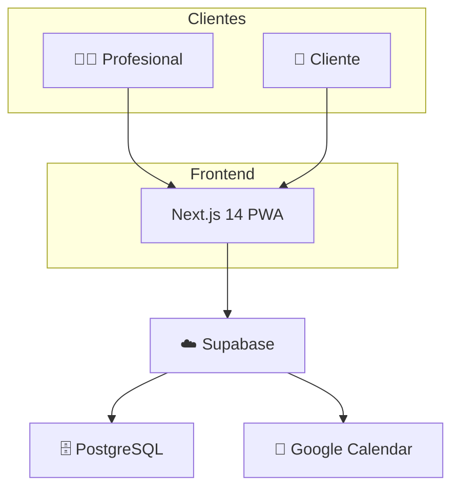

# 🕐 TimeFlowPro

<div align="center">


**Sistema de agendamiento inteligente para profesionales móviles**

[](https://nextjs.org/)
[](https://supabase.com/)
[](https://www.typescriptlang.org/)
[](https://tailwindcss.com/)
[](./LICENSE)

[Demo](https://timeflowpro.app) · [Documentación](./Documentacion/) · [RoadMap](./RoadMap/)

</div>

---

## 📋 Descripción

TimeFlowPro es un sistema de gestión de citas diseñado específicamente para **profesionales móviles** que trabajan en múltiples ubicaciones. A diferencia de las agendas tradicionales que asumen horarios rígidos y ubicaciones fijas, TimeFlowPro:

- ✅ **Aprende** la duración real de los servicios por cliente
- ✅ **Calcula** tiempos de traslado entre ubicaciones
- ✅ **Bloquea** automáticamente tiempo de viaje
- ✅ **Sincroniza** con Google Calendar
- ✅ **Permite** reservas online sin registro de clientes

### El Problema que Resuelve

> "Las agendas tradicionales están pensadas para lugares fijos y tiempos rígidos, no para profesionales móviles ni para servicios que evolucionan con el cliente."

**Ejemplo real:** Felipe es kinesiólogo y trabaja en:
- 🏋️ Iron Gym
- 🏠 Domicilios particulares  
- 🏨 Hotel Viejas Escuelas

Con agendas tradicionales, Felipe pierde tiempo porque:
- Los servicios duran 45 min por defecto, pero algunos pacientes solo necesitan 30 min
- El sistema no considera que necesita 20 min para trasladarse entre ubicaciones
- Termina con "huecos muertos" que nadie puede reservar

**TimeFlowPro soluciona esto** adaptando duraciones y bloqueando tiempos de traslado automáticamente.

---

## ✨ Características Principales

### MVP (Fase 1)

| Funcionalidad | Descripción |
|---------------|-------------|
| 🔐 **Auth con Google** | Login sin contraseñas, trial de 14 días |
| 📍 **Multi-ubicación** | Gestiona múltiples lugares de trabajo |
| 🛠️ **Servicios flexibles** | Duración, precio, reserva online |
| 👥 **Gestión de clientes** | Historial y datos de contacto |
| 📅 **Calendario inteligente** | Vista diaria/semanal con colores |
| ⏱️ **Duración adaptativa** | Aprende del historial cliente-servicio |
| 🚗 **Travel blocks** | Bloquea tiempo de traslado automáticamente |
| 🌐 **Portal público** | Clientes reservan sin registrarse |
| 📆 **Google Calendar** | Sincronización bidireccional |
| 🔒 **Bloqueos personales** | Almuerzo, vacaciones, tiempo personal |

### Fase 2 (Roadmap)

- 💳 Pagos con MercadoPago
- 🗺️ Google Maps para rutas
- 📊 Reportes y métricas
- 📱 App móvil nativa

---

## 🛠️ Tech Stack

| Capa | Tecnología |
|------|------------|
| **Frontend** | Next.js 14 (App Router), React 18, TailwindCSS |
| **Backend** | Supabase (PostgreSQL + Auth + Edge Functions) |
| **Lenguaje** | TypeScript 5.3 |
| **Hosting** | Vercel (Frontend), Supabase Cloud (Backend) |
| **CI/CD** | GitHub Actions |
| **Testing** | Vitest, Testing Library, Playwright (local) |

### Arquitectura



---

## 🚀 Quick Start

### Prerrequisitos

- Node.js 20+
- pnpm 8+
- Docker (para Supabase local)

### Instalación

```bash
# Clonar repositorio
git clone https://github.com/HypeVault/TimeFlowPro.git
cd TimeFlowPro

# Instalar dependencias
pnpm install

# Copiar variables de entorno
cp .env.example .env.local

# Iniciar Supabase local
pnpm supabase:start

# Ejecutar migraciones
pnpm supabase:migrate

# Iniciar desarrollo
pnpm dev
```

### Variables de Entorno

```env
# .env.local
NEXT_PUBLIC_SUPABASE_URL=http://localhost:54321
NEXT_PUBLIC_SUPABASE_ANON_KEY=your-anon-key
SUPABASE_SERVICE_ROLE_KEY=your-service-key

# Google OAuth
GOOGLE_CLIENT_ID=your-client-id
GOOGLE_CLIENT_SECRET=your-client-secret

# App
NEXT_PUBLIC_APP_URL=http://localhost:3000
```

---

## 📁 Estructura del Proyecto

```
TimeFlowPro/
├── apps/
│   └── web/                    # Next.js 14 App
│       ├── src/
│       │   ├── app/            # App Router pages
│       │   ├── components/     # Componentes React
│       │   │   ├── ui/         # Componentes base
│       │   │   └── features/   # Componentes de negocio
│       │   ├── lib/
│       │   │   ├── supabase/   # Clientes Supabase
│       │   │   └── messages/   # Sistema i18n (español)
│       │   ├── services/       # Lógica de negocio
│       │   ├── hooks/          # Custom hooks
│       │   └── types/          # TypeScript types
│       └── tests/              # Tests unitarios e integración
├── supabase/
│   ├── migrations/             # Migraciones SQL
│   ├── functions/              # Edge Functions
│   └── seed.sql                # Datos de prueba
├── Documentacion/              # PRD completo
├── RoadMap/                    # Sprints y tickets
└── Prompt/                     # Templates de prompts
```

---

## 📚 Documentación

| Documento | Descripción |
|-----------|-------------|
| [0-FichaProyecto](./Documentacion/0-FichaProyecto.md) | Información general y stack |
| [1-DescripcionGeneral](./Documentacion/1-DescripcionGeneral.md) | Funcionalidades y UX |
| [2-ArquitecturaSistema](./Documentacion/2-ArquitecturaSistema.md) | Arquitectura técnica |
| [3-ModeloDatos](./Documentacion/3-ModeloDatos.md) | Esquema de base de datos |
| [4-HistoriasUsuario](./Documentacion/4-HistoriasUsuario.md) | User stories con Gherkin |
| [5-EspecificacionAPI](./Documentacion/5-EspecificacionAPI.md) | Endpoints en OpenAPI |
| [6-TicketsTrabajo](./Documentacion/6-TicketsTrabajo.md) | Tickets detallados |
| [7-PullRequests](./Documentacion/7-PullRequests.md) | Estándares de PRs |

### RoadMap

| Sprint | Tema | Estado |
|--------|------|--------|
| [Sprint 0](./RoadMap/sprint-0.md) | Setup & Fundamentos | 📋 Pendiente |
| [Sprint 1](./RoadMap/sprint-1.md) | Autenticación | 📋 Pendiente |
| [Sprint 2](./RoadMap/sprint-2.md) | Ubicaciones y Servicios | 📋 Pendiente |
| [Sprint 3](./RoadMap/sprint-3.md) | Citas y Calendario | 📋 Pendiente |
| [Sprint 4](./RoadMap/sprint-4.md) | Portal Público | 📋 Pendiente |
| [Sprint 5](./RoadMap/sprint-5.md) | Google Calendar | 📋 Pendiente |

---

## 🧪 Testing

```bash
# Tests unitarios
pnpm test

# Tests con coverage
pnpm test:coverage

# Tests de integración
pnpm test:integration

# Tests E2E (solo local)
pnpm test:e2e
```

---

## 🤝 Contribuir

1. Fork el repositorio
2. Crea una rama (`git checkout -b feat/nueva-funcionalidad`)
3. Commit con conventional commits (`git commit -m 'feat(scope): descripción'`)
4. Push a la rama (`git push origin feat/nueva-funcionalidad`)
5. Abre un Pull Request

### Convenciones

- **Commits:** [Conventional Commits](https://www.conventionalcommits.org/)
- **Código:** ESLint + Prettier
- **Idioma código:** Inglés
- **Mensajes usuario:** Español (via `messages.es.yml`)

---

## 📄 Licencia

Este proyecto está bajo la Licencia MIT. Ver [LICENSE](./LICENSE) para más detalles.

---

## 👥 Equipo

- **Rubén** - Desarrollo y Arquitectura

---

## 📞 Contacto

- **Email:** 4tipruben@gmail.com
- **GitHub:** [@rcontreras1337](https://github.com/rcontreras1337)

---

<div align="center">

**Hecho con ❤️ por Ruben Contreras**

[⬆ Volver arriba](#-timeflowpro)

</div>

