# 🕐 TimeFlowPro

<div align="center">


**Sistema de agendamiento inteligente para profesionales móviles**

[](https://nextjs.org/)
[](https://supabase.com/)
[](https://www.typescriptlang.org/)
[](https://tailwindcss.com/)
[](./LICENSE)

[Demo](https://timeflowpro.app) · [Documentación](./Documentacion/) · [RoadMap](./RoadMap/)

</div>

---

## 📋 Descripción

TimeFlowPro es un sistema de gestión de citas diseñado específicamente para **profesionales móviles** que trabajan en múltiples ubicaciones. A diferencia de las agendas tradicionales que asumen horarios rígidos y ubicaciones fijas, TimeFlowPro:

- ✅ **Aprende** la duración real de los servicios por cliente
- ✅ **Calcula** tiempos de traslado entre ubicaciones
- ✅ **Bloquea** automáticamente tiempo de viaje
- ✅ **Sincroniza** con Google Calendar
- ✅ **Permite** reservas online sin registro de clientes

### El Problema que Resuelve

> "Las agendas tradicionales están pensadas para lugares fijos y tiempos rígidos, no para profesionales móviles ni para servicios que evolucionan con el cliente."

**Ejemplo real:** Felipe es kinesiólogo y trabaja en:

- 🏋️ Iron Gym
- 🏠 Domicilios particulares
- 🏨 Hotel Viejas Escuelas

Con agendas tradicionales, Felipe pierde tiempo porque:

- Los servicios duran 45 min por defecto, pero algunos pacientes solo necesitan 30 min
- El sistema no considera que necesita 20 min para trasladarse entre ubicaciones
- Termina con "huecos muertos" que nadie puede reservar

**TimeFlowPro soluciona esto** adaptando duraciones y bloqueando tiempos de traslado automáticamente.

---

## ✨ Características Principales

### MVP (Fase 1)

| Funcionalidad                 | Descripción                                |
| ----------------------------- | ------------------------------------------ |
| 🔐 **Auth con Google**        | Login sin contraseñas, trial de 14 días    |
| 📍 **Multi-ubicación**        | Gestiona múltiples lugares de trabajo      |
| 🛠️ **Servicios flexibles**    | Duración, precio, reserva online           |
| 👥 **Gestión de clientes**    | Historial y datos de contacto              |
| 📅 **Calendario inteligente** | Vista diaria/semanal con colores           |
| ⏱️ **Duración adaptativa**    | Aprende del historial cliente-servicio     |
| 🚗 **Travel blocks**          | Bloquea tiempo de traslado automáticamente |
| 🌐 **Portal público**         | Clientes reservan sin registrarse          |
| 📆 **Google Calendar**        | Sincronización bidireccional               |
| 🔒 **Bloqueos personales**    | Almuerzo, vacaciones, tiempo personal      |

### Fase 2 (Roadmap)

- 💳 Pagos con MercadoPago
- 🗺️ Google Maps para rutas
- 📊 Reportes y métricas
- 📱 App móvil nativa

---

## 🛠️ Tech Stack

| Capa         | Tecnología                                     |
| ------------ | ---------------------------------------------- |
| **Frontend** | Next.js 14 (App Router), React 18, TailwindCSS |
| **Backend**  | Supabase (PostgreSQL + Auth + Edge Functions)  |
| **Lenguaje** | TypeScript 5.3                                 |
| **Hosting**  | Vercel (Frontend), Supabase Cloud (Backend)    |
| **CI/CD**    | GitHub Actions                                 |
| **Testing**  | Vitest, Testing Library, Playwright (local)    |

### Arquitectura

```mermaid
flowchart TB
    subgraph Clientes
        Pro["🧑‍⚕️ Profesional"]
        Cli["👤 Cliente"]
    end

    subgraph Frontend
        PWA["Next.js 14 PWA"]
    end

    Pro --> PWA
    Cli --> PWA

    PWA --> Supabase["☁️ Supabase"]
    Supabase --> PostgreSQL["🗄️ PostgreSQL"]
    Supabase --> GCal["📅 Google Calendar"]
```



---

## 🚀 Quick Start

### Prerrequisitos

- Node.js 20+
- pnpm 8+
- Docker (para Supabase local)

### Instalación

```bash
# Clonar repositorio
git clone https://github.com/HypeVault/TimeFlowPro.git
cd TimeFlowPro

# Instalar dependencias
pnpm install

# Copiar variables de entorno
cp .env.example .env.local

# Iniciar Supabase local
pnpm supabase:start

# Ejecutar migraciones
pnpm supabase:migrate

# Iniciar desarrollo
pnpm dev
```

### Variables de Entorno

```env
# .env.local
NEXT_PUBLIC_SUPABASE_URL=http://localhost:54321
NEXT_PUBLIC_SUPABASE_ANON_KEY=your-anon-key
SUPABASE_SERVICE_ROLE_KEY=your-service-key

# Google OAuth
GOOGLE_CLIENT_ID=your-client-id
GOOGLE_CLIENT_SECRET=your-client-secret

# App
NEXT_PUBLIC_APP_URL=http://localhost:3000
```

---

## 📁 Estructura del Proyecto

```
TimeFlowPro/
├── apps/
│   └── web/                    # Next.js 14 App
│       ├── src/
│       │   ├── app/            # App Router pages
│       │   ├── components/     # Componentes React
│       │   │   ├── ui/         # Componentes base
│       │   │   └── features/   # Componentes de negocio
│       │   ├── lib/
│       │   │   ├── supabase/   # Clientes Supabase
│       │   │   └── messages/   # Sistema i18n (español)
│       │   ├── services/       # Lógica de negocio
│       │   ├── hooks/          # Custom hooks
│       │   └── types/          # TypeScript types
│       └── tests/              # Tests unitarios e integración
├── supabase/
│   ├── migrations/             # Migraciones SQL
│   ├── functions/              # Edge Functions
│   └── seed.sql                # Datos de prueba
├── Documentacion/              # PRD completo
├── RoadMap/                    # Sprints y tickets
└── Prompt/                     # Templates de prompts
```

---

## 📚 Documentación

| Documento                                                         | Descripción                 |
| ----------------------------------------------------------------- | --------------------------- |
| [0-FichaProyecto](./Documentacion/0-FichaProyecto.md)             | Información general y stack |
| [1-DescripcionGeneral](./Documentacion/1-DescripcionGeneral.md)   | Funcionalidades y UX        |
| [2-ArquitecturaSistema](./Documentacion/2-ArquitecturaSistema.md) | Arquitectura técnica        |
| [3-ModeloDatos](./Documentacion/3-ModeloDatos.md)                 | Esquema de base de datos    |
| [4-HistoriasUsuario](./Documentacion/4-HistoriasUsuario.md)       | User stories con Gherkin    |
| [5-EspecificacionAPI](./Documentacion/5-EspecificacionAPI.md)     | Endpoints en OpenAPI        |
| [6-TicketsTrabajo](./Documentacion/6-TicketsTrabajo.md)           | Tickets detallados          |
| [7-PullRequests](./Documentacion/7-PullRequests.md)               | Estándares de PRs           |

### RoadMap

| Sprint                            | Tema                    | Estado               |
| --------------------------------- | ----------------------- | -------------------- |
| [Sprint 0](./RoadMap/sprint-0.md) | Setup & Fundamentos     | 🔄 En progreso (4/6) |
| [Sprint 1](./RoadMap/sprint-1.md) | Autenticación           | 📋 Pendiente         |
| [Sprint 2](./RoadMap/sprint-2.md) | Ubicaciones y Servicios | 📋 Pendiente         |
| [Sprint 3](./RoadMap/sprint-3.md) | Citas y Calendario      | 📋 Pendiente         |
| [Sprint 4](./RoadMap/sprint-4.md) | Portal Público          | 📋 Pendiente         |
| [Sprint 5](./RoadMap/sprint-5.md) | Google Calendar         | 📋 Pendiente         |

---

## 🧪 Testing

```bash
# Tests unitarios
pnpm test

# Tests con coverage
pnpm test:coverage

# Tests de integración
pnpm test:integration

# Tests E2E (solo local)
pnpm test:e2e
```

---

## 🤝 Contribuir

1. Fork el repositorio
2. Crea una rama (`git checkout -b feat/nueva-funcionalidad`)
3. Commit con conventional commits (`git commit -m 'feat(scope): descripción'`)
4. Push a la rama (`git push origin feat/nueva-funcionalidad`)
5. Abre un Pull Request

### Convenciones

- **Commits:** [Conventional Commits](https://www.conventionalcommits.org/)
- **Código:** ESLint + Prettier
- **Idioma código:** Inglés
- **Mensajes usuario:** Español (via `messages.es.yml`)

---

## 📝 Changelog

### v0.1.0 (2026-01-04) - Sprint 0

#### T-0-01: Brand Identity ✅

- 🎨 **Logo principal** creado en SVG (light, dark, icon-only)
- 🎨 **Design Tokens** definidos:
  - Paleta de colores (Primary Blue, Secondary Teal, Accent Orange)
  - Sistema tipográfico (Plus Jakarta Sans)
  - Espaciado y layout (8px base grid)
  - Sombras y elevación
- 🎨 **Favicons y PWA Icons** configurados (SVG base)
- 🎨 **Open Graph Image** para redes sociales
- 📄 **Web Manifest** para PWA
- 📚 **Documentación de brand assets** en `apps/web/BRAND-ASSETS.md`

#### Archivos Añadidos

```
apps/web/
├── public/
│   ├── logo.svg
│   ├── logo-dark.svg
│   ├── logo-icon.svg
│   ├── favicon.svg
│   ├── apple-touch-icon.svg
│   ├── og-image.svg
│   └── site.webmanifest
├── src/styles/
│   ├── globals.css
│   └── tokens/
│       ├── colors.css
│       ├── typography.css
│       └── spacing.css
└── BRAND-ASSETS.md

scripts/
└── generate-icons.js
```

#### T-0-02: Setup Monorepo + Next.js 14 ✅

- 📦 **Monorepo** configurado con pnpm workspaces
- ⚡ **Next.js 14** con App Router y TypeScript estricto
- 🎨 **TailwindCSS** integrado con design tokens
- 🏗️ **Arquitectura Hexagonal** estructura de carpetas
- 🧩 **Componentes base UI** (Button, Input, Card)
- 🔧 **Supabase clients** configurados (browser, server, middleware)
- 📦 **Package shared** con tipos y utilidades comunes

#### Archivos Añadidos T-0-02

```
./
├── package.json              # Monorepo root
├── pnpm-workspace.yaml       # Workspace config
├── .npmrc                    # pnpm config
├── .gitignore               # Git ignore rules
├── .env.example             # Environment template

apps/web/
├── package.json             # Web app dependencies
├── tsconfig.json            # TypeScript strict config
├── tailwind.config.ts       # Tailwind with design tokens
├── postcss.config.mjs       # PostCSS config
├── next.config.mjs          # Next.js config
├── .eslintrc.json           # ESLint config
├── src/
│   ├── app/
│   │   ├── layout.tsx       # Root layout with fonts
│   │   ├── page.tsx         # Landing page
│   │   └── globals.css      # Global styles
│   ├── components/ui/
│   │   ├── button.tsx       # Button component
│   │   ├── input.tsx        # Input component
│   │   ├── card.tsx         # Card component
│   │   └── index.ts         # UI exports
│   ├── lib/
│   │   ├── utils/cn.ts      # Classnames utility
│   │   └── supabase/        # Supabase clients
│   ├── types/               # TypeScript types
│   └── middleware.ts        # Auth middleware

packages/shared/
├── package.json
├── tsconfig.json
└── src/
    ├── types/               # Shared types
    └── utils/               # Shared utilities
```

#### T-0-03: Configuración Supabase Local (Docker) ✅

- 🐳 **Supabase CLI** instalado y configurado
- 🔧 **config.toml** configurado con:
  - PostgreSQL 16 en puerto 54322
  - API REST en puerto 54321
  - Supabase Studio en puerto 54323
  - Auth con Google OAuth habilitado
  - Storage y Realtime habilitados
- 📦 **Scripts de Supabase** en package.json:
  - `supabase:start`, `supabase:stop`, `supabase:status`
  - `supabase:reset`, `supabase:types`, `supabase:migrate`
- 🔄 **Generación automática de tipos** TypeScript desde el schema
- 🧪 **Tests de integración** para validar conexión a Supabase
- 🧪 **Tests unitarios** para clientes Supabase (browser/server)

#### Archivos Añadidos T-0-03

```
./
├── supabase/
│   ├── config.toml          # Configuración Supabase local
│   ├── seed.sql             # Datos de prueba (vacío)
│   └── migrations/
│       └── .gitkeep         # Mantener carpeta en git
├── vitest.config.ts         # Configuración tests integración
└── tests/
    ├── integration/
    │   └── supabase-connection.test.ts
    └── unit/
        └── lib/
            └── supabase-client.test.ts

apps/web/
├── vitest.config.ts         # Configuración tests unitarios
├── tests/
│   └── setup.ts             # Setup de tests
├── .env.local               # Variables de entorno local
├── .env.example             # Template de variables
└── src/types/
    └── database.types.ts    # Tipos auto-generados
```

#### T-0-04: GitHub Actions CI/CD Pipeline ✅

- 🔄 **CI Pipeline** configurado con GitHub Actions:
  - Lint + TypeCheck en cada PR a main
  - Tests unitarios con coverage
  - Build de producción
  - Deploy automático a Vercel en push a main
- 📝 **PR Check Workflow**:
  - Validación de títulos (Conventional Commits)
  - Etiquetado automático por tamaño del PR
  - Verificación de archivos sensibles
- 🤖 **Dependabot** configurado para actualizaciones automáticas
- 🧪 **Tests unitarios** para componentes UI
- 📊 **Coverage** con Codecov integrado

#### Archivos Añadidos T-0-04

```
.github/
├── workflows/
│   ├── ci.yml               # Pipeline principal CI/CD
│   └── pr-check.yml         # Validaciones de PR
└── dependabot.yml           # Configuración Dependabot

apps/web/
├── vitest.config.ts         # Config actualizada con coverage
└── tests/
    └── unit/
        ├── components/
        │   └── button.test.tsx
        ├── lib/
        │   └── example.test.ts
        └── utils/
            └── cn.test.ts
```

---

## 📄 Licencia

Este proyecto está bajo la Licencia MIT. Ver [LICENSE](./LICENSE) para más detalles.

---

## 👥 Equipo

- **Rubén** - Desarrollo y Arquitectura

---

## 📞 Contacto

- **Email:** 4tipruben@gmail.com
- **GitHub:** [@rcontreras1337](https://github.com/rcontreras1337)

---

<div align="center">

**Hecho con ❤️ por Ruben Contreras**

[⬆ Volver arriba](#-timeflowpro)

</div>
