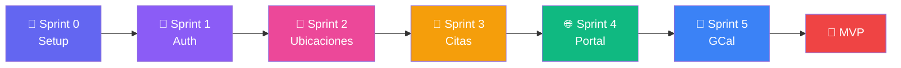

# 🗺️ RoadMap TimeFlowPro MVP

## 📋 Índice de Sprints

| Sprint | Nombre | Tickets | Story Points | Estado |
|--------|--------|---------|--------------|--------|
| [Sprint 0](./sprint-0.md) | Setup & Fundamentos | 6 | 21 | 📋 Pendiente |
| [Sprint 1](./sprint-1.md) | Autenticación y Perfil | 7 | 31 | 📋 Pendiente |
| [Sprint 2](./sprint-2.md) | Ubicaciones y Servicios | 8 | 36 | 📋 Pendiente |
| [Sprint 3](./sprint-3.md) | Clientes y Citas | 6 | 36 | 📋 Pendiente |
| [Sprint 4](./sprint-4.md) | Portal Público | 9 | 44 | 📋 Pendiente |
| [Sprint 5](./sprint-5.md) | Google Calendar + Bloqueos | 8 | 42 | 📋 Pendiente |
| **TOTAL MVP** | | **44** | **210** | |

---

## ⚠️ Importante: Solo MVP

Este RoadMap cubre **únicamente el MVP (Fase 1)**. 

Las funcionalidades de **Fase 2** (US-24 a US-30) incluyen:
- 🗺️ Cálculo automático con Google Maps
- 💳 Pagos con MercadoPago  
- 📊 Reportes y estadísticas
- 👥 Gestión multi-profesional
- 📲 Recordatorios WhatsApp

Estas HDUs están documentadas pero **no tienen tickets de trabajo** hasta completar el MVP.

---

## 🚀 Orden de Ejecución



---

## 📁 Estructura de Archivos

```
RoadMap/
├── README.md                    # Este archivo
├── prompt-ticket-template.md    # Template de prompt para IA
├── sprint-0.md                  # Detalle Sprint 0
├── sprint-1.md                  # Detalle Sprint 1
├── sprint-2.md                  # Detalle Sprint 2
├── sprint-3.md                  # Detalle Sprint 3
├── sprint-4.md                  # Detalle Sprint 4
└── sprint-5.md                  # Detalle Sprint 5
```

---

## 🎯 Cómo Usar Este RoadMap

### Para Desarrolladores

1. **Consulta el sprint actual** en la tabla de arriba
2. **Abre el archivo del sprint** (ej: `sprint-1.md`)
3. **Selecciona un ticket** que no esté bloqueado
4. **Usa el template de prompt** (`prompt-ticket-template.md`) para pedir ayuda a la IA
5. **Marca el ticket como completado** cuando termines

### Para IA (Cursor/Claude)

1. El desarrollador te pasará el contenido del `prompt-ticket-template.md`
2. Recibirás el ID del ticket y contexto adicional
3. Consulta `Documentacion/6-TicketsTrabajo.md` para los detalles
4. Implementa siguiendo las especificaciones exactas
5. Genera tests según lo indicado en el ticket

---

## 📊 Progreso

```
Sprint 0: ░░░░░░░░░░ 0%
Sprint 1: ░░░░░░░░░░ 0%
Sprint 2: ░░░░░░░░░░ 0%
Sprint 3: ░░░░░░░░░░ 0%
Sprint 4: ░░░░░░░░░░ 0%
Sprint 5: ░░░░░░░░░░ 0%
─────────────────────────
TOTAL:    ░░░░░░░░░░ 0%
```

---

## 🔗 Referencias

- [Documentación PRD completa](../Documentacion/)
- [Tickets de Trabajo detallados](../Documentacion/6-TicketsTrabajo.md)
- [Historias de Usuario](../Documentacion/4-HistoriasUsuario.md)
- [Arquitectura del Sistema](../Documentacion/2-ArquitecturaSistema.md)

---

**Última actualización:** Enero 2026

