# 🔧 Sprint 0: Setup & Fundamentos

## 📊 Resumen

| Métrica | Valor |
|---------|-------|
| **Tickets** | 6 |
| **Story Points** | 21 |
| **Duración estimada** | 1 semana |
| **Objetivo** | Configurar proyecto, CI/CD, design system y sistema de mensajes |

---

## 📋 Lista de Tickets

| ID | Título | Tipo | Pts | HDU | Estado | Bloqueado por |
|----|--------|------|-----|-----|--------|---------------|
| T-0-01 | Definición de Brand Identity | Design | 3 | - | ⬜ Pendiente | - |
| T-0-02 | Setup Monorepo + Next.js 14 | Infra | 5 | - | ⬜ Pendiente | T-0-01 |
| T-0-03 | Supabase Local (Docker) | Infra | 3 | - | ⬜ Pendiente | - |
| T-0-04 | GitHub Actions CI/CD | Infra | 5 | - | ⬜ Pendiente | T-0-02 |
| T-0-05 | Husky + Commitlint + ESLint | Infra | 2 | - | ⬜ Pendiente | T-0-02 |
| T-0-06 | Sistema de Mensajes (i18n) | Infra | 3 | - | ⬜ Pendiente | T-0-02 |

> **Nota:** Sprint 0 es infraestructura fundacional, no tiene HDUs asociadas.

---

## 🔗 Diagrama de Dependencias

```mermaid
flowchart TD
    T001["T-0-01<br/>🎨 Brand Identity"]
    T003["T-0-03<br/>🐳 Supabase Docker"]
    
    T001 --> T002["T-0-02<br/>📦 Monorepo"]
    T003 --> T002
    
    T002 --> T004["T-0-04<br/>🔄 GitHub Actions"]
    T002 --> T005["T-0-05<br/>🪝 Husky"]
    T002 --> T006["T-0-06<br/>🌐 i18n Messages"]

    style T001 fill:#EC4899,color:#fff
    style T002 fill:#6366F1,color:#fff
    style T003 fill:#0EA5E9,color:#fff
    style T004 fill:#10B981,color:#fff
    style T005 fill:#F59E0B,color:#fff
    style T006 fill:#8B5CF6,color:#fff
```

---

## 📝 Orden de Ejecución Sugerido

1. **Paralelo inicial:**
   - T-0-01 (Brand Identity) - Designer/Dev
   - T-0-03 (Supabase Docker) - Dev

2. **Secuencial:**
   - T-0-02 (Monorepo) - Requiere T-0-01

3. **Paralelo final:**
   - T-0-04 (GitHub Actions)
   - T-0-05 (Husky)
   - T-0-06 (Sistema de Mensajes)

---

## 🎫 Detalles Rápidos por Ticket

### T-0-01: Brand Identity
- **Objetivo:** Logo, colores, tipografía
- **Entregables:** 
  - Logo SVG/PNG
  - Paleta en `tailwind.config.ts`
  - Tipografía: Plus Jakarta Sans

### T-0-02: Monorepo + Next.js
- **Objetivo:** Estructura de proyecto
- **Entregables:**
  - pnpm workspaces
  - Next.js 14 + TailwindCSS
  - Arquitectura hexagonal
  - Componentes base (Button, Input, Card)

### T-0-03: Supabase Local
- **Objetivo:** BD local para desarrollo
- **Entregables:**
  - Docker compose
  - Clientes browser/server
  - Tipos TypeScript generados

### T-0-04: GitHub Actions
- **Objetivo:** CI/CD automatizado
- **Entregables:**
  - Lint + TypeCheck
  - Tests unitarios e integración
  - Deploy a Vercel

### T-0-05: Husky + Commitlint
- **Objetivo:** Calidad de código
- **Entregables:**
  - Pre-commit hooks
  - Conventional commits enforced

### T-0-06: Sistema de Mensajes (i18n)
- **Objetivo:** Centralizar textos de usuario
- **Entregables:**
  - Archivo `messages.es.yml`
  - Helper `getMessage()`
  - Configuración de idioma

---

## ✅ Checklist de Completado

- [ ] Logo y Brand aprobados
- [ ] Proyecto corre localmente (`pnpm dev`)
- [ ] Supabase local funcionando
- [ ] CI pasa en GitHub
- [ ] Commits siguen conventional commits
- [ ] Sistema de mensajes configurado
- [ ] README actualizado

---

**Referencia completa:** [Documentacion/6-TicketsTrabajo.md](../Documentacion/6-TicketsTrabajo.md)

