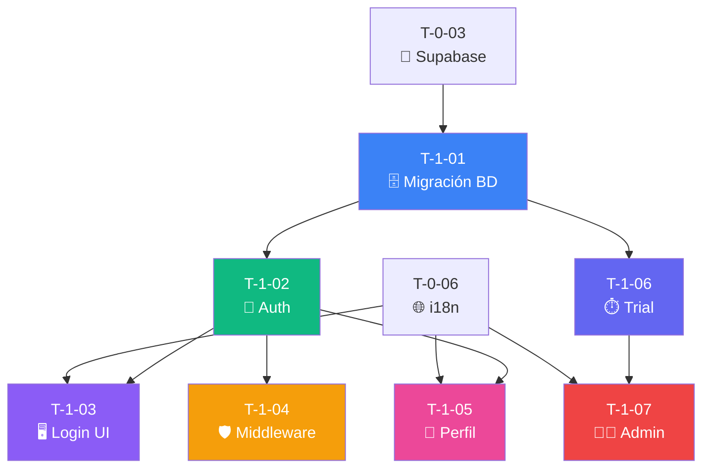

# 🔐 Sprint 1: Autenticación y Perfil

## 📊 Resumen

| Métrica | Valor |
|---------|-------|
| **Tickets** | 7 |
| **Story Points** | 31 |
| **Duración estimada** | 2 semanas |
| **Objetivo** | Login con Google, gestión de perfil, sistema de trial y dashboard admin |

---

## 📋 Lista de Tickets

| ID | Título | Tipo | Pts | HDU | Estado | Bloqueado por |
|----|--------|------|-----|-----|--------|---------------|
| T-1-01 | Migración inicial de BD | Database | 5 | US-01 | ⬜ Pendiente | T-0-03 |
| T-1-02 | Supabase Auth + Google OAuth | Backend | 5 | US-01 | ⬜ Pendiente | T-1-01 |
| T-1-03 | Página de Login | Frontend | 3 | US-01 | ⬜ Pendiente | T-1-02, T-0-06 |
| T-1-04 | Middleware de autenticación | Backend | 3 | US-01, US-19 | ⬜ Pendiente | T-1-02 |
| T-1-05 | Formulario de perfil | Frontend | 5 | US-02 | ⬜ Pendiente | T-1-02, T-0-06 |
| T-1-06 | Sistema de trial | Backend | 5 | US-16, US-19 | ⬜ Pendiente | T-1-01 |
| T-1-07 | Dashboard Admin | Frontend | 5 | US-16, US-17, US-18 | ⬜ Pendiente | T-1-06, T-0-06 |

---

## 🔗 Diagrama de Dependencias

---

## 📝 HDUs Cubiertas

- **US-01:** Registro y Login con Google
- **US-02:** Configuración de Perfil Profesional
- **US-16:** Configuración de Trial por Superadmin
- **US-17:** Dashboard de Gestión de Profesionales
- **US-18:** Notificaciones de Registro y Trial
- **US-19:** Cuenta en Modo Solo Lectura

---

## ✅ Checklist de Completado

- [ ] Login con Google funciona
- [ ] Perfil se puede editar
- [ ] Trial de 14 días se asigna automáticamente
- [ ] Modo solo lectura funciona al expirar trial
- [ ] Admin puede ver y gestionar profesionales
- [ ] Todos los mensajes en español via YML

---

**Referencia completa:** [Documentacion/6-TicketsTrabajo.md](../Documentacion/6-TicketsTrabajo.md)

