# 🔐 Sprint 1: Autenticación y Perfil

## 📊 Resumen

| Métrica               | Valor                                                                   |
| --------------------- | ----------------------------------------------------------------------- |
| **Tickets**           | 7                                                                       |
| **Story Points**      | 31                                                                      |
| **Duración estimada** | 2 semanas                                                               |
| **Objetivo**          | Login con Google, gestión de perfil, sistema de trial y dashboard admin |

---

## 📋 Lista de Tickets

| ID     | Título                       | Tipo     | Pts | HDU                 | Estado       | Bloqueado por  |
| ------ | ---------------------------- | -------- | --- | ------------------- | ------------ | -------------- |
| T-1-01 | Migración inicial de BD      | Database | 5   | US-01               | ⬜ Pendiente | T-0-03         |
| T-1-02 | Supabase Auth + Google OAuth | Backend  | 5   | US-01               | ⬜ Pendiente | T-1-01         |
| T-1-03 | Página de Login              | Frontend | 3   | US-01               | ⬜ Pendiente | T-1-02, T-0-06 |
| T-1-04 | Middleware de autenticación  | Backend  | 3   | US-01, US-19        | ⬜ Pendiente | T-1-02         |
| T-1-05 | Formulario de perfil         | Frontend | 5   | US-02               | ⬜ Pendiente | T-1-02, T-0-06 |
| T-1-06 | Sistema de trial             | Backend  | 5   | US-16, US-19        | ⬜ Pendiente | T-1-01         |
| T-1-07 | Dashboard Admin              | Frontend | 5   | US-16, US-17, US-18 | ⬜ Pendiente | T-1-06, T-0-06 |

---

## 🔗 Diagrama de Dependencias

```mermaid
flowchart TD
    T003["T-0-03<br/>🐳 Supabase"] --> T101["T-1-01<br/>🗄️ Migración BD"]
    T006["T-0-06<br/>🌐 i18n"] --> T103
    T006 --> T105
    T006 --> T107

    T101 --> T102["T-1-02<br/>🔑 Auth"]
    T101 --> T106["T-1-06<br/>⏱️ Trial"]

    T102 --> T103["T-1-03<br/>🖥️ Login UI"]
    T102 --> T104["T-1-04<br/>🛡️ Middleware"]
    T102 --> T105["T-1-05<br/>📝 Perfil"]

    T106 --> T107["T-1-07<br/>👨‍💼 Admin"]

    style T101 fill:#3B82F6,color:#fff
    style T102 fill:#10B981,color:#fff
    style T103 fill:#8B5CF6,color:#fff
    style T104 fill:#F59E0B,color:#fff
    style T105 fill:#EC4899,color:#fff
    style T106 fill:#6366F1,color:#fff
    style T107 fill:#EF4444,color:#fff
```

---

## 📝 HDUs Cubiertas

- **US-01:** Registro y Login con Google
- **US-02:** Configuración de Perfil Profesional
- **US-16:** Configuración de Trial por Superadmin
- **US-17:** Dashboard de Gestión de Profesionales
- **US-18:** Notificaciones de Registro y Trial
- **US-19:** Cuenta en Modo Solo Lectura

---

## ✅ Checklist de Completado

- [ ] Login con Google funciona
- [ ] Perfil se puede editar
- [ ] Trial de 14 días se asigna automáticamente
- [ ] Modo solo lectura funciona al expirar trial
- [ ] Admin puede ver y gestionar profesionales
- [ ] Todos los mensajes en español via YML

---

**Referencia completa:** [Documentacion/6-TicketsTrabajo.md](../Documentacion/6-TicketsTrabajo.md)
