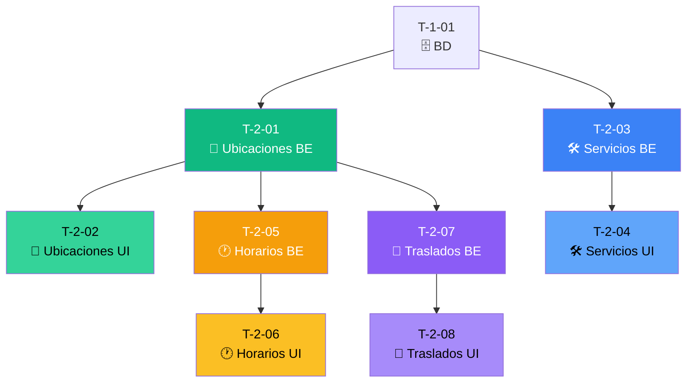

# 📍 Sprint 2: Ubicaciones y Servicios

## 📊 Resumen

| Métrica               | Valor                                                          |
| --------------------- | -------------------------------------------------------------- |
| **Tickets**           | 8                                                              |
| **Story Points**      | 36                                                             |
| **Duración estimada** | 2 semanas                                                      |
| **Objetivo**          | CRUD de ubicaciones, servicios, horarios y tiempos de traslado |

---

## 📋 Lista de Tickets

| ID     | Título                           | Tipo     | Pts | HDU   | Estado       | Bloqueado por |
| ------ | -------------------------------- | -------- | --- | ----- | ------------ | ------------- |
| T-2-01 | CRUD Ubicaciones (Backend)       | Backend  | 5   | US-03 | ⬜ Pendiente | T-1-01        |
| T-2-02 | UI Gestión de Ubicaciones        | Frontend | 5   | US-03 | ⬜ Pendiente | T-2-01        |
| T-2-03 | CRUD Servicios (Backend)         | Backend  | 5   | US-04 | ⬜ Pendiente | T-1-01        |
| T-2-04 | UI Gestión de Servicios          | Frontend | 5   | US-04 | ⬜ Pendiente | T-2-03        |
| T-2-05 | Horarios por ubicación (Backend) | Backend  | 5   | US-05 | ⬜ Pendiente | T-2-01        |
| T-2-06 | UI Horarios de trabajo           | Frontend | 5   | US-05 | ⬜ Pendiente | T-2-05        |
| T-2-07 | Tiempos de traslado (Backend)    | Backend  | 3   | US-06 | ⬜ Pendiente | T-2-01        |
| T-2-08 | UI Matriz de traslados           | Frontend | 3   | US-06 | ⬜ Pendiente | T-2-07        |

---

## 🔗 Diagrama de Dependencias

---

## 📝 HDUs Cubiertas

- **US-03:** Gestión de Ubicaciones de Trabajo
- **US-04:** Definición de Servicios
- **US-05:** Configuración de Horarios de Trabajo (por ubicación)
- **US-06:** Definición de Tiempos de Traslado (manual)

---

## ✅ Checklist de Completado

- [ ] CRUD de ubicaciones funciona
- [ ] CRUD de servicios funciona
- [ ] Horarios por ubicación configurables
- [ ] Matriz de tiempos de traslado editable
- [ ] Drag & drop para reordenar
- [ ] Todos los mensajes en español via YML

---

**Referencia completa:** [Documentacion/6-TicketsTrabajo.md](../Documentacion/6-TicketsTrabajo.md)
