# 📅 Sprint 3: Clientes y Citas

## 📊 Resumen

| Métrica | Valor |
|---------|-------|
| **Tickets** | 6 |
| **Story Points** | 36 |
| **Duración estimada** | 2 semanas |
| **Objetivo** | Gestión de clientes, citas, calendario y motor de disponibilidad |

---

## 📋 Lista de Tickets

| ID | Título | Tipo | Pts | HDU | Estado | Bloqueado por |
|----|--------|------|-----|-----|--------|---------------|
| T-3-01 | CRUD Clientes (Backend) | Backend | 5 | US-07 | ⬜ Pendiente | T-1-01 |
| T-3-02 | UI Gestión de Clientes | Frontend | 5 | US-07, US-08 | ⬜ Pendiente | T-3-01 |
| T-3-03 | Crear/Editar Citas (Backend) | Backend | 8 | US-09 | ⬜ Pendiente | T-2-01, T-2-03, T-3-01 |
| T-3-04 | Motor de Disponibilidad | Backend | 8 | US-09 | ⬜ Pendiente | T-2-05, T-2-07 |
| T-3-05 | Vista de Calendario (UI) | Frontend | 5 | US-09 | ⬜ Pendiente | T-3-03 |
| T-3-06 | Crear cita desde calendario | Frontend | 5 | US-09 | ⬜ Pendiente | T-3-04, T-3-05 |

> **Nota:** Los bloqueos personales (almuerzo, vacaciones) se implementan en Sprint 5 junto con Google Calendar.

---

## 🔗 Diagrama de Dependencias

```mermaid
flowchart TD
    T101["T-1-01<br/>🗄️ BD"] --> T301["T-3-01<br/>👥 Clientes BE"]
    T201["T-2-01<br/>📍 Ubicaciones"] --> T303
    T203["T-2-03<br/>🛠️ Servicios"] --> T303
    T205["T-2-05<br/>🕐 Horarios"] --> T304
    T207["T-2-07<br/>🚗 Traslados"] --> T304
    
    T301 --> T302["T-3-02<br/>👥 Clientes UI"]
    T301 --> T303["T-3-03<br/>📅 Citas BE"]
    
    T303 --> T305["T-3-05<br/>📆 Calendario"]
    
    T304["T-3-04<br/>⚡ Disponibilidad"] --> T306["T-3-06<br/>➕ Crear Cita UI"]
    T305 --> T306

    style T301 fill:#8B5CF6,color:#fff
    style T302 fill:#A78BFA,color:#000
    style T303 fill:#3B82F6,color:#fff
    style T304 fill:#10B981,color:#fff
    style T305 fill:#F59E0B,color:#fff
    style T306 fill:#EC4899,color:#fff
```

---

## 📝 HDUs Cubiertas

- **US-07:** Registro de Clientes
- **US-08:** Historial de Atenciones por Cliente
- **US-09:** Agendar Cita Manual (calendario visual)

> **Nota:** US-10 (Duración Adaptativa) y US-11 (Completar Cita) se implementan en Sprint 4.

---

## ✅ Checklist de Completado

- [ ] CRUD de clientes funciona
- [ ] Crear citas manual funciona
- [ ] Motor de disponibilidad calcula slots
- [ ] Travel blocks se crean automáticamente
- [ ] Calendario muestra citas y bloqueos
- [ ] Crear cita desde click en calendario
- [ ] Todos los mensajes en español via YML

---

**Referencia completa:** [Documentacion/6-TicketsTrabajo.md](../Documentacion/6-TicketsTrabajo.md)

