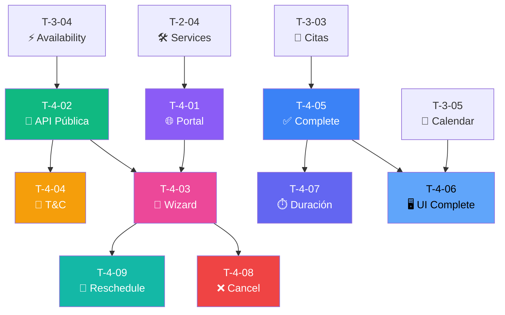

# 🌐 Sprint 4: Portal Público y Reservas Online

## 📊 Resumen

| Métrica               | Valor                                                                    |
| --------------------- | ------------------------------------------------------------------------ |
| **Tickets**           | 9                                                                        |
| **Story Points**      | 44                                                                       |
| **Duración estimada** | 2 semanas                                                                |
| **Objetivo**          | Portal público por slug, wizard de reserva, cancelación y reagendamiento |

---

## 📋 Lista de Tickets

| ID     | Título                       | Tipo     | Pts | HDU          | Estado       | Bloqueado por  |
| ------ | ---------------------------- | -------- | --- | ------------ | ------------ | -------------- |
| T-4-01 | Portal público por slug      | Frontend | 5   | US-12        | ⬜ Pendiente | T-2-04         |
| T-4-02 | API Disponibilidad pública   | Backend  | 5   | US-12, US-13 | ⬜ Pendiente | T-3-04         |
| T-4-03 | Wizard de reserva online     | Frontend | 8   | US-13        | ⬜ Pendiente | T-4-01, T-4-02 |
| T-4-04 | Términos y condiciones       | Backend  | 3   | US-23        | ⬜ Pendiente | T-4-02         |
| T-4-05 | Completar/Cancelar extensión | Backend  | 5   | US-11        | ⬜ Pendiente | T-3-03         |
| T-4-06 | UI Completar cita            | Frontend | 3   | US-11        | ⬜ Pendiente | T-4-05, T-3-05 |
| T-4-07 | Duración adaptativa refinada | Backend  | 5   | US-10        | ⬜ Pendiente | T-4-05         |
| T-4-08 | Cancelación por cliente      | Backend  | 5   | US-20        | ⬜ Pendiente | T-4-03         |
| T-4-09 | Reagendamiento de citas      | Backend  | 5   | US-21        | ⬜ Pendiente | T-4-03         |

---

## 🔗 Diagrama de Dependencias

---

## 📝 HDUs Cubiertas

- **US-12:** Portal Público del Profesional
- **US-13:** Reservar Cita Online (sin cuenta)
- **US-20:** Cancelación de Cita por Cliente
- **US-21:** Reagendamiento de Cita
- **US-23:** Términos y Condiciones al Reservar

---

## ✅ Checklist de Completado

- [ ] Portal público accesible por slug
- [ ] SEO metadata dinámica
- [ ] Wizard de 6 pasos funciona
- [ ] Cliente puede reservar sin cuenta
- [ ] Términos y condiciones obligatorios
- [ ] Cancelación con anticipación mínima
- [ ] Reagendamiento funciona
- [ ] Todos los mensajes en español via YML

---

**Referencia completa:** [Documentacion/6-TicketsTrabajo.md](../Documentacion/6-TicketsTrabajo.md)
