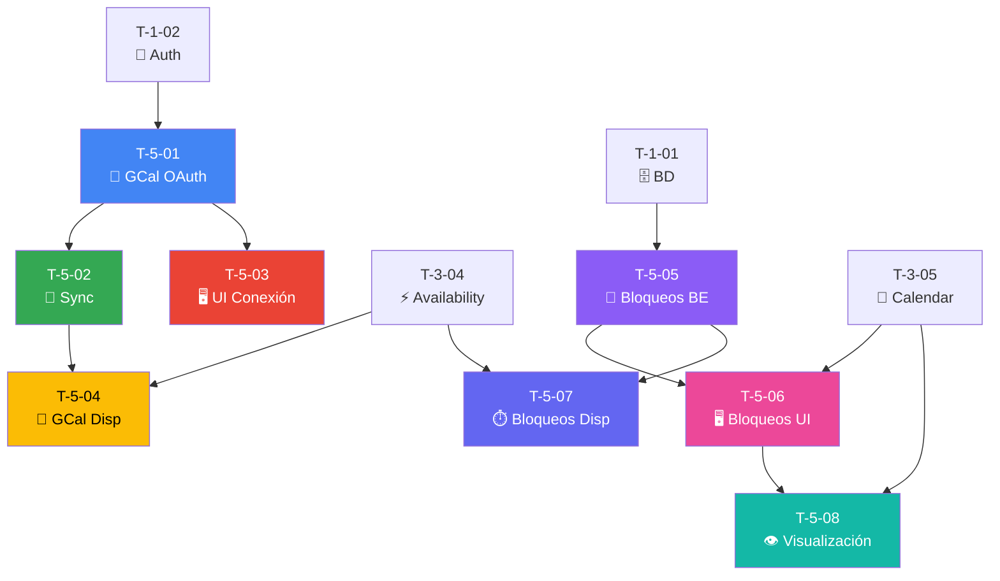

# 📆 Sprint 5: Google Calendar + Bloqueos Personales

## 📊 Resumen

| Métrica | Valor |
|---------|-------|
| **Tickets** | 8 |
| **Story Points** | 42 |
| **Duración estimada** | 2 semanas |
| **Objetivo** | Sincronización unidireccional con Google Calendar y gestión de bloqueos personales |

> **⚠️ Nota MVP:** La sincronización es **unidireccional** (TimeFlowPro → GCal). Los webhooks para sincronización bidireccional (GCal → TimeFlowPro) se implementarán en **Fase 2**.

---

## 📋 Lista de Tickets

| ID | Título | Tipo | Pts | HDU | Estado | Bloqueado por |
|----|--------|------|-----|-----|--------|---------------|
| T-5-01 | Google Calendar OAuth | Backend | 8 | US-14 | ⬜ Pendiente | T-1-02 |
| T-5-02 | Sincronización unidireccional (→GCal) | Backend | 8 | US-14 | ⬜ Pendiente | T-5-01 |
| T-5-03 | UI Conexión GCal | Frontend | 5 | US-14 | ⬜ Pendiente | T-5-01 |
| T-5-04 | Leer eventos GCal (disponibilidad) | Backend | 5 | US-15 | ⬜ Pendiente | T-5-01, T-3-04 |
| T-5-05 | CRUD Bloqueos personales | Backend | 5 | US-22 | ⬜ Pendiente | T-1-01 |
| T-5-06 | UI Bloqueos personales | Frontend | 5 | US-22 | ⬜ Pendiente | T-5-05, T-3-05 |
| T-5-07 | Bloqueos en disponibilidad | Backend | 3 | US-22 | ⬜ Pendiente | T-5-05, T-3-04 |
| T-5-08 | Visualización bloqueos | Frontend | 3 | US-22 | ⬜ Pendiente | T-5-06, T-3-05 |

---

## 🔗 Diagrama de Dependencias

---

## 📝 HDUs Cubiertas

- **US-14:** Sincronización con Google Calendar
- **US-15:** Bloqueo por Eventos Externos (GCal)
- **US-22:** Bloqueos Personales (Almuerzo, Vacaciones)

---

## ✅ Checklist de Completado

- [ ] OAuth con Google Calendar funciona
- [ ] Citas se sincronizan **a** GCal (unidireccional)
- [ ] Eventos de GCal se **leen** para bloquear disponibilidad
- [ ] CRUD de bloqueos personales funciona
- [ ] Recurrencia (diaria, semanal, mensual) funciona
- [ ] Bloqueos visibles en calendario con color distintivo
- [ ] Todos los mensajes en español via YML

> **⚠️ NO incluido en MVP:** Webhooks para sincronización GCal → TimeFlowPro (Fase 2)

---

## 🚀 MVP Completado

Al finalizar este sprint, el MVP estará listo para:

1. **Piloto con Felipe** (kinesiólogo)
2. **Feedback inicial** de usuarios
3. **Iteración** basada en métricas

---

**Referencia completa:** [Documentacion/6-TicketsTrabajo.md](../Documentacion/6-TicketsTrabajo.md)

